# [单机版 ElasticSearch 和 Kibana 快速搭建](https://www.cnblogs.com/studyjobs/p/17756027.html)

ElasticSearch 是一款底层是基于 lucene 实现，功能强大的搜索引擎中间件，也可以认为 ElasticSearch 是一款 NoSql 数据库。每一种 NoSql 数据库的诞生，都是为了解决传统关系型数据库无法解决的问题，ElasticSearch 能够从海量数据中快速找到所需要的内容，专注于搜索、分析和计算。Kibana 是官网提供的可以用来很方便的操作 ElasticSearch 的配套可视化工具。

本篇博客不对 ElasticSearch 的相关细节和概念进行介绍，只介绍如何使用 docker-compose 快速搭建单机版的 ElasticSearch 和 Kibana，为学习和开发工作提供便利条件。我的虚拟机操作系统为 CentOS 7.9（ IP 地址为 192.168.136.128），已经提前安装好了 docker 和 docker-compose，需要注意的是：虚拟机的内存最好在 3G 以上，建议 ElasticSearch 本身运行的内存不要低于 1 G。

ElasticSearch 和 Kibana 的官网地址：[https://www.elastic.co](https://www.elastic.co/)

### 一、部署过程

这里部署的 ElasticSearch 和 Kibana 的版本都是 8.8.2 版本，使用 docker-compose 部署过程，相比于其它中间件的部署，可能稍微有点繁琐。首先创建好文件夹，我的文件夹结构如下所示：

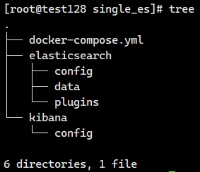

创建了 /app/single_es 文件夹，在 single_es 文件夹下面，创建了 elasticsearch 和 kibana 文件夹及其子文件夹。

需要注意：elasticsearch 和 kibana 的文件夹权限，不能小于 755，否则 elasticsearch 和 kibana 可能会无法启动。

```shell
# 直接将存放 ElasticSearch 和 Kibana 相关文件的目录，权限递归修改为 755
chmod -R 755 /app/single_es
```

在 single_es 文件夹下面，创建 docker-compose.yml 文件，内容先填写以下内容（后面还需要改动）：

```yaml
version: "3.2"
 
services:
  elasticsearch:
    container_name: elasticsearch
    image: docker.elastic.co/elasticsearch/elasticsearch:8.8.2
    restart: always
    # 容器拥有root权限
    privileged: true
    # 在 Linux 里使用 ulimit 命令可以对进程的资源进行限制，这里设置为无限
    ulimits:
      memlock:
        soft: -1
        hard: -1
    environment:
      # 该环境变量设置 ElasticSearch 的最小和最大内存使用都是 1G
      - "ES_JAVA_OPTS=-Xms1024m -Xmx1024m"
      # 该环境变量设置成 0.0.0.0 表示允许任意客户端机器的连接访问
      - "http.host=0.0.0.0"
      - "node.name=elastic"
      - "cluster.name=cluster_elasticsearch"
      # 该环境变量设置为 single-node 表示部署的 ElasticSearch 为单节点
      - "discovery.type=single-node"
    ports:
      - 9200:9200
    networks:
      - elastic_net
 
  kibana:
    container_name: kibana
    image: docker.elastic.co/kibana/kibana:8.8.2
    restart: always
    environment:
      - "ELASTICSEARCH_HOSTS=http://elasticsearch:9200"
    ports:
      - 5601:5601
    networks:
      - elastic_net
 
# 网络配置
networks:
  elastic_net:
    driver: bridge
```

然后在 single_es 文件夹下，运行 `docker-compose up -d` 启动 ElasticSearch 和 Kibana 容器。

虽然容器能够启动成功，但是无法使用。我们需要将容器内的配置文件拷贝出来，修改一下，进行宿主机映射才能使用。

```shell
# 将 elasticsearch 容器中的 config 目录及其下面的所有内容拷贝出来，放到我们提前创建好的文件夹中
docker cp elasticsearch:/usr/share/elasticsearch/config /app/single_es/elasticsearch

# 将 kibana 容器中的 config 目录及其下面的所有内容拷贝出来，放到我们提前创建好的文件夹中
docker cp kibana:/usr/share/kibana/config /app/single_es/kibana
```

进入到 /app/single_es/elasticsearch/config 文件夹中，打开 elasticsearch.yml 文件，清除文件内容并填写如下内容：

```yaml
# 集群节点名称
node.name: "elastic01"
 
# 设置集群名称为 elasticsearch
cluster.name: "cluster_elasticsearch"
 
# 网络访问限制
network.host: 0.0.0.0
 
# 以单一节点模式启动
discovery.type: single-node
 
# 是否支持跨域
http.cors.enabled: true
 
# 表示支持所有域名
http.cors.allow-origin: "*"
 
# 内存交换的选项，官网建议为 true
bootstrap.memory_lock: true
 
# 修改安全配置 关闭 https 安全校验
xpack.security.http.ssl:
  enabled: false
 
# 修改安全配置 关闭传输 ssl 校验
xpack.security.transport.ssl:
  enabled: false
```

进入到 /app/single_es/kibana/config 文件夹中，打开 kibana.yml 文件，清除文件内容并填写如下内容：

```yaml
# 让 Kibana 的界面为中文界面
i18n.locale: zh-CN
server.host: "0.0.0.0"
server.shutdownTimeout: "5s"
# 使用 elasticsearch 容器的服务名称，配置连接访问地址
elasticsearch.hosts: [ "http://elasticsearch:9200" ]
monitoring.ui.container.elasticsearch.enabled: true
 
# 这里填写连接 elastic search 的账号密码，
# 账号名称是固定的，就是 kibana_system ，密码后续由 ElasticSearch 生成，这里先不填写
elasticsearch.username: "kibana_system"
elasticsearch.password: ""
```

然后更改 /app/single_es/docker-compose.yml 文件，对 elasticsearch 和 kibana 都增加 volume 挂载映射配置：

```yaml
version: "3.2"
 
services:
  elasticsearch:
    container_name: elasticsearch
    image: docker.elastic.co/elasticsearch/elasticsearch:8.8.2
    restart: always
    # 容器拥有root权限
    privileged: true
    # 在linux里ulimit命令可以对shell生成的进程的资源进行限制
    ulimits:
      memlock:
        soft: -1
        hard: -1
    environment:
      - "ES_JAVA_OPTS=-Xms1024m -Xmx1024m"
      - "http.host=0.0.0.0"
      - "node.name=elastic"
      - "cluster.name=cluster_elasticsearch"
      - "discovery.type=single-node"
    ports:
      - 9200:9200
    volumes:
      - /app/single_es/elasticsearch/config:/usr/share/elasticsearch/config
      - /app/single_es/elasticsearch/data:/usr/share/elasticsearch/data
      - /app/single_es/elasticsearch/plugins:/usr/share/elasticsearch/plugins
    networks:
      - elastic_net
 
  kibana:
    container_name: kibana
    image: docker.elastic.co/kibana/kibana:8.8.2
    restart: always
    environment:
      - "ELASTICSEARCH_HOSTS=http://elasticsearch:9200"
    ports:
      - 5601:5601
    volumes:
      - /app/single_es/kibana/config:/usr/share/kibana/config
    networks:
      - elastic_net
 
# 网络配置
networks:
  elastic_net:
    driver: bridge
```

最后在 /app/single_es 目录下，重新运行 `docker-compose up -d` 更新容器服务即可。

### 二、生成并配置账号密码

上面的 ElasticSearch 和 Kibana 部署好了，但是无法使用，原因是我们不知道账号密码，登录不进去。

```shell
# 重置 elasticsearch 容器的 elastic 账号的密码（反斜杠为命令换行符，表示命令还没输入完成）
docker exec -it elasticsearch \
/usr/share/elasticsearch/bin/elasticsearch-reset-password -u elastic

# 打印内容如下：
This tool will reset the password of the [elastic] user to an autogenerated value.
The password will be printed in the console.
Please confirm that you would like to continue [y/N]

# 输入 y 后即可显示密码，请保存好这个密码
Password for the [elastic] user successfully reset.
New value: xxxxxx
```

我操作后获取到的 elastic 账号的密码为：`tdGiSi*fhwW0F60*i*Jc`

```shell
# 重置 elasticsearch 容器的 kibana_system 账号的密码（反斜杠为命令换行符，表示命令还没输入完成）
# 注意：kibana_system 账号和密码，需要配置到 Kibana 的配置文件中，能够让 Kibana 连接访问 elasticsearch
docker exec -it elasticsearch \
/usr/share/elasticsearch/bin/elasticsearch-reset-password -u kibana_system

# 提示如下 输入 y：
This tool will reset the password of the [kibana_system] user to an autogenerated value.
The password will be printed in the console.
Please confirm that you would like to continue [y/N]

# 输入 y 后即可显示密码，请保存好这个密码
Password for the [kibana_system] user successfully reset.
New value: xxxxxx
```

我操作后获取到的 kibana_system 账号的密码为：`ZU0X09Kr++NZr5=ldlux`

#### 自定义密码

~~~
docker exec -it elasticsearch /usr/share/elasticsearch/bin/elasticsearch-reset-password -u kibana_system -i
~~~


然后将 kibana_system 账号的密码，配置到 /app/single_es/kibana/config/kibana.yml 文件中，完整内容如下：

```yaml
# 让 Kibana 的界面为中文界面
i18n.locale: zh-CN
server.host: "0.0.0.0"
server.shutdownTimeout: "5s"
# 使用 elasticsearch 容器的服务名称，配置连接访问地址
elasticsearch.hosts: [ "http://elasticsearch:9200" ]
monitoring.ui.container.elasticsearch.enabled: true
 
# 此处配置重置后的 kibana_system 账号和密码
elasticsearch.username: "kibana_system"
elasticsearch.password: "ZU0X09Kr++NZr5=ldlux"
```

最后，我们重启一下 elasticsearch 容器和 kibana 容器，稍等片刻即可使用。

```shell
docker restart elasticsearch
docker restart kibana
```

ElasticSearch 主要有 4 种常用角色：

- superuser 角色：该角色的用户时超级用户，比如默认的超级用户 elastic
- kibana_system 角色：该角色的用户，主要用于 kibana 连接 elasticsearch 通信
- logstash_system 角色：该角色的用户，主要用于 logstash 连接 elasticsearch 通信
- beats_system 角色：该角色的用户，主要用于 beats 连接 elasticsearch 通信

我们自己也可以创建上面角色的相应用户，比如创建一个类似 elastic 这样的超级用户 jobs

```shell
# 进入容器中
docker exec -it elasticsearch bash
# 创建超级用户
./bin/elasticsearch-users useradd jobs -r superuser
# 系统提示输入密码，即可创建成功
```

### 三、访问验证搭建成果

首先我们访问搭建好的 elasticseach ，使用浏览器访问：`http://192.168.136.128:9200`

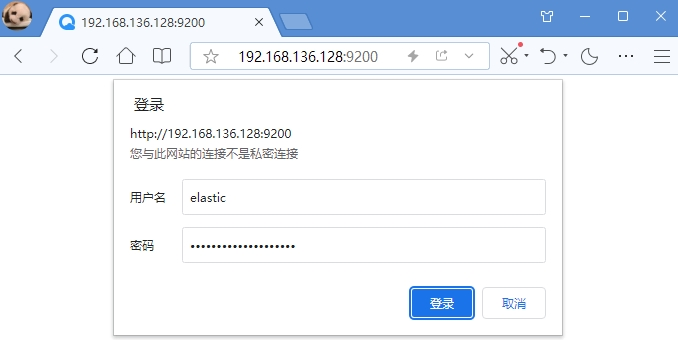

输入刚刚重置的账号 elastic 及其密码，登录后看到如下 json 内容，表示 elastic 已经部署成功

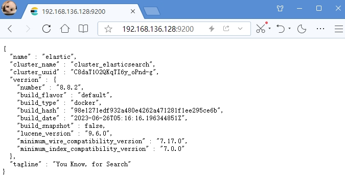

上面的 Json 内容中，显示了所部署的 elasticsearch 的节点名称 name，集群名称 cluster_name，版本 version 等信息。

然后访问部署好的 kibana 可视化界面：`http://192.168.126.128:5601`

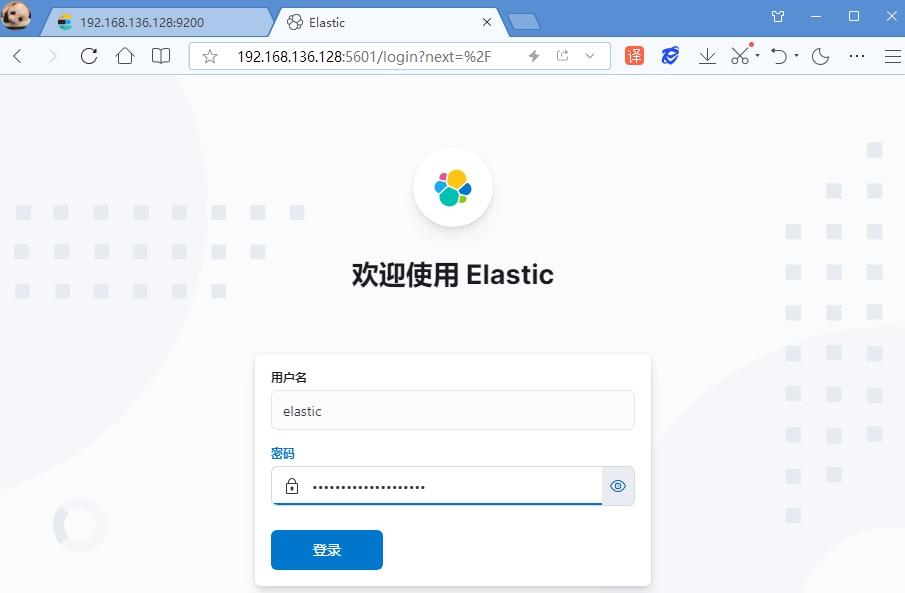

注意：kibana_system 账号是无法登录的，因为该账号只是让 kibana 中间件后台服务的方式访问 elasticsearch 中间件。

仍然输入刚刚重置的账号 elastic 及其密码即可登录进去，主界面如下所示：

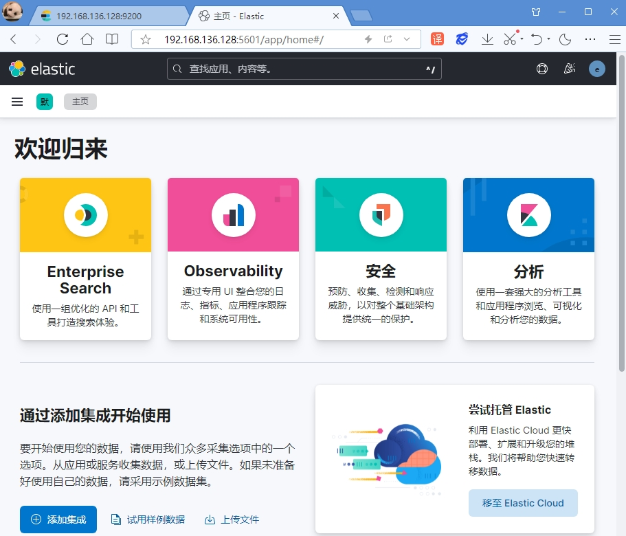

点击左侧菜单，即可进入开发工具界面：

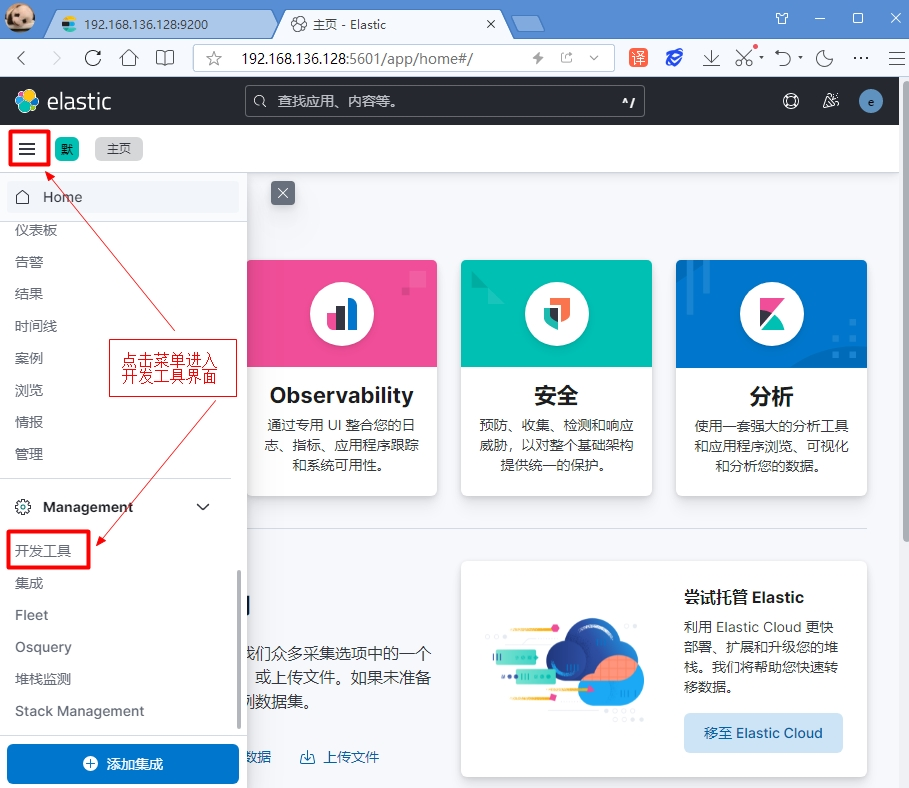

在开发工具界面中，可以编写 DSL 语句，操作 elasticsearch 进行增删改查。

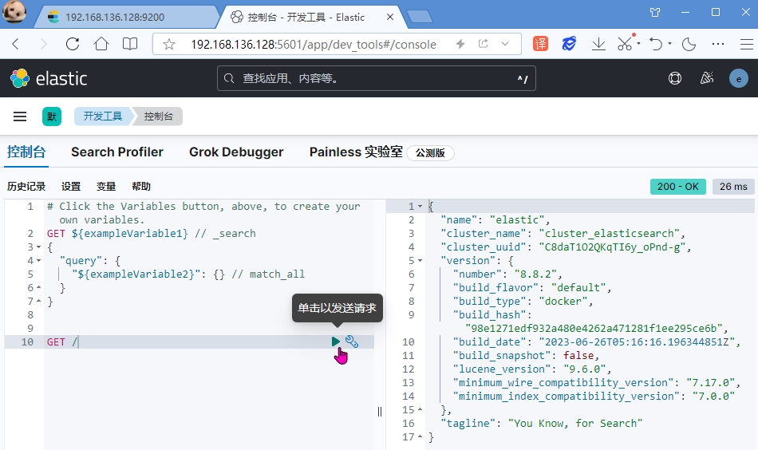

由于 elasticsearch 都是通过 restful 接口，发送 json 数据操作的。

其实我们 Get 访问 / 就是在访问 `http://192.168.136.128:9200/`地址，右侧返回的 Json 字符串，跟我们上面直接在浏览器地址栏访问 elasticsearch 返回的 Json 内容完全一样。

Kibana 可视化界面，编写操作 elasticsearch 的 DSL 语句，有强大的智能提示功能，简化并提高了我们的工作效率。

### 四、安装 IK 分词器

ElasticSearch 集成的分词器，都是基于英文的分词器，对中文的支持很不友好，IK 分词器是专门对中文进行分词的。

IK 分词器的下载地址为：https://github.com/medcl/elasticsearch-analysis-ik/releases

由于 github 网站是国外网站，可能无法访问，可以换个时间段进行尝试访问。

由于本篇博客安装的 ElasticSearch 版本是 8.8.2 ，因此下载的 IK 分词器的版本也是 8.8.2 ，两者版本最好保持一致。下载后的 zip 包名称为 elasticsearch-analysis-ik-8.8.2.zip，解压缩后如下所示：

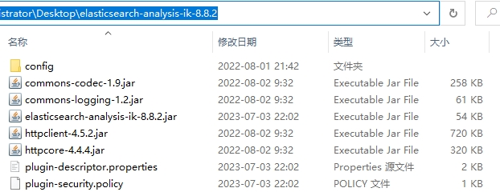

将包含以上文件的目录（原始目录名称太长，我重命名为 ik）上传到虚拟机的 /app/single_es/elasticsearch/plugins 目录即可：

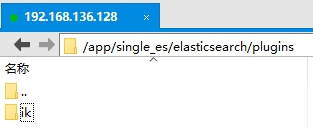

然后重启 elasticsearch 容器即可，可以通过查看日志验证 ik 分词器是否安装成功：

```shell
# 重启 elasticsearch 容器
docker restart elasticsearch

# 查看 elasticsearch 容器的日志
docker logs -f elasticsearch
```

由于 xshell 中显示的日志太杂乱，我复制到一个文件中进行查看，发现如下信息，就表示 ik 分词器安装成功了：

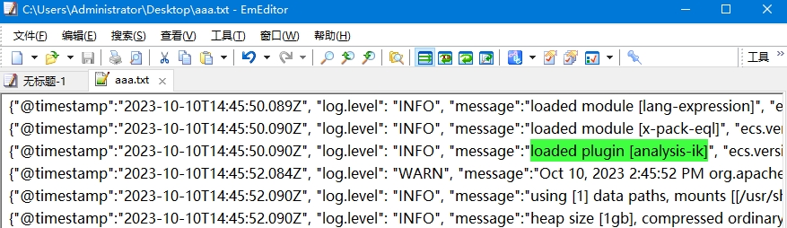

IK 分词器包含两种分词模式：ik_smart 模式表示最少切分，ik_max_word 模式表示最细切分。

在其 config 目录下，以 .dic 结尾的文件都是已经内置好的分词文件，

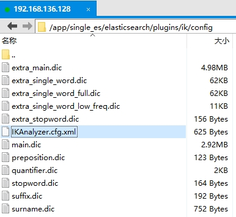

可以修改 IKAnalyzer.cfg.xml 文件，扩展或禁用某些分词内容：

```xml
<?xml version="1.0" encoding="UTF-8"?>
<!DOCTYPE properties SYSTEM "http://java.sun.com/dtd/properties.dtd">
<properties>
	<comment>IK Analyzer 扩展配置</comment>
	<!--用户可以在这里配置自己的扩展字典 -->
	<entry key="ext_dict"></entry>
	 <!--用户可以在这里配置自己的扩展停止词字典-->
	<entry key="ext_stopwords"></entry>
	<!--用户可以在这里配置远程扩展字典 -->
	<!-- <entry key="remote_ext_dict">words_location</entry> -->
	<!--用户可以在这里配置远程扩展停止词字典-->
	<!-- <entry key="remote_ext_stopwords">words_location</entry> -->
</properties>
```

需要注意：新添加的 .dic 文件必须是 utf8 编码，不要使用 windows 默认的 gbk 编码，否则不起作用。

如果配置的是本地的词典，每次修改文件内容，需要重启 elasticsearch 容器服务才能生效，比较麻烦。

如果配置的是词典是通过 http 请求返回的，满足以下条件即可实现热更新，不需要重启 elasticsearch 容器服务：

- http 请求需要返回两个头部(header)，一个是 Last-Modified，一个是 ETag，这两者都是字符串类型，只要有一个发生变化，该插件就会去抓取新的分词进而更新词库。
- 该 http 请求返回的内容格式是一行一个分词，换行符用 \n 即可。

有关 IK 分词器的详细用法，可参考官网地址：https://github.com/medcl/elasticsearch-analysis-ik

Ok，以上就是单机版 ElasticSearch 和 Kibana 的搭建过程和 IK 分词器的安装介绍。

