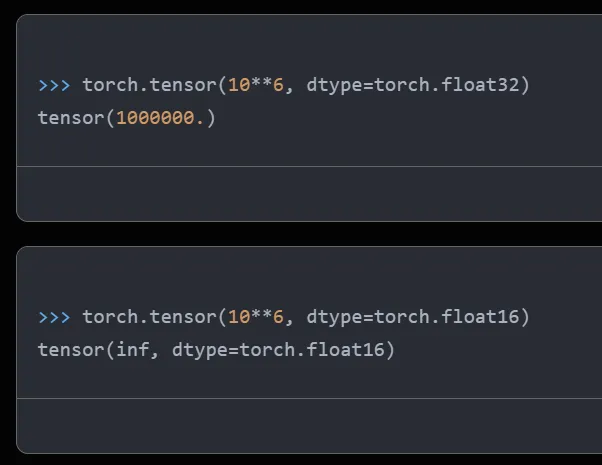

# FP32、FP16、TF32、BF16、混合精度

模型训练和推理的速度随着大模型的到来变得越来越重要，减小计算过程中数据的长度从而降低存储和带宽，是提升速度的一个重要方法。


**从FP32说起**

计算机处理数字类型包括整数类型和浮点类型，IEEE 754号标准定义了浮点类型数据的存储结构。一个浮点数由三部分组成，以最常见的FP32(Float Point 32)为例：


图1. FP32位数分配

- Sign：最高位用1位表示符号位，1表示负数，0表示正数，记为S

- Exponent：中间8位表示指数位，记为E

- Mantissa：低位23位表示小数部分，记为M

  

我们以十进制数9.625为例，看看十进制和FP32二进制之间如何转换：

**十进制--》二进制**

先分为整数部分9和小数部分0.625。

9转为二进制1001，0.625通过乘以2取整数部分，剩余小数部分再乘以2取整数部分不断循环的方法，得到0.101，合起来就是1001.101，写成2进制指数形式为$1.001101*2^3$。

根据IEEE 754的规范，FP32的**指数**部分要加127偏移，调整为**3**+127=130，对应二进制为10000010，**小数**部分001101后面补齐为23位后，**符号**位为0，三个部分拼起来就是

`0 10000010 00110100000000000000000`。

使用转换工具验证，正确！工具的上面把三个部分都表示出来了，复选框打勾表示对应位置二进制数为1，否则为0。


图2. FP32转换工具

**二进制--》十进制**

直接把上面这个步骤反过来为例，把二进制分为三个部分S、E、M，FP32转换为十进制的公式为：


其中1.M表示小数部分的二进制表示，上述例子具体为S=0，E二进制10000010转为十进制为130，M为00110100000000000000000,1.M小数部分后面的0没用直接去掉，实为1.001101（二进制），转为十进制为：


顺利还原回了十进制数。

FP32搞清楚了，FP16、FP64类似，只是指数位和小数位的长度不一样：

| **类型**       | **符号位长度 ** | **指数位长度** | **小数位长度 ** | **偏移 ** |
| -------------- | --------------- | -------------- | --------------- | --------- |
| **半精度FP16** | 1               | 5              | 10              | 15        |
| **单精度FP32** | 1               | 8              | 23              | 127       |
| **双精度FP64** | 1               | 11             | 52              | 1023      |


**模型训练中不同精度的问题**

首先对比FP32和FP64，由于一个FP32浮点数只占32位，和FP64比有明显的优势：

1. 减少存储使用：模型训练显存大小是关键，FP32只占用一半的存储，同样的GPU可以训练更大的模型，或者同样的模型batch_size可以更大；

2. 提高训练速度：同样的两个数进行计算，FP32由于位数少，计算量更小，可以降低计算时间。

   

同样的道理适用于FP16和FP32的对比，但是否意味着我们都使用FP16就行了？当然不是，主要原因是位数少同时有两个劣势：

1. 位数少时精度比位数多时低，可能导致准确度不够；

2. 位数少时表示的范围比位数多时要小，可能导致数据溢出，装不下了。

   

先看看精度问题，以下是用FP64、FP32、FP16表示1/3时不同的精度：


精度越高，数据表示和计算越准确，模型训练拟合出来的参数更精准，这个需要看我们对具体模型精度的要求。

再看表示的范围，通过pytorch的接口，我们看看FP32和FP16能表示的数的范围：


我们用一个大数$10^6$看看二者能否表示：



显然$10^6$已经超过了FP16能支持的范围，无法处理。如果模型的某些参数超过了65504，就无法用FP16表达了。


**混合精度**

既然FP32和FP16长短各有优缺点，那我们就可以采取混合使用的方法，在模型训练的不同步骤使用不同的精度：


图3. 混合精度使用流程

1. 把神经网络权重参数由初始化的FP32转为FP16；

2. 用FP16进行前向和后向计算，并进行梯度计算；

3. 把FP16的梯度转为FP32；

4. 使用FP32的梯度和学习率learning rate相乘；

5. 使用FP32更新网络权重，得到FP32的更新后的权重。

   

以上步骤不断循环进行。简单来讲就是使用梯度更新权重的时候用FP32，因为梯度乘上学习率后一般数值都比较小，使用FP32能防止精度不够。

混合使用精度的时候，有一个**"****损失缩放"**的技术，在反向计算前，将得到的损失扩大一个倍数，避免数据太小精度不够变为0了，扩大后在FP16可表达的范围内，反向计算后，再把梯度缩小同样的倍数，确保最后数值是对的。

资料[1]使用DistilBERT模型进行了一个电影情感分类任务微调，对比了单独使用FP32、FP16和混合使用的性能及准确率：


图4. FP32、FP16和混合精度训练对比

从图4可以看出，混合精度训练时间和FP16接近，为FP32的1/3，使用的存储间于二者之间，但预测准确率和FP32类似，甚至比FP32还高，作者说了高可能是因为使用了正则化的原因，FP16的预测准确率低很多，应该是训练中发生了数据溢出，模型已经不准了。


**BF16、TF32**

PF16的指数位只有5位，小数位10位，能表示的整数范围有点小，于是谷歌为了深度学习特别是他们的TPU定义了一种新的格式Brain Floating Point 16，简称BF16。和FP16比，总长度都是16位，只是把指数由5位变为了8位（和FP32一样，能有其相同的整数范围），小数位数缩短到了7位。

英伟达根据其GPU的需要定义了TF32，指数位8位（和FP32、BF16一样），小数位10位（和FP16一样，比BF16长），其实就是比BF16多了3个小数位。


图5. BF16、TF32位数

资料[1]对除了TF32之外的所有类型以及混合精度做了对比，仍然使用之前相同的任务：


图6. 各种精度综合对比

可以看出，BF16是时间最短（和FP16相当，因为长度都是16位）、使用存储最少（小数位少）、准确率最高（主要是和其他几个92%的同一水平，可能其他因素会导致微小偏差）。


大模型的训练和推理，经常涉及到精度的概念，种类很多，而且同等精度级别下，还分不同格式，网上没看到一篇能够介绍全面的，这里梳理总结一份全面的介绍。

## **整体介绍**

浮点数精度：双精度（FP64）、单精度（FP32、TF32）、半精度（FP16、BF16）、8位精度（FP8）、4位精度（FP4、NF4）

量化精度：INT8、INT4 （也有INT3/INT5/INT6的）

另外，实际使用场景中，还有多精度和混合精度的概念


## **什么是精度**

假设你每秒钟赚到的钱是1块钱，那一个月的收入是1*60*60*24*30=216000，如果每秒钟赚到1块1呢，那一个月的收入是237600，就一个1毛钱的小数点，让你月收入少了1万多，这就是精度不同导致的差异。

另外一个典型的例子是π，常用3.14表示，但是如果要更高精度，小数点后面可以有无数位。

当然，这些都是数学里面的精度概念，在计算机里面，浮点数的精度，跟存储方式有关，占用的bit越多，精度越高。


## **为什么要有这么多精度**

因为成本和准确度。

都知道精度高肯定更准确，但是也会带来更高的计算和存储成本。较低的精度会降低计算精度，但可以提高计算效率和性能。所以多种不同精度，可以让你在不同情况下选择最适合的一种。

双精度比单精度表达的更精确，但是存储占用多一倍，计算耗时也更高，如果单精度足够，就没必要双精度。


## **不同的浮点数精度**

在计算机中，浮点数存储方式，由由符号位（sign）、指数位（exponent）和小数位（fraction）三部分组成。符号位都是1位，指数位影响浮点数范围，小数位影响精度。

### **[FP精度]**

Floating Point，是最原始的，IEEE定义的标准浮点数类型。由符号位（sign）、指数位（exponent）和小数位（fraction）三部分组成。

FP64，是64位浮点数，由1位符号位，11位指数位和52位小数位组成。


FP32、FP16、FP8、FP4都是类似组成，只是指数位和小数位不一样。

但是FP8和FP4不是IEEE的标准格式。

FP8是2022年9月由多家芯片厂商定义的，论文地址：https://arxiv.org/abs/2209.05433

FP4是2023年10月由某学术机构定义，论文地址：https://arxiv.org/abs/2310.16836

FP8格式有两种变体，E4M3(4位指数和3位尾数)和E5M2(5位指数和2位尾数)

符号位、指数位、小数位的位数如下表所示：

| 格式     | 符号位 | 指数位 | 小数位 | 总位数 |
| -------- | ------ | ------ | ------ | ------ |
| FP64     | 1      | 11     | 52     | 64     |
| FP32     | 1      | 8      | 23     | 32     |
| FP16     | 1      | 5      | 10     | 16     |
| FP8 E4M3 | 1      | 4      | 3      | 8      |
| FP8 E5M2 | 1      | 5      | 2      | 8      |
| FP4      | 1      | 2      | 1      | 4      |


### **[****特殊精度]**

#### TF32，Tensor Float 32，英伟达针对机器学习设计的一种特殊的数值类型，用于替代FP32。首次在A100 GPU中支持。

由1个符号位，8位指数位（对齐FP32）和10位小数位（对齐FP16）组成，实际只有19位。在性能、范围和精度上实现了平衡。


python中查看是否支持：

```
import torch
//是否支持tf32
torch.backends.cuda.matmul.allow_tf32
//是否允许tf32，在PyTorch1.12及更高版本中默认为False
torch.backends.cudnn.allow_tf32
```

#### BF16，Brain Float 16，由Google Brain提出，也是为了机器学习而设计。由1个符号位，8位指数位（和FP32一致）和7位小数位（低于FP16）组成。所以精度低于FP16，但是表示范围和FP32一致，和FP32之间很容易转换。


在 NVIDIA GPU 上，只有 Ampere 架构以及之后的GPU 才支持。

python中查看是否支持：

```
import transformers
transformers.utils.import_utils.is_torch_bf16_gpu_available()
```

#### NF4，4-bit NormalFloat，一种用于量化的特殊格式，于23年5月由华盛顿大学在QLoRA量化论文中提出，论文地址：https://arxiv.org/abs/2305.14314

NF4是建立在**分位数量化技术**的基础之上的一种信息理论上最优的数据类型。把4位的数字归一化到均值为 0，标准差为 [-1,1] 的正态分布的固定期望值上，知道量化原理的应该就会理解。

FP精度和特殊精度加上，位数总结如下表

| 格式     | 符号位 | 指数位 | 小数位 | 总位数 |
| -------- | ------ | ------ | ------ | ------ |
| FP64     | 1      | 11     | 52     | 64     |
| FP32     | 1      | 8      | 23     | 32     |
| TF32     | 1      | 8      | 10     | 19     |
| BF16     | 1      | 8      | 7      | 16     |
| FP16     | 1      | 5      | 10     | 16     |
| FP8 E4M3 | 1      | 4      | 3      | 8      |
| FP8 E5M2 | 1      | 5      | 2      | 8      |
| FP4      | 1      | 2      | 1      | 4      |


### **多精度和混合精度**

多精度计算，是指用不同精度进行计算，在需要使用高精度计算的部分使用双精度，其他部分使用半精度或单精度计算。

混合精度计算，是在单个操作中使用不同的精度级别，从而在不牺牲精度的情况下实现计算效率，减少运行所需的内存、时间和功耗

## **量化精度**

一般情况下，精度越低，模型尺寸和推理内存占用越少，为了尽可能的减少资源占用，量化算法被发明。FP32占用4个字节，量化为8位，只需要1个字节。

常用的是INT8和INT4，也有其他量化格式（6位、5位甚至3位）。虽然资源占用减少，但是推理结果差不了多少。


量化算法这里不详细展开。