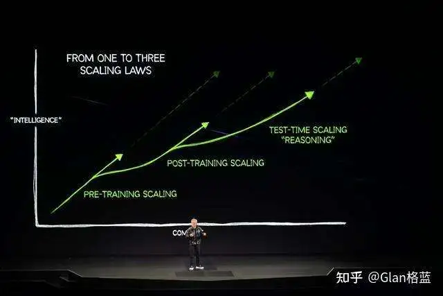

# LLM 领域的一些热词

## **MoE**

全称：Mixture-of-Experts

中文：混合专家（模型）

出处：最早这个概念是 Hinton 老爷子在1991年发表的《Adaptive Mixtures of Local Experts》[1] 中提出，然后在23年3月 GPT-4 发布后火了一把，因为黑客的小道消息传其使用了 MoE 架构，之后23年12月 Mistral AI 发布了首个开源的 MoE 架构模型 Mixtral-8x7B [2]，接着24年1月 DeepSeek 发布了国内首个开源的 MoE 架构模型 DeepSeekMoE [3]。

胡侃：2024年模型上以 DeepSeekMoE 开头，以为 MoE 架构会在24年大放异彩，但中途被 o1 截胡，不过在年尾 DeepSeek-V3 [4] 还是挽了下 MoE 的尊。但是 V3 这么大，下载量截止目前已经有155K [5] 了，大家都这么富裕了吗？

## **Agentic**

中文：智能体化

出处：说 Agentic 肯定要先说 Agent，这个词很早就有了，但在 LLM 领域最早认为是 OpenAI 在23年6月的一篇博客中《LLM Powered Autonomous Agents》[6] 对 LLM 中的 Agent 进行了一个较为综合的定义，之后 OpenAI 在23年12月份发布的《Practices for Governing Agentic AI Systems》 [7] 提到了 Agentic 这个词。

胡侃：2024 应用上以 Agent/Agentic 开头，以为24年将会遍地开花，但在24年的结尾来看水花不大，不过 Anthropic 在24年结尾的 《Building effective agents》[8] 写的真实在。目前大家的 Agent 大部分本质就是 Workflow + Prompt，但汇报还是得用“Agent”讲故事。

## **Sora**

出处：24年2月OpenAI发布的视频生成模型。

相关：24年6月快手可灵，7月智谱清影，8月 MiniMax video-01，9月字节 PixelDance 和 Seaweed 。

胡侃：24年尾巴上了，终于可以掏钱体验 Sora 了，体验之后发现和年初吹的牛皮差的有点距离呀！

## **GraphRAG**

中文：图检索增强生成

出处：微软在24年4月于《From Local to Global: A Graph RAG Approach to Query-Focused Summarization》[9] 中提出。

相关：RAG 这个概念最早是由 Meta 在20年于《Retrieval-Augmented Generation for Knowledge-Intensive NLP Tasks》[10]中提出，目前各种 RAG 层出不穷，不在此叙述了。

胡侃：当前 RAG 已经成为了一种解决 LLM 知识时效性差、幻觉、领域专业性欠缺等问题的范式，24年 RAG 方向的工作依然很火热，毕竟能真实应用落地，LLM 落地的一根大拐杖。但 Graph 的方式是不是 RAG 的正确打开方式呢？

## **GPT-4o**

出处：24年5月 OpenAI 发布的多模态模型。

相关：24年7月阶跃 Step-1.5V，9月 Meta Llama 3.2 ，9月 Mistral AI Pixtral 12B，10月阿里 Qwen2-VL，10月百川 Baichuan-Omni。

胡侃：4o 三模端到端，但24年来看多模态依然前路漫漫，未来的 AGI 一定是多模态的，但现在的 AGI 还是文本的。

## **o1**

出处：24年9月 OpenAI 发布的推理模型。

相关：24年11月阿里 QwQ-32B-Preview，11月 DeepSeek-R1-Lite，11月月暗 k0-math，12月智谱 GLM-Zero-Preview

胡侃：2024 真神降临！

------

**接下来是和 o1 相关的热词，毕竟下半年大家都在研究 o1**

## **ORM；PRM**

全称：Outcome-supervised Reward Model；Process-supervised Reward Model

中文：结果监督奖励模型；过程监督奖励模型

出处：早在23年5月 OpenAI 的《Let's Verify Step by Step》[11]就提出了。

胡侃：o1 横空出世后，大家都在解密他，PRM 应该是其核心的一个方法，大家开始训 PRM 了，但 OpenAI 有800K 的标注数据，虽然开源了，但没开源的有多少呢？

## **train-time compute；test-time compute**

中文：训练时计算量；测试时计算量

出处：24年9月份 OpenAI 的《Learning to reason with LLMs》[12] 博客中提到。

胡侃：结合原文看

We have found that the performance of o1 consistently improves with more reinforcement learning (train-time compute) and with more time spent thinking (test-time compute)

时间长才会真的强。

## **Inference Scaling Laws/Test-Time Scaling**

中文：推理扩展定律

出处：o1 发布后， Scaling Laws 的推理版本，准确的出处说不太清，这篇 Paper 实验做的不错《Inference Scaling Laws: An Empirical Analysis of Compute-Optimal Inference for LLM Problem-Solving》[13]

胡侃：开启一个新的阶段，老黄这张图不错

三个阶段

## **MCTS**

全称：Monte Carlo Tree Search

中文：蒙特卡洛树搜索

出处：最早是 2006 年的《Bandit based Monte - Carlo Planning》[14] 提出

胡侃：o1 到底用没用？

## **猜测的 o1 推理范式：SA，MR，DC，SR，CI，EC**

全称中文：

> 系统分析Systematic Analysis（SA）
> 方法重用Method Reuse（MR）
> 分而治之Divide and Conquer（DC）
> 自我改进Self-Refinement（SR）
> 上下文识别Context Identification （CI）
> 强化约束Emphasizing Constraints（EC）

出处：一篇研究 o1 的 Paper 猜测的 o1 推理范式 《 A COMPARATIVE STUDY ON REASONING PATTERNS OF OPENAI’S O1 MODEL》[15]

胡侃：你 Close 你的，我研究我的。

------

**接下来是几个"self"**

## **Self-Play**

中文：自博弈

出处：第一次热是2016年AlphaGo大战李世石后，这次随着 o1 又热了起来，Self-Play 本身是正统RL里面的一个概念，24年8月份这篇综述不错《A Survey on Self-play Methods in Reinforcement Learning》[16]

胡侃：NLP 出身搞 LLM 的，接受正统 RL 的洗礼吧，下面缺一个卖 RL 课的广告...

## **Self-Rewarding**

中文：自我奖励

出处：24年1月 Meta 在《Self-Rewarding Language Models》[17] 提到。

胡侃：就是不用人工来标数据了，让 LLM-as-a-Judge，但是感觉路漫漫。

## **Self-Correct/Correction**

中文：自我纠错

出处：这个概念 LLM 出现后就有了，结合 RL 的24年9月 DeepMind 在《Training Language Models to Self-Correct via Reinforcement Learning》中提到[18]

胡侃：在o1发布的8天后， DeepMind 甩出了这篇 Paper，但声量似乎有点少。

## **Self-Refine**

中文：自我优化

出处：一般指23年3月卡内基梅隆大学的这篇《Self-refine: Iterative refinement with self-feedback》[19]

胡侃：成为了众多 Paper 中的一个 Baseline。

## **Self-Reflection**

中文：自我反思

出处：这个提到的比较多，贴几篇不错的

《Self-Reflection in LLM Agents: Effects on Problem-Solving Performance》[20]；

《Self-RAG: Learning to Retrieve, Generate and Critique through Self-Reflection》[21]；

《Towards Mitigating Hallucination in Large Language Models via Self-Reflection》[22]

胡侃：什么是人类的反思，什么是 LLM 的反思？

## **Self-Consistency**

中文：自我一致性

出处：一般指23年Google的这篇《Self-Consistency Improves Chain of Thought Reasoning in Language Models》[23]

胡侃：期待更多实用的 ”self“，毕竟人类喜欢低耗能的事情，不喜欢自己动（洗数据）

## **RFT**

全称：Reinforcement Fine-Tuning

中文：强化微调

出处：OpenAI 的 12 Days 第二天直播提出的，这是直播的视频[24]，这是申请单[25]。

注意和字节 ReFT 的区别（所以到底有区别吗），OpenAI 的官方简称是RFT

> Today, we're excited to introduce a new way of model customization for our O1 series: reinforcement fine-tuning, or RFT for short.

## **ReFT**

全称：Reinforced Fine-Tuning

中文：强化微调

出处：24年1月字节在《ReFT: Reasoning with Reinforced Fine-Tuning》[26]提出

胡侃：从 OpenAI 目前披露出的消息，应该和字节的 ReFT 原理差的不是特别多，不过 OpenAI 概念的神，PPO～RFT，Reward Model ～ Verifier。但如果在专业领域，答案固定且 Verifier 也比较好定义的任务上，真的需要 “dozens of data” 就能够非常有效的话，想想还是挺期待的。不要再像 Sora 一样拖到 25 年底才能体验吧...

------

**下面是几个"O"**

## **PPO**

全称：Proximal Policy Optimization

中文：近端策略优化

出处：2017年 OpenAI 在这篇《Proximal Policy Optimization Algorithms》[27]提出。

胡侃：以下 O 的老祖宗。

## **DPO**

全称：Direct Preference Optimization

中文：直接偏好优化

出处：23年斯坦福在这篇《Direct Preference Optimization: Your Language Model is Secretly a Reward Model》[28]提出。

胡侃：你的出现让中小作坊大喜！

## **GRPO**

全称：Group Relative Policy Optimization

出处：DeepSeek 在24年2月《DeepSeekMath: Pushing the Limits of Mathematical Reasoning in Open Language Models》[29] 中提出。

胡侃：优雅实用高效

------

**几个比较常见且已经有实现的"O"**

## **ORPO**

全称：Odds Ratio Preference Optimization

出处：KAIST AI 在24年3月份《ORPO: Monolithic Preference Optimization without Reference Model》[30]提出。

## **KTO**

全称：Kahneman-Tversky Optimization

出处：24年2月份的《KTO: Model Alignment as Prospect Theoretic Optimization》[31] 提出

## **SimPO**

全称：Simple Preference Optimization

出处：24年5月份的《SimPO: Simple Preference Optimization with a Reference-Free Reward》[32]提出

## **RLOO**

全称：Reinforce Leave-One-Out

出处：Cohere For AI 在24年2月份的《Back to Basics: Revisiting REINFORCE Style Optimization for Learning from Human Feedback in LLMs》[3] 提出

2024 结束，2025 的 GPT-5 ，o3 又将会掀起什么大风大浪呢？风浪越大鱼越贵！