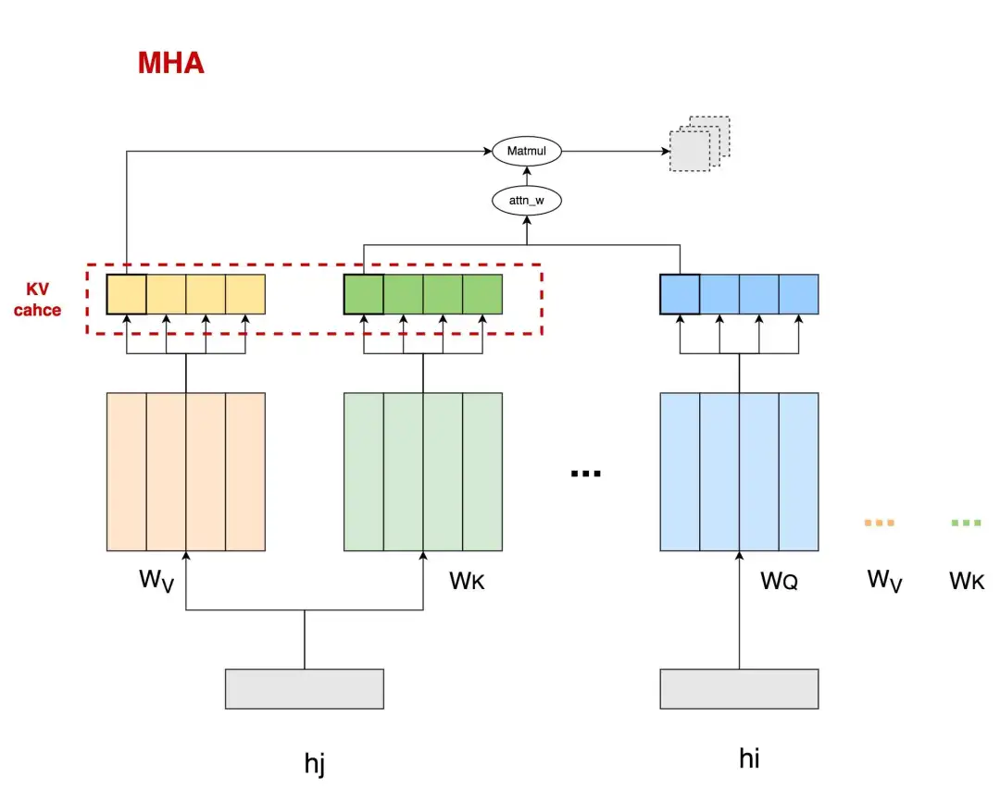
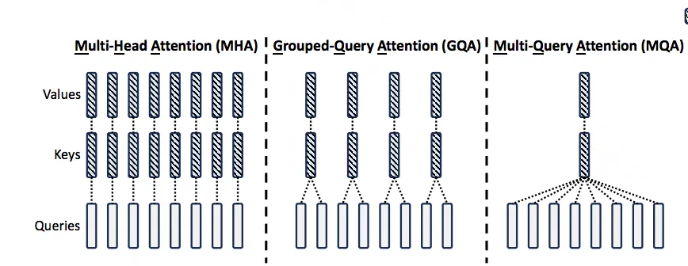
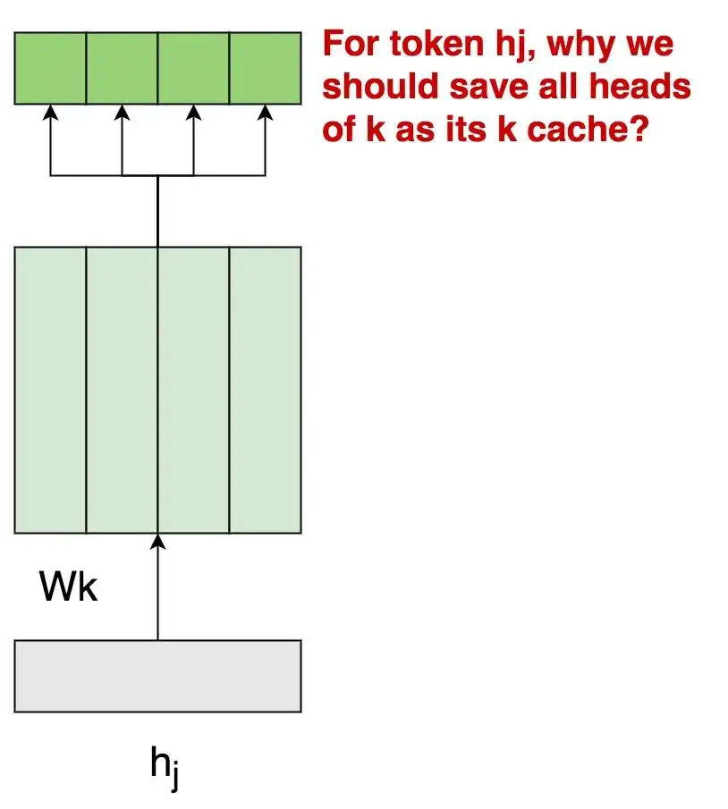
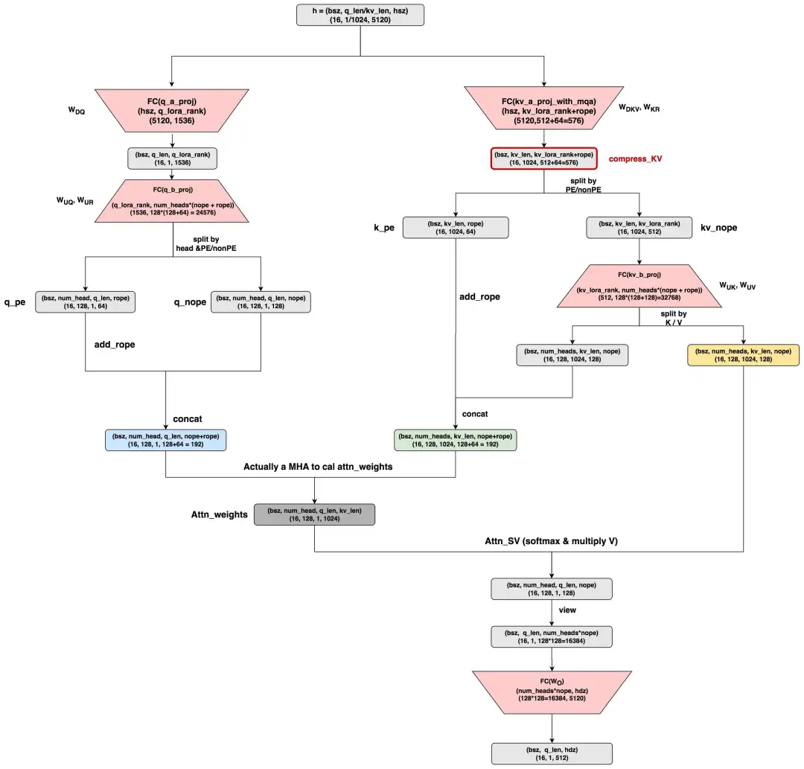
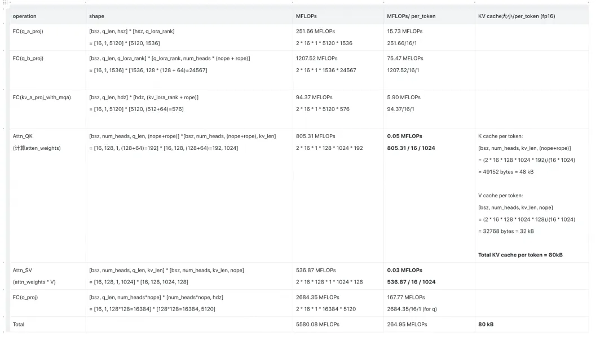
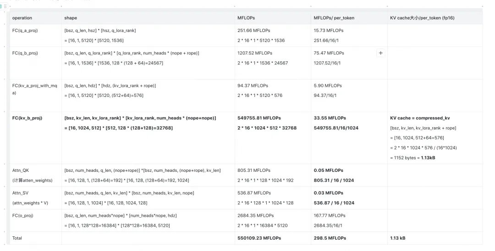
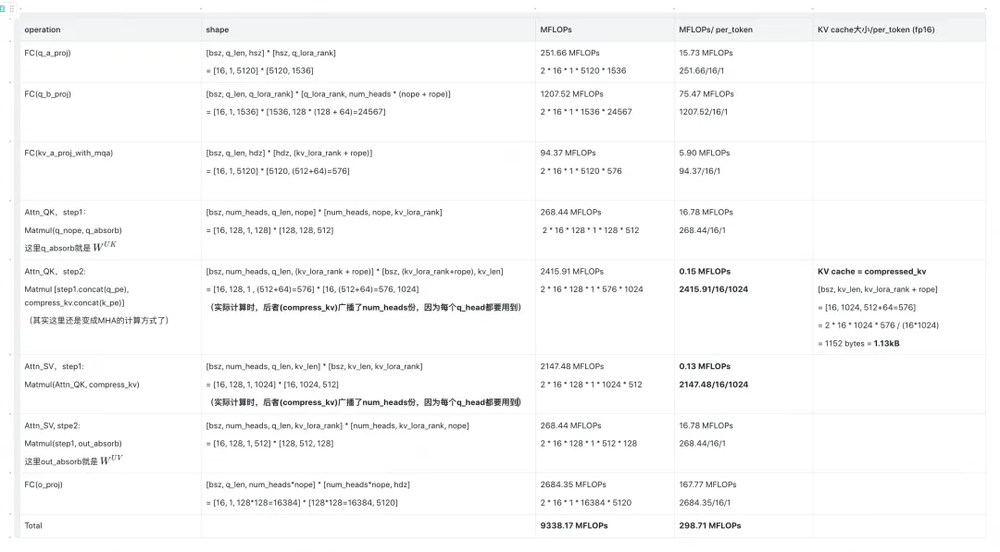
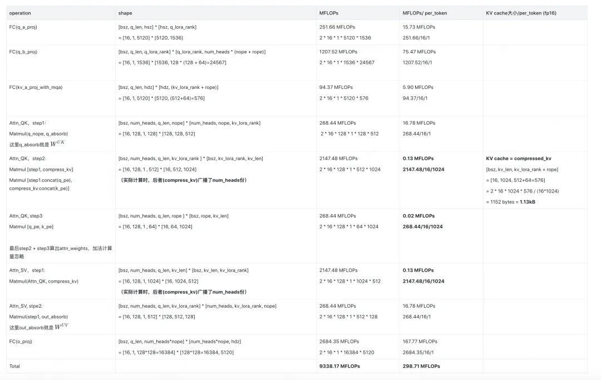

# MLA

关于MLA，我想先简单记录下我了解它的心路历程：

- **我第一次了解MLA，是在它刚出来的档口**。在我读过它的原生实践后，**我发现它既不省KV cache，还徒增了计算量**。这个问题让我困扰了很久，当时网上对MLA细节的讨论很少，所以我觉得大概是我没弄懂，所以它就被我放到一边去了。别人问起我MLA，我都回答不知道，因为我确实没想明白。
- 直到最近dpsk v3的风刮起来，再加上实际体验后它的推理速度确实很快（当然我知道不止于MLA），所以又有了重新认识它的兴趣。而幸运的是，此时网上已经有关于MLA的诸多讨论了，这样就能和我的理解相互校验。在这一次的重新认识中，**我发现我之前的认知其实没有错，原生MLA确实存在上述的2个问题，并且开源社区已有了各种对原生MLA的优化方法**，这里我主要参考了：
  - **blog**：https://zhuanlan.zhihu.com/p/700214123
  - **代码**：https://github.com/madsys-dev/deepseekv2-profile/tree/main
- 
- **章明星老师关于MLA优化的思路**，本文里介绍的MLA优化思路也来自于此，我推荐大家都看看这块，写得非常具有启发性(链接见上，编辑出问题了sry)
- **知乎上一篇对MLA计算量的分析**，在这个分析思路的启发下，本文按照自己的理解重新做了MLA各种优化方法的计算量和KV cache分析：https://zhuanlan.zhihu.com/p/714761319

我个人认为，理解MLA的难点之一，是它算法设计颇为“绕”，不管是用数学公式，或者是用流程图，似乎都很难一下找到它设计的核心思想。**所以本文第一部分，将会抛开所有复杂的计算细节，根据我自己的理解，抽象出MLA的设计方案。基于此再来谈计算细节和各种优化**，全文目录如下：

**一、MLA的基本思想**
1.1 MLA, MQA 和 GQA
1.2 MLA的整体设计思想

**二、MLA的运作细节**
2.1 CD（原生MLA）
2.2 CC
2.3 A_CC
2.4 A_CC_ME

**三、MLA可以用TP吗？**

# **一、MLA的基本思想**

## **1.1 MLA，MQA与GQA**

我们先来快速复习一下decoder架构的MHA的运作流程，如下图：

这里head_num = 4，图中刻画了head0的运算过程，包括 attn_weights = Matmul(q, k) 以及 attn_sv = Matmul(attn_weights, v)，图中虚线灰框表示在head0上的结果是由包括其在内的若干前置tokens计算结果汇总而来。为了表达简便，这里省去了诸如softmax，的计算过程。**图中被红色虚线框圈起来的部分，就是大家熟知的将被用在推理阶段的KV cache**。

KV cache的存在，本来是为了避免在推理阶段对前置序列的重复计算的。但是，随着前置序列的长度变长（我们记为kv_len），需要读取的KV cache也将越来越大，数据的传输成本增加，**这就使得attn计算逐渐变成memory bound**。**我们采取了一些策略来缓解KV cache过大的问题，其中2种就是大家熟知的MQA和GQA**。

MQA和GQA的运作方式如下：

- **在MQA的情况下，一个token所有的heads都共享同一个k和v**。这样在降低param weights大小的同时，还让原本需要保存num_heads份的kv cache降低为只需保存1份。
- 但是，MQA可能造成模型效果上的损失，毕竟原来对于1个token，它的每个head都有各自的k、v信息的，现在却被压缩为一份。**所以GQA作为一种折衷的方案出现了**，即将1个token的head分成num_group组，每个group内共享同一个k，v信息，使得信息压缩不像GQA那样严重。

**但是，不管是MQA还是GQA，对于1个token来说，总是存在heads上k、v信息被压缩的情况。那么是否有一种办法，能在尽量不压缩head上k，v信息的情况下，节省kv cache，提高整体推理速度呢？**那么接下来，我们就来大致看一下MLA的设计思想。

## **1.2 MLA的整体设计思想**

在本节中，我们会以K cache为例，抽象出MLA的核心优化思想。V cache的优化思想也是同理，但不在这节赘述，而是合并到后文对于MLA的细节讲解中（参见2.3节A_CC）。

现在先让我们回到MHA上（图1.1），来思考一个问题：为什么对于一个token，我们需要保存它所有heads上的K值作为K cache呢？

主要原因我们在上文解释过：**这是因为每个k_head附带有不同的信息，它将用这份独有的信息和对应的q_head进行attn的计算**，用公式表示即为，这里的是合并了所有head对应的param weight后的表达。

我们现在的总目标是节省K cache，当你再次端详上面这幅图时，一个idea在你的头脑中出现：

- 当前我要存的K cache是4个k_head（图中深绿色框），**但如果我能从这4个k_head中抽取出1份共有的信息，然后在做attn计算时，每个head都用这1份共有的信息做计算，那么我也只需存这1份共有信息作为K cache了**。这样我就把K cache从原来num_heads = 4变成num_heads = 1，这不就能节省K cache了吗？
- 但是等等，**现在共有的k_head信息是抽取出来了，那么相异的k_head信息呢？（简单来说，就是由不同head部分学习到的相异信息）**。我们当然是希望k_head间相异的信息也能保留下来，那么该把它们保留至哪里呢？当你回顾attn_weights的计算公式时，一个想法在你脑中闪现：**q部分不是也有heads吗！我可以把每个k_head独有的信息转移到对应的q_head上吗！写成公式解释就是**：
  - 原来，括号表示运算顺序，即先各自算2个括号内的，再做 * 计算
  - 现在 ，同理括号表示运算顺序。
  - **也就是说，这里我们通过矩阵乘法的交换律，巧妙地把1个token上k_heads独有的信息转移到了对应的q_head上来，这样1个token上k_heads间共享的相同信息就能被我们当作K cache存储下来。**

（在这里，你可以抽象地把理解成是4个k_heads共享的信息，但最终K cache的形式还会在这基础上有所变化。我知道此时你脑海中一定有很多疑惑。但我们先不要纠结细节的问题，因为在后文会展示全部细节，这里我们要做的是从宏观上理解MLA设计的核心思想。）

现在我们更具体地画出上面这套“信息转移”方案的具体流程：

' fill='%23FFFFFF'%3E%3Crect x='249' y='126' width='1' height='1'%3E%3C/rect%3E%3C/g%3E%3C/g%3E%3C/svg%3E)

⚠️⚠️⚠️：**再次说明，在本部分，我们侧重于抽象出MLA的优化思路，大家在阅读上面这幅图时，请不要带入任何具体的细节（例如矩阵尺寸）等去做计算，这部分细节我们会在下文详细介绍。**

我们来详细看这幅图：

- **对于每个token的k_heads，我们需要抽取出它们的相异信息**，**而这个相异信息本质上是由维护的**。观测到所有tokens都共享1个，所以我们对于q_heads，我们只需做1次对于的吸收，就能统一获取所有tokens的所有k_heads上的相异信息。
- **对于每个tokens的k_heads，我们还需要抽取出它们的相同信息**，而这个相同信息应该是每个tokens的所有k_heads共享一份，同时不在不同tokens间共享。那么我们自然而然想到，**可以学习一个linear参数矩阵，从原始token 中提取出这份共有信息**，以此作为我们的K cache。而不管是从“信息提取”还是从“进一步节省K cache大小”的角度来说，似乎这个linear参数参数矩阵如果能把压缩到一个更低维的空间，会收获更紧密的信息表达和更小的存储量，这也是图中compress_k的由来。
- **最后，我们使用压缩后了共有信息的compress_k，和吸收了相异信息的q_head做计算，得到attn_weights**。

对v cache的优化也是同理，这里额外提几点：

- 事实上，当我们考虑到v cache优化时，上**图中的compress_k其实应该被理解成compress_kv**，也就是它是1个token所有k_heads和v_heads的共有信息。
- 可以和作吸收，我们在后文会讲这块细节。
- **总结起来，我们应该尽量直接使用compress_kv，而不要将其用或者进行展开，因为q已经吸收过这两者的信息了。**

好，到此为止，我们抽象出了MLA的整体优化思路，从中你可以发现：

- 虽然从形式上来说，MLA和MQA/GQA很像，似乎都是通过压缩k/v_heads的数量来节省KV cache大小的。**但MLA是压缩num_heads，不压缩信息（把信息转移到了q_heads上）；而MQA/GQA则在一定程度上对信息做了压缩。**
- **从这一点上看，我个人认为MLA其实更应该理解成是MHA的变种优化，而并非MQA/GQA的变种优化。**

# **二、MLA的运作流程**

## **2.1 CD (CacheDecompressed, dpsk MLA的原生实现）**

现在我们可以来看MLA的运作细节了。

- 本图参考自huggingface上dpsk v2的MLA原生实现：https://huggingface.co/deepseek-ai/DeepSeek-V2/blob/main/modeling_deepseek.py#L682
- 关于MLA的更多细节，例如“为什么要区分nope和rope维度”，“为什么要做low rank压缩”等，已经有前人的分析珠玉在前，因此本文不做重点阐述，更多细节请参考：
  - https://kexue.fm/archives/10091
  - https://arxiv.org/pdf/2405.04434
- 这里假设q_len = 1，kv_len = 1024，nope表示非pe部分的head_dim，rope表示pe部分的head_dim。其余维度已标注在图中。其中红色表示param_weights，其中：
  - `q_b_proj`：是q计算中的升维矩阵，它包含了两部分，分别表示对q的nope/rope部分的计算。
  - `kv_a_proj_with_mqa`：**是对原始hidden_states的压缩矩阵，它包含了两部分，分别用于计算compress_kv（即抽取k_heads和v_heads的共同信息）**，以及计算k_pe的部分。
  - `kv_b_proj`：它包含了两部分，分别表示对 k_nope 和 v 部分的计算。
  - **以上符号表示皆遵从dpsk原始论文，下标表示Down降维，表示Up升维，表示做Rope（诸如就表示和K的rope相关）**。

好，现在关于这个MLA的原生实现，我们来讨论几个有意思的点：

**（1）在MLA中，每个head_dim的尺寸更大了**。观察到原始hidden_size = 5120，如果按照num_heads = 128来看的话，正常来说一个head_dim = 40 (5120/128=40)。但是在MLA中，一个head_dim = 128，远大于40。也就说MLA其实是用比一般MHA更大的head_dim（或者也可能是num_heads）来做attn计算的，然后在最终的

矩阵中映射回原来的hidden_size。对此我个人给出一些简单猜测：如果推理阶段KV cache造成的memory bound的问题已经得到解决的话，那么训练时我就能少一点后顾之忧，然后通过提升模型的复杂度来取得与MHA比肩或更好的效果（训练阶段还有别的优化方式）。这样当我回到推理阶段时，我的整体计算强度就上去了（每读1次，算的次数更多了）只要没有达到compute bound的界限，这样的提升就是有好处的。

**（2）原生MLA的计算最终展开成了MHA的计算**。这一点可以参见图中q（蓝色），k（绿色），v（黄色），它们最终都变成了标准MHA的计算。从理论上来说，这一点也不奇怪，因为我们在第一部分说过MLA就是MHA的变种，只是它在MHA的基础上做了信息从k/v_head向q_head的转移。嗯?!!但是等等，从上图这个原生MLA上来看，虽然产出了compress_kv，但是好像并没有做什么信息转移呀，也就是粗糙来看目前的计算流程还是而不是转移后的 呀：

- **是的，如果你有这个疑惑，那么恭喜你发现了原生MLA的问题，也就是它没有做任何的信息转移**。
- 同时，原生MLA保存的KV cache并不是图中绘制的compress_kv，而是图中已经成形的完整的k（绿色）和v（黄色），这一点在上面的代码中可以看见。
- 再有，考虑到这里head_dim = 128（远大于同num_heads数量下的标准head_dim=40），所以原生MLA增加算力所付出的代价是，KV cache显存反而增加了。

**基于这些，我们管原生MLA的实现方式为CD（CacheDecompressed）**，即存储的KV cache是没有经过任何压缩的。为什么dpsk放出来的原生MLA会这样呢？这一点我一直没有想通，这也是为什么我在MLA刚出来那阵，看完它的实践就决定先暂停探索的原因。当时没有实际的业务需求，自己也没动力去细想，以及考虑到MLA算法的复杂性，我还以为是我理解错了。但是随着时间推移，后续开源社区有一系列对MLA的优化实现，直到近期再次捡起来后，才使我对MLA有了更多的了解。目前来看，这个原生MLA似乎以提供“MLA的概念”为主，而具体的优化实践方式还是要看个人。我**们马上就来看后一些做过“信息转移/吸收”的优化方法，不过在此之前，我们先对原生MLA的计算量和KV cache做一个分析。**

(公众号编辑表格太难了，这里我直接从我笔记截图了，大家可以点开放大看)

我们对这张表格做一些说明：

- **这张表格描述的是推理阶段的Attn部分相关的计算量(MFLOPs, Million FLOPs)和KV Cache大小(per layer per token, kB)。后面这类型的表格都是同理。**
- 首先，再次声明，在CD方法下，我们存储的是图中MHA形态的K，V值（绿色，黄色框）。所以KV相关的计算量都是从这两个框之后开始的，大家可以对着图看。
- 表格的前3行，是每个做query的token必须要执行的操作。其中，对于kv_a_proj_with_mqa这个操作，是当前做query的token也会产出自己的KV值。
- **MFLOPs/per_token**：这个指标更准确的说是 MFLOPs/per_layer/per_token，衡量的是单token的计算量。我们知道1个token有分q部分和kv部分，**那么表格中除以1的就可以理解为是q部分相关的计算量，除以1024的可以理解成是kv部分相关的计算量**。通过这种方式，可以帮助我们更好理解计算量是如何在q和kv之间转移的，我们在后文会更好感受这个“转移”
- **我们接下来会对比除CD外的MLA优化方法，这里提前预告下，在这些比较中，你会发现CD的计算量是最小的（不难理解，因为它相当于是从流程图最靠近下方的部分开始计算的），但是它的KV cache是最大的**。注意，这里我们说的计算量小，是CD相比于别的MLA优化方法，而不是CD相比于head_dim=40的标准MHA。
- **最后总结一下，在CD中，单token KV cache = 80 KB ，单token KV相关的计算量为 0.08 MFLOPs。**

## **2.2 CC (CacheCompressed）**

好，在进入大家从第一部分开始就心心念念的“k/v_head信息向q转移（或者理解成被q吸收）”**这个优化介绍前，我们先介绍基于原生实践和这个优化的一个中间态：CC (CacheCompressed）**。**在这个中间态中，我们终于是以compress_kv为kv cache了，但是我们没做任何吸收**。之所以要介绍这个中间态，是方便大家更好感受“吸收”的好处。

我们直接对着2.1的图，列出CC表格：

不难发现，在这个中间态CC优化的MLA下：

- 单token KV cache = 1.13 KB ，相比CD有了显著降低。
- 单token的kv计算量 = 33.55 + 0.05 + 0.03 = 33.63 MFLOPs。**主要犯罪嫌疑人就在kv_b_proj上**。简单来说，在没有做吸收/转移前，一个矩阵需要作用在kv_len = 1024条数据上，但是现在它只需要被q_len=1条数据算1次就好了，即我们把属于kv的计算量转移到了q上。

## **2.3 A_CC（AbsorbCacheCompressed）**

现在，终于来到我们心心念念的涉及吸收的优化了：

- 单token KV cache = 1.13 KB
- 单token的KV计算量 = 0.15 + 0.13 = 0.25 MFLOPs
- 达到了节省KV cache的同时，维持单token KV计算量不变的需求。

这里解释下为什么A_CC相比于CC，总计算量降低了很多，但单token计算量却没有变化：

- 这是因为单token计算量分成作用在q和作用在kv上的。而q对应的seq_len = 1，kv对应的seq_len=1024
- A_CC相比于CC，把原来属于单kv的计算量转移到q上了，而q的seq_len=1，对总计算量的影响本来就少。

## **2.4 A_CC_ME**

最后，这个优化其实就是在A_CC的基础上，在计算attn_weights的时候，把nope和rope的部分拆开算，然后再求和。这样做是为了避开无用的数据拷贝和广播（可以看代码，你会发现A_CC为了做数据拼接，是先初始化一个一个拼接好的空张量，再往里塞数据，这样就是2倍的显存开销。而避开拼接各自算各自的，可以直接复用已有的数据），实际测起来这种方法性能是最好的。

# **三、MLA可以用TP吗**

现在，回来看一个经常被讨论的问题：**MLA可以做TP吗？因为看样子，对于每一个token来说，它所有的num_heads上的kv信息已经被压缩成compress_kv了，好像是不能再切分了？**

**这里先说结论：MLA可以做TP，但是它可能需要一些定制化的TP方式，而不是直接套用惯常decoder模型的TP方式。**

为了解答这个问题，我们这里再贴出2.1中的流程图：

我们着重关注流程图中红色部分（也就是param_weights），大家回想一下之前的介绍：尽管compress_kv已经被抽取成类似单头的形式了（1个token只有1个，且不区分heads），但是它能这样做的原因是因为kv_heads上的信息转移去q_heads了，对了！q还是有heads的呀！！

我们首先来看一下，dpsk官方是如何在上面这张流程图中做TP切分的，详细代码可以参见这里：https://github.com/deepseek-ai/DeepSeek-V3/blob/ee4c4ea32bfd89e197616b80e713466954c51c75/inference/model.py#L409，从图里来说：

- 在TP的情况下，一个tp_group内的每个tp_rank都共享相同的compress_kv。（这里有一个优化方案，那就是可以通过类似cache pool的方式，只维护一份compress_kv，然后每个tp_rank都从上面去取，就能避免数据的重复存储了）
- 在dpsk官方给出的tp示例中，图中所有带num_heads的红色矩阵是按照num_heads做TP划分的，这一点不难理解，因为q依然是按照heads划分的，而kv的信息又是被吸收到各个q_heads上的
- 而对于 q_a_proj 和 kv_a_proj_with_mqa，dpsk官方是不切的，即各个tp_rank上重复维护同样的param_weights。但这不意味着这两个param_weights不能再切分，**例如实践上，你可以用col/row对他们做切分，只要保证在输入输出的位置做好正确的通信即可**。具体的方式则要看实际应用场景。