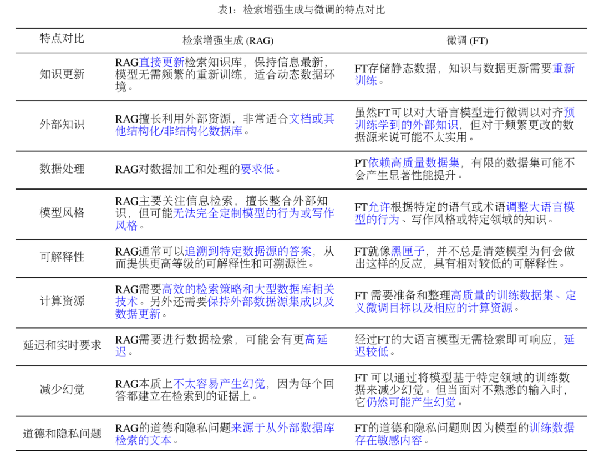

# RAG

- 论文题目：Retrieval-Augmented Generation for Large Language Models: A Survey
- 论文原文：https://arxiv.org/abs/2312.10997
- 官方仓库：https://github.com/Tongji-KGLLM/RAG-Survey

----

## **RAG 是什么？**

*图 1 RAG 技术在 QA 问题中的案例*

一个典型的 RAG 案例如图所示。如果我们向 ChatGPT 询问 OpenAI CEO Sam Atlman 在短短几天内突然解雇随后又被复职的事情。由于受到预训练数据的限制，缺乏对最近事件的知识，ChatGPT 则表示无法回答。RAG 则通过从外部知识库检索最新的文档摘录来解决这一差距。在这个例子中，它获取了一系列与询问相关的新闻文章。这些文章，连同最初的问题，随后被合并成一个丰富的提示，使 ChatGPT 能够综合出一个有根据的回应。

## **RAG 技术范式发展**

RAG 的概念首次于 2020 年被提出，随后进入高速发展。RAG 技术的演进历程如图所示，相关研究进展可以明确地划分为数个关键阶段。在早期的预训练阶段，研究的焦点集中在如何通过预训练模型注入额外的知识，以此增强语言模型的能力。随着 ChatGPT 的面世，对于运用大型模型进行深层次上下文学习的兴趣激增，这推动了 RAG 技术在研究领域的快速发展。随着 LLMs 的潜力被进一步开发，旨在提升模型的可控性并满足不断演变的需求，RAG 的研究逐渐聚焦于增强推理能力，并且也探索了在微调过程中的各种改进方法。特别是随着 GPT-4 的发布，RAG 技术经历了一次深刻的变革。研究重点开始转移至一种新的融合 RAG 和微调策略的方法，并且持续关注对预训练方法的优化。

*图 2 RAG 技术发展的科技树*

在 RAG 的技术发展过程中，我们从技术范式角度，将其总结成如下几个阶段：

### **朴素（Naive RAG）**

前文案例中展示了经典的 RAG 流程，也被称为 Naive RAG。主要包括包括三个基本步骤：

1. 索引 — 将文档库分割成较短的 Chunk，并通过编码器构建向量索引。
2. 检索 — 根据问题和 chunks 的相似度检索相关文档片段。
3. 生成 — 以检索到的上下文为条件，生成问题的回答。

### **进阶的 RAG（Advanced RAG）**

Naive RAG 在检索质量、响应生成质量以及增强过程中存在多个挑战。Advanced RAG 范式随后被提出，并在数据索引、检索前和检索后都进行了额外处理。通过更精细的数据清洗、设计文档结构和添加元数据等方法提升文本的一致性、准确性和检索效率。在检索前阶段则可以使用问题的重写、路由和扩充等方式对齐问题和文档块之间的语义差异。在检索后阶段则可以通过将检索出来的文档库进行重排序避免 “Lost in the Middle ” 现象的发生。或是通过上下文筛选与压缩的方式缩短窗口长度。

### **模块化 RAG（Modular RAG）**

随着 RAG 技术的进一步发展和演变，新的技术突破了传统的 Naive RAG 检索 — 生成框架，基于此我们提出模块化 RAG 的概念。在结构上它更加自由的和灵活，引入了更多的具体功能模块，例如查询搜索引擎、融合多个回答。技术上将检索与微调、强化学习等技术融合。流程上也对 RAG 模块之间进行设计和编排，出现了多种的 RAG 模式。然而，模块化 RAG 并不是突然出现的，三个范式之间是继承与发展的关系。Advanced RAG 是 Modular RAG 的一种特例形式，而 Naive RAG 则是 Advanced RAG 的一种特例。

*图 3 RAG 范式对比图*

## **如何进行检索增强？**

RAG 系统中主要包含三个核心部分，分别是 “检索”，“增强” 和 “生成”。正好也对应的 RAG 中的三个首字母。想要构建一个好的 RAG 系统，增强部分是核心，则需要考虑三个关键问题：**检索什么？什么时候检索？怎么用检索的内容？**

**检索增强的阶段**：在预训练、微调和推理三个阶段中都可以进行检索增强，这决定了外部知识参数化程度的高低，对应所需要的计算资源也不同。

**检索增强的数据源**：增强可以采用多种形式的数据，包括非结构化的文本数据，如文本段落、短语或单个词汇。此外，也可以利用结构化数据，比如带有索引的文档、三元组数据或子图。另一种途径是不依赖外部信息源，而是充分发挥 LLMs 的内在能力，从模型自身生成的内容中检索。

**检索增强的过程**：最初的检索是一次性过程，在 RAG 发展过程中逐渐出现了迭代检索、递归检索以及交由 LLMs 自行判断检索时刻的自适应检索方法。

*图 4 RAG 核心组件的分类体系*

## **RAG 和微调应该如何选择？**

除了 RAG，LLMs 主要优化手段还包括了提示工程 (Prompt Engineering)、微调 (Fine-tuning，FT)。他们都有自己独特的特点。根据对外部知识的依赖性和模型调整要求上的不同，各自有适合的场景。

RAG 就像给模型一本教科书，用于定制的信息检索，非常适合特定的查询。另一方面，FT 就像一个学生随着时间的推移内化知识，更适合模仿特定的结构、风格或格式。FT 可以通过增强基础模型知识、调整输出和教授复杂指令来提高模型的性能和效率。然而，它不那么擅长整合新知识或快速迭代新的用例。RAG 和 FT，并不是相互排斥的，它们可以是互补的，联合使用可能会产生最佳性能。

*图 5 RAG 与其他大模型微调技术对比*

## **如何评价 RAG？**

RAG 的评估方法多样，主要包括三个质量评分：**上下文相关性、答案忠实性和答案相关性**。此外，评估还涉及四个关键能力：噪声鲁棒性、拒答能力、信息整合和反事实鲁棒性。这些评估维度结合了传统量化指标和针对 RAG 特性的专门评估标准，尽管这些标准尚未统一。

在评估框架方面，存在如 RGB 和 RECALL 这样的基准测试，以及 RAGAS、ARES 和 TruLens 等自动化评估工具，它们有助于全面衡量 RAG 模型的表现。表中汇总了如何将传统量化指标应用于 RAG 评估以及各种 RAG 评估框架的评估内容，包括评估的对象、维度和指标，为深入理解 RAG 模型的性能和潜在应用提供了宝贵信息。

## **未来 RAG 还有哪些发展前景？**

RAG 的发展方兴未艾，还有哪些问题值得进一步去研究？我们从三个方面进行展望：

### **1.RAG 的垂直优化**

垂直优化旨在进一步解决 RAG 当前面临的挑战；

**长下文长度**。检索内容过多，超过窗口限制怎么办 ？如果 LLMs 的上下文窗口不再受限制，RAG 应该如何改进？

**鲁棒性**。检索到错误内容怎么处理？怎么对检索出来内容进行过滤和验证？怎么提高模型抗毒、抗噪声的能力。

**与微调协同**。如何同时发挥 RAG 和 FT 的效果，两者怎么协同，怎么组织，是串行、交替还是端到端？

**Scaling-Law**：RAG 模型是否满足 Scaling Law？RAG 是否会，或是在什么场景下会出现 Inverse Scaling Law 的现象？

**LLM 的角色**。LLMs 可以用于检索（用 LLMs 的生成代替检索或检索 LLMs 记忆）、用于生成、用于评估。如何进一步挖掘 LLMs 在 RAG 中的潜力？

**工程实践**。如何降低超大规模语料的检索时延？如何保证检索出来内容不被大模型泄露？

### **2. RAG 的多模态的拓展**

如何将 RAG 不断发展的技术和思想拓展到图片、音频、视频或代码等其他模态的数据中？一方面可以增强单一模态的任务，另一方面可以通过 RAG 的思想将多模态进行融合。

### **3. RAG 的生态**

RAG 的应用已经不仅仅局限于问答系统，其影响力正在扩展到更多领域。现在，推荐系统、信息抽取和报告生成等多种任务都开始受益于 RAG 技术的应用。与此同时，RAG 技术栈也在井喷。除了已知的 Langchain 和 LlamaIndex 等工具，市场上涌现出更多针对性的 RAG 工具，例如：**用途定制化**，满足更加聚焦场景的需求；**使用简易化**，进一步降低上手门槛的；**功能专业化**，逐渐面向生产环境。

*图 6 RAG 的生态系统概览*