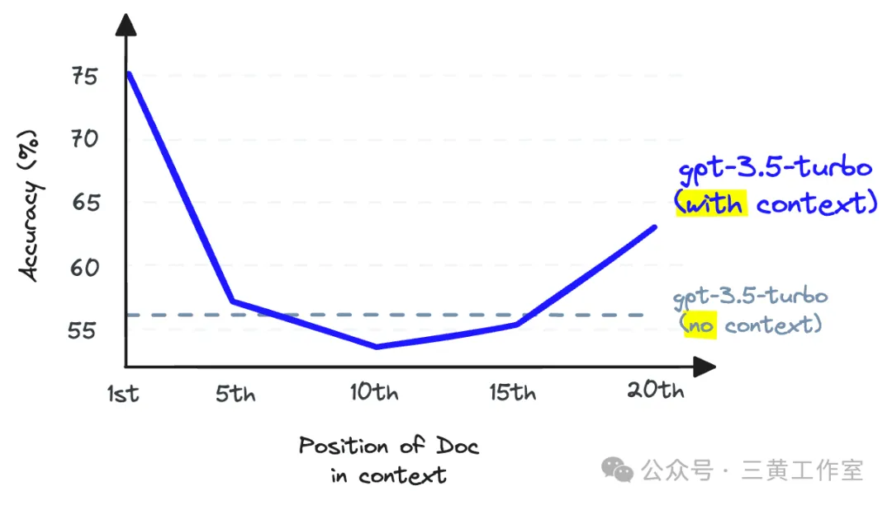
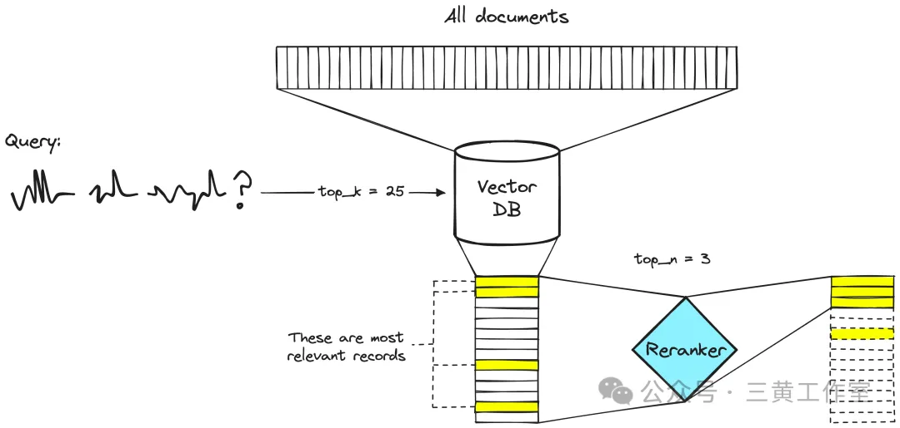
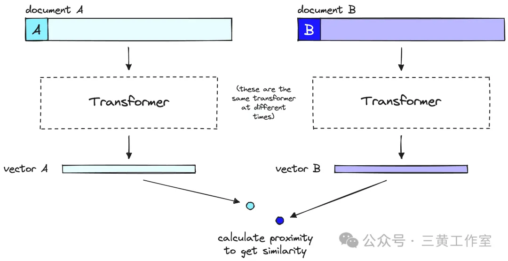

# 为什么RAG一定需要Rerank？

最容易、最快实施的解决方案——**重排序 Rerank**。

## 召回率与上下文窗口

当然，在介绍解决方案之前，咱们先聊聊单纯RAG存在的问题。使用RAG时，我们要对许多文本文档进行 **语义搜索** ——这些文档可能从数万篇到数百亿篇不等。

为了确保大规模搜索时的速度够快，我们通常会使用向量搜索。也就是说，把文本转换成向量，将它们都放入一个向量空间，然后使用像余弦相似度这样的相似性度量来比较它们与查询向量的接近程度。

要让向量搜索起作用，我们需要向量。这些向量本质上是将某些文本背后的 “含义” 压缩成（通常是）768维或1024维的向量。由于我们把这些信息压缩成了单个向量，所以会有一些信息丢失。

因为这种信息丢失，我们经常会发现，例如，向量搜索返回的前三篇文档可能会遗漏相关信息。相关信息可能会在我们设置的 `top_k` 阈值之外被检索到。

如果位置靠后的相关信息能帮助我们的LLM给出更好的回复，那该怎么办呢？最简单的方法就是增加返回的文档数量（提高 `top_k` 值），然后把这些文档都传给LLM。

这里我们衡量的指标是 **召回率** ，意思是 “我们检索到了多少相关文档” 。召回率不考虑检索到的文档总数，所以我们可以通过返回 *所有* 文档来 “操纵” 这个指标，从而得到 *完美* 的召回率。
$$
recall@K=relevantdocsreturned/relevantdocsindataset
$$
可惜的是，我们不能返回所有文档。LLM对于能接收的文本量是有限制的，我们把这个限制称为 **上下文窗口** 。有些LLM的上下文窗口很大，比如Anthropic的Claude，它的上下文窗口有100K个Token 。有了这么大的窗口，我们可以放入几十页的文本。

那么，我们能不能返回很多文档（虽然不能是全部），然后 “塞满” 上下文窗口来提高召回率呢？

答案还是不行。我们不能使用上下文填充的方法，因为这会降低LLM的 **召回性能** 。注意，这里说的是LLM的召回率，和我们之前讨论的检索召回率是不一样的。

当在上下文窗口中间存储信息时，与一开始就不提供该信息相比，LLM回忆该信息的能力会变差

研究表明，随着我们在上下文窗口中放入更多的标记，LLM召回率会降低。当我们塞满上下文窗口时，LLM也不太可能遵循指令，所以上下文填充不是个好主意。

那么问题来了：我们可以增加向量数据库返回的文档数量来提高检索召回率，但如果把这些文档都传给LLM，就会损害LLM的召回率。怎么办？

解决这个问题的办法是，通过检索大量文档来最大化检索召回率，然后通过 **最小化** 传给LLM的文档数量来最大化LLM召回率。要做到这一点，我们需要对检索到的文档重新排序，只保留对LLM最相关的文档，而实现这个操作，我们就要用到 **Rerank** 。

## Rerank的强大之处

重排序模型，也被称为 **交叉编码器** ，是一种模型，给定一个查询和文档对，它会输出一个相似度分数。我们用这个分数根据文档与查询的相关性对文档进行重新排序。

一个两阶段检索系统。向量数据库步骤通常会包括一个双编码器或稀疏嵌入模型。

我们都知道现在搜索工程师们在两阶段检索系统中使用Rerank已经有 *很长时间* 了。在这些两阶段系统中，第一阶段的模型（一个嵌入模型/检索器）从更大的数据集中检索出一组相关文档。然后，第二阶段的模型（Rerank）用来对第一阶段模型检索到的那些文档进行重新排序。

我们采用两阶段的方式，是因为从大数据集中检索出一小部分文档比重新排序一大部分文档要快得多。简单来说，Rerank运行速度慢，而检索器运行 *速度快* 。

### 为什么要用Rerank？

如果Rerank速度这么慢，那为什么还要用它们呢？答案是，Rerank比嵌入模型要准确得多。

双编码器准确性较差的原因在于，双编码器必须把一个文档所有可能的含义压缩成一个单一向量，这就意味着我们会丢失信息。此外，双编码器在查询方面没有上下文信息，因为在收到查询之前，我们并不知道查询内容（我们在用户查询之前就创建了嵌入）。

另一方面，Rerank可以将原始信息直接输入到模型中计算，这意味着信息丢失更少。因为我们是在用户查询时运行Rerank，所以还有一个额外的好处，那就是可以根据用户查询来分析文档的特定含义，而不是试图生成一个通用的、平均的含义。

Rerank避免了双编码器的信息丢失问题，但它们也有另一个代价—— *时间* 。

一个双编码器模型将文档或查询的含义压缩成一个单一向量。请注意，双编码器在用户查询时，以与处理文档相同的方式处理我们的查询。

假设你有4000万条记录，如果我们在V100 GPU上使用像BERT这样的 **小** 型重排序模型，那么为了返回一个查询结果，我们可能要等上50多个小时 。而使用编码器模型和向量搜索，同样的操作可以在不到100毫秒内完成。