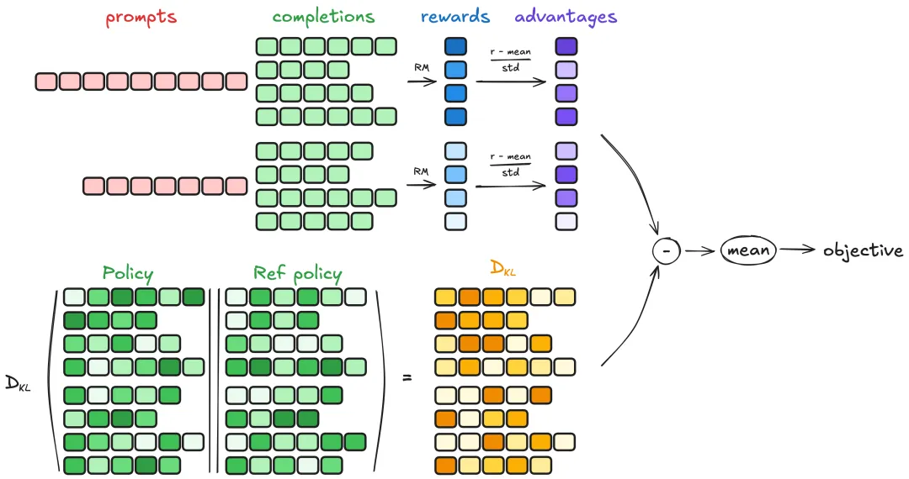

基于Qwen基座，使用OpenAI的gsm8k数据集，基于Qwen基座模型，复现类似DeepSeek-R1的Reasoning模型。


**基座模型**


Qwen2.5-0.5B-Instruct：https://modelscope.cn/models/Qwen/Qwen2.5-0.5B-Instruct


**数据集**


gsm8k：https://modelscope.cn/datasets/modelscope/gsm8k


**训练工具**


TRL：https://huggingface.co/docs/trl/main/en/grpo_trainer


**Notebook分享链接**


https://modelscope.cn/notebook/share/ipynb/c4d8363a/Qwen-GRPO.ipynb


本文使用TRL 的 GRPO Trainer 来训练Qwen基座模型（注，本文示例使用Qwen2.5-0.5B模型作为示例，但是生产场景建议使用3B及以上模型），如Zhihong Shao等人在论文《DeepSeekMath：在开放语言模型中突破数学推理的极限》中所述。


该论文的摘要如下：

> 数学推理因其复杂性和结构性而对语言模型构成了重大挑战。在本文中，我们介绍了 DeepSeekMath 7B，它继续使用来自 Common Crawl 的 120B 个数学相关标记以及自然语言和代码数据对 DeepSeek-Coder-Base-v1.5 7B 进行预训练。DeepSeekMath 7B 在不依赖外部工具包和投票技术的情况下，在竞赛级 MATH 基准上取得了令人印象深刻的 51.7% 的成绩，接近 Gemini-Ultra 和 GPT-4 的性能水平。DeepSeekMath 7B 在 64 个样本上的自一致性在 MATH 上达到 60.9%。DeepSeekMath 的数学推理能力归功于两个关键因素：首先，我们通过精心设计的数据选择管道充分利用了公开可用的网络数据的巨大潜力。其次，我们引入了近端策略优化（PPO）的一种变体——群相对策略优化（GRPO），它可以增强数学推理能力，同时优化 PPO 的内存使用情况。


**第一步：**安装依赖

其他的依赖在ModelScope的notebook镜像预装好，本次仅需要升级vllm和trl到最新版本，安装后请重启ipynb环境。

```
!pip install vllm -U
!pip install trl -U
```


**第二步：**定义prompt的结构，需要包含Reasoning tag

```python
import re
import torch
from modelscope.msdatasets import MsDataset
from modelscope import AutoTokenizer, AutoModelForCausalLM
from trl import GRPOConfig, GRPOTrainer

# Load and prep dataset

SYSTEM_PROMPT = """
Respond in the following format:
<reasoning>
...
</reasoning>
<answer>
...
</answer>
"""

XML_COT_FORMAT = """\
<reasoning>
{reasoning}
</reasoning>
<answer>
{answer}
</answer>
"""
```


**第三步：**导入 gsm8k 数据集并重构它以适应对话prompt的结构

```python
def extract_xml_answer(text: str) -> str:
    answer = text.split("<answer>")[-1]
    answer = answer.split("</answer>")[0]
    return answer.strip()

def extract_hash_answer(text: str) -> str | None:
    if "####" not in text:
        return None
    return text.split("####")[1].strip()

# uncomment middle messages for 1-shot prompting
def get_gsm8k_questions(split = "train") -> MsDataset:
    data =  MsDataset.load('modelscope/gsm8k', subset_name='main', split=split)
    data = data.map(lambda x: { # type: ignore
        'prompt': [
            {'role': 'system', 'content': SYSTEM_PROMPT},
            {'role': 'user', 'content': x['question']}
        ],
        'answer': extract_hash_answer(x['answer'])
    }) # type: ignore
    return data # type: ignore

dataset = get_gsm8k_questions()
```


**第四步：**使用自定义Rewarding函数。其中最重要的是“正确性”函数correctness_reward_func，它充当验证器（比较模型完成情况与答案）。其他三个是格式化函数，本文针对gsm8k数学场景，验证结果是否为int型，输出是否带Reasoning tag等。

```python
# Reward functions
def correctness_reward_func(prompts, completions, answer, **kwargs) -> list[float]:
    responses = [completion[0]['content'] for completion in completions]
    q = prompts[0][-1]['content']
    extracted_responses = [extract_xml_answer(r) for r in responses]
    print('-'*20, f"Question:\n{q}", f"\nAnswer:\n{answer[0]}", f"\nResponse:\n{responses[0]}", f"\nExtracted:\n{extracted_responses[0]}")
    return [2.0 if r == a else 0.0 for r, a in zip(extracted_responses, answer)]

def int_reward_func(completions, **kwargs) -> list[float]:
    responses = [completion[0]['content'] for completion in completions]
    extracted_responses = [extract_xml_answer(r) for r in responses]
    return [0.5 if r.isdigit() else 0.0 for r in extracted_responses]

def strict_format_reward_func(completions, **kwargs) -> list[float]:
    """Reward function that checks if the completion has a specific format."""
    pattern = r"^<reasoning>\n.*?\n</reasoning>\n<answer>\n.*?\n</answer>\n$"
    responses = [completion[0]["content"] for completion in completions]
    matches = [re.match(pattern, r) for r in responses]
    return [0.5 if match else 0.0 for match in matches]

def soft_format_reward_func(completions, **kwargs) -> list[float]:
    """Reward function that checks if the completion has a specific format."""
    pattern = r"<reasoning>.*?</reasoning>\s*<answer>.*?</answer>"
    responses = [completion[0]["content"] for completion in completions]
    matches = [re.match(pattern, r) for r in responses]
    return [0.5 if match else 0.0 for match in matches]

def count_xml(text) -> float:
    count = 0.0
    if text.count("<reasoning>\n") == 1:
        count += 0.125
    if text.count("\n</reasoning>\n") == 1:
        count += 0.125
    if text.count("\n<answer>\n") == 1:
        count += 0.125
        count -= len(text.split("\n</answer>\n")[-1])*0.001
    if text.count("\n</answer>") == 1:
        count += 0.125
        count -= (len(text.split("\n</answer>")[-1]) - 1)*0.001
    return count

def xmlcount_reward_func(completions, **kwargs) -> list[float]:
    contents = [completion[0]["content"] for completion in completions]
    return [count_xml(c) for c in contents]
```


原理参考：GRPO 是一种在线学习算法，这意味着它通过在训练期间使用训练模型本身生成的数据来迭代改进。GRPO 目标背后的直觉是最大化生成的完成的优势，同时确保模型保持接近参考策略。要了解 GRPO 的工作原理，可以将其分解为四个主要步骤：**生成完成、计算优势、估计 KL 散度和计算损失。**



图片来源：https://huggingface.co/docs/trl/main/en/grpo_trainer


**第五步：**设置训练参数，本文是在22G显存算力上运行，业务场景上建议使用两张卡，一张专门用作vLLM推理，另一张用于训练。

```python
model_name = "Qwen/Qwen2.5-0.5B-Instruct"

output_dir="outputs/Qwen-0.5B-GRPO"
run_name="Qwen-0.5B-GRPO-gsm8k"

training_args = GRPOConfig(
    output_dir=output_dir,
    run_name=run_name,
    learning_rate=5e-6,
    adam_beta1 = 0.9,
    adam_beta2 = 0.99,
    weight_decay = 0.1,
    warmup_ratio = 0.1,
    lr_scheduler_type='cosine',
    logging_steps=1,
    bf16=True,
    per_device_train_batch_size=1,
    gradient_accumulation_steps=4,
    num_generations=8,
    max_prompt_length=256,
    max_completion_length=200,
    num_train_epochs=1,
    save_steps=100,
    max_grad_norm=0.1,
    log_on_each_node=False,
    use_vllm=True,
    vllm_gpu_memory_utilization=.2,
    vllm_device="cuda:0",
    report_to="none" #I'm disabling Wandb.
)

model = AutoModelForCausalLM.from_pretrained(
    model_name,
    torch_dtype=torch.bfloat16,
    device_map=None
).to("cuda")

tokenizer = AutoTokenizer.from_pretrained(model_name)
tokenizer.pad_token = tokenizer.eos_token
```


**第六步：**构造trainer，开始训练

```python
trainer = GRPOTrainer(
    model=model,
    processing_class=tokenizer,
    reward_funcs=[
        xmlcount_reward_func,
        soft_format_reward_func,
        strict_format_reward_func,
        int_reward_func,
        correctness_reward_func],
    args=training_args,
    train_dataset=dataset,
    #peft_config=peft_config
)
trainer.train()
```


**第七步：**推理效果验证

```python
from modelscope import AutoModelForCausalLM, AutoTokenizer

model_name = "/mnt/workspace/outputs/Qwen-0.5B-GRPO/checkpoint-1868"

model = AutoModelForCausalLM.from_pretrained(
    model_name,
    torch_dtype="auto",
    device_map="auto"
)
tokenizer = AutoTokenizer.from_pretrained(model_name)

prompt = "Xiao Ming bought 4 apples, ate 1, and gave 1 to his sister. How many apples were left?"
messages = [
    {"role": "system", "content": SYSTEM_PROMPT},
    {"role": "user", "content": prompt}
]
text = tokenizer.apply_chat_template(
    messages,
    tokenize=False,
    add_generation_prompt=True
)
model_inputs = tokenizer([text], return_tensors="pt").to(model.device)

generated_ids = model.generate(
    **model_inputs,
    max_new_tokens=256
)
generated_ids = [
    output_ids[len(input_ids):] for input_ids, output_ids in zip(model_inputs.input_ids, generated_ids)
]

response = tokenizer.batch_decode(generated_ids, skip_special_tokens=True)[0]
print(response)
```

推理结果：

~~~
<reasoning> 

Initially, Xiao Ming had 4 apples. After eating 1 apple, he was left with 4 - 1 = 3 apples. Then, he gave 1 apple to his sister, leaving him with 3 - 1 = 2 apples. 

</reasoning>

<answer> 

2 

</answer>
~~~

