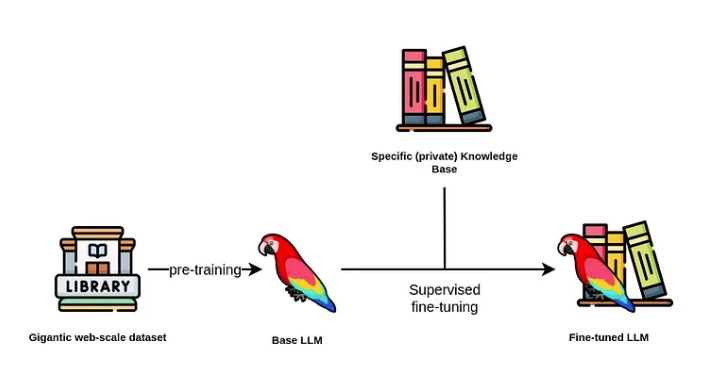
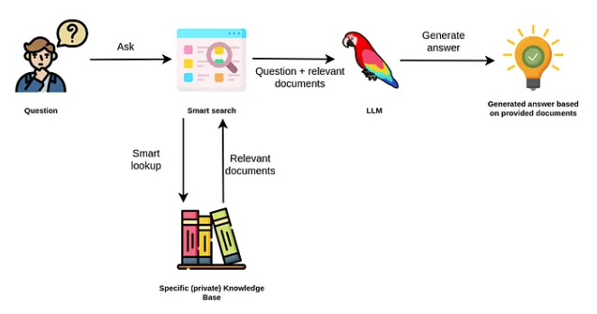

# 大模型调优的策略

大模型存在两个非常显著的问题：

* **知识截止**：模型只能了解其训练数据截止日期之前的知识，无法获取训练后发生的事件或私人/机密信息。
* **信息准确性**：由于模型训练的目标是生成逼真的文本而不是准确的信息，所以它可能会在缺失数据的情况下编造看似合理但实际上是错误的答案，这被称为幻觉问题。

因此，在使用大型模型时，需要谨慎验证其提供的信息，并采取措施来提高信息的准确性。

---

调优方法：

- 全面微调（FinTuning）：使用任务特定数据调整LLM的所有参数。
- 参数高效精细调整（PEFT）：修改选定参数以实现更高效的适应。
- 提示工程（prompt）：改进模型输入以指导其输出。
- RAG（检索增强生成）：将提示工程与数据库查询结合，以获得丰富的上下文答案。

---

## 微调（FinTuning）🐫

通过提供额外的问答对在监督训练阶段微调大模型，以此来优化大模型的性能。

通常，大多数人倾向于使用已经预训练好的基础大模型，以此避免对大模型进行预训练。因为基础大模型需要使用庞大的文本语料库进行预训练的，通常有数十亿甚至数万亿个标记，这意味着成本可能高达数十万甚至数百万美元。

选择基础大模型后，便可以开始下一步对其进行微调。由于 LoRa 和 QLoRA 等可用技术，微调这一步骤的成本相对便宜。

我们有一些利用大模型从知识图谱上下文构建问答对的想法。

然而，目前还有很多未知数。例如，能否为同一问题提供两个不同的答案，然后大模型以某种方式将它们组合到内部知识库中？

另一个考虑因素是，如果不考虑其关系，知识图中的某些信息是不相关的。因此，我们是否必须预先定义相关查询，或者是否有更通用的方法来实现？或者我们可以使用表示主语-谓语-宾语表达式的节点-关系-节点模式来生成相关对吗？

想象一下，我们以某种方式设法根据知识图谱中存储的信息生成包含问答对的训练数据集并对大模型进行微调，因此现在大模型包含了更新的知识。但是，对模型进行微调并没有解决知识截止问题，因为它只是将知识截止推迟到了更晚的日期。

因此，**建议仅在数据更新的速度较缓的情况下通过微调技术来更新 LLM 的内部知识**。例如，我们可以使用微调模型来提供旅游信息。

除了知识截止问题，目前微调还可以帮助减轻幻觉，但不能完全消除它们。

一方面原因在于大模型在提供答案时没有引用其来源。因此，你不知道答案是来自预训练数据、微调数据集，还是大模型编造的。

另一方面，如果我们使用 LLM 创建微调数据集，则可能存在另一个可能的虚假来源。

最后，经过微调的模型无法根据提出问题的用户自动提供不同的响应。同样，不存在访问限制的概念，这意味着与大模型互动的任何人都可以访问其所有信息，所以从根本上大模型就不能够获取机密信息。除了知识截止问题，目前微调还可以帮助减轻幻觉，但不能完全消除它们。

---
## RAG🐫
RAG 通过在语言模型生成答案之前，先从广泛的文档数据库中检索相关信息，然后利用这些信息来引导生成过程，极大地提升了内容的准确性和相关性。RAG 有效地缓解了幻觉问题，提高了知识更新的速度，并增强了内容生成的可追溯性，使得大型语言模型在实际应用中变得更加实用和可信。

大模型在自然语言应用程序中表现非常好，例如：文字概括、提取相关信息、实体消歧、从一种语言翻译成另一种语言，甚至可以将自然语言转换为数据库查询或脚本代码。

此外，以前的 NLP 模型通常是特定于领域和任务的，这意味着我们很可能需要根据我们的用例和领域来训练自定义自然语言模型。然而，由于大模型的泛化能力，单个模型可以应用于解决各种任务集合。

RAG 使用大模型根据数据源中额外提供的相关文档生成答案。

因此，我们不必依赖大模型的内部知识来得出答案。相反，大模型仅用于从我们传入的文档中提取相关信息并进行总结。

例如，ChatGPT 插件可以被视为 LLM 应用程序的 RAG。

与微调方法相比，RAG 具有一些明显的**优势**：

* **答案可以引用其信息来源**：这使我们可以验证信息并可能根据要求更改或更新基础信息

* **不太可能产生幻觉**：因为我们不依赖大模型的内部知识来回答问题，而仅使用相关文件中提供的信息。当我们将问题从 LLM 维护转换为数据库维护、查询和上下文构建问题时，更改、更新和维护 LLM 使用的基础信息会变得更加容易。

* 可以根据用户上下文或其访问权限对答案进行个性化。

另一方面，在使用检索增强方法时，我们应该考虑以下**限制**：

* 答案取决于**智能搜索工具**

* 应用程序需要访问我们的特定知识库，无论是数据库还是其他数据存储

* 完全无视语言模型的内部知识限制了可以回答的问题数量

* 有时大模型无法遵循指示，因此如果在上下文中找不到相关答案数据，则存在上下文可能被忽略或出现幻觉的风险。

---

## **汇总结论**

这里我分几个方面来进行对比吧。

首先是知识层面，这个应该是RAG使用者最关心的。

- RAG对知识的更新时间和经济成本更低。不需要训练，只需要更新数据库即可。
- RAG对知识的掌控力会更强，相比微调更不用担心学不到或者是遗忘的问题。
- 但是如果模型强缺乏某个领域的知识，足量数据的微调才能让模型对该领域有基本的概念，如果不具备领域知识基础，RAG仍旧无法正确回答。

然后是具体任务效果的问题。

- RAG相比微调能更容易获得更好的效果，突出的是稳定性、可解释性。
- （有点经验之谈了）对任务模式比较简单的任务，微调能触碰到更高的上限，但是对训练、数据等方面的要求会更苛刻。
- 幻觉方面，RAG从各种实测来看，短板基本都在检索模块，只要检索不出大问题，整体效果还是RAG比较有优势的。

第三块来聊成本了，现实应用很难避开成本的问题。

- 训练角度，RAG的成本就是更新数据库，但是微调就需要大量的显卡、时间资源。
- 推理角度，考虑到RAG本身需要检索，而且检索层为了确保检索准确，还需要很多额外工作，所以推理的耗时会比微调多，但具体多多少，就要看检索模块的复杂程度了，如果这里面还需要额外调大模型，那成本就会多很多，如果只是小模型之类的，那这个增加可以说是忽略不计。微调后的大模型直接使用，和原本模型的耗时一致。
- 系统拓展角度。随着项目的发展，大模型训练不一定能支撑多任务，而拿着大模型训好几个，对部署而言并不方便。

上面的内容所体现出来的，更多是RAG的优势，看起来似乎微调就没有什么好处了。但事实并非如此，RAG还是有很多不适用的环境的。

- RAG依赖知识库。如果不具备构造知识库的条件，那RAG无从谈起，例如没有具体的业务数据，或者是机器不支持支撑检索之类的。
- 业务需求并非对知识依赖。例如某些业务的话术生成，更多是对语言风格的约束，此时要么通过prompt解决，要么就是构造业务数据来进行训练即可，根本没有构造RAG的必要。
- 依赖实时信息而非固有信息。直接举例，对话摘要应该是大模型具有的比较强的能力，这种任务更多是依赖收到的对话记录，而非一些固有存储好的内容，此时通过工程手段直接把信息获取导入到模型即可，不需要把对应内容入库了。如果对对话摘要的内容不满意，则应该是通过prompt和微调来解决。当然有人可能会说通过few-shot的方式，可以用RAG，这个当然是可以的，但就不是必须了。
- 指令不生效或者领域知识完全不具备。这个不多解释了，大模型此处是短板，那即使是RAG，把答案摆在面前，也解决不了问题。
- 内容会受到检索结果局限。有些创造性的任务，本身是想通过大模型获取新的灵感，然而检索结果给到大模型后，大模型往往容易受到限制，这个限制在有些时候是好事，但并非所有时候。

---

## **技术方案分析案例**

借助两个比较典型的案例，大家应该能体会这两者的区别了。

### **产品百科问答**

电商场景下，客服都要具备一个能力，就是产品百科问答，用户会需要咨询某些商品的属性等细节消息，这是一个很具体的场景了。然而实际我们需要面对的，除了这个功能本身，还需要解决一个问题，即商品信息是需要更新和变化的，例如新商品上架、价格优惠修改等，这个信息是需要快速反映在问答系统中的，此时我们RAG非常有必要性。

- 商品信息的更新，不定期且频繁，这种更新通过微调来做，敏捷度不足，风险也比较高。
- 知识如果是结构化，本身用于微调训练并不方便，需要转化，但是数据库存储则比较方便。
- 商品型号很多很接近，容易混淆，大模型很容易出现“张冠李戴”现象。

### **日常工作工具**

写周报、灵感、工作日志、修改一份材料、查错查重、话术推荐、会议纪要之类的，类似这些问题，我们更多的日常使用方式就是prompt+大模型完成，我们做起来非常自然，可能顶多会根据自己的需求加一些例子，但往往不会优先考虑RAG。

- 对固有信息要求不高，甚至没有需求。
- 供给检索的数据，如果不是因为产品本身的信息收集，一般情况下很难获取，对RAG而言可以说是无米之炊了。
- 类似灵感的任务，案例反而可能限制模型发挥。
- 要求的更多是指令的执行能力，这个如果不具备，很可能就要考虑通过微调来整了。

---
