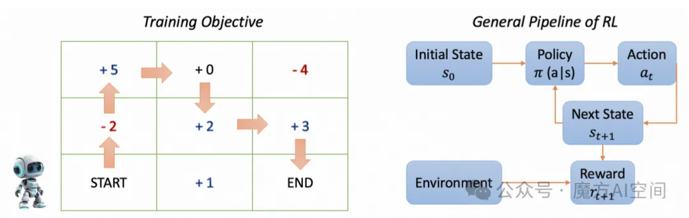
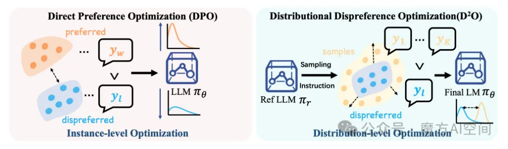

# 强化学习技术全面解读 SFT、RLHF、RLAIF、DPO

> **可带着如下问题深入阅读：**什么是**强化学习**以及**有哪些强化学习方法**，如何在训练过程中**引入人类反馈以优化模型行为**，以及如何在没有显式奖励模型的情况下**直接利用人类偏好数据**进行对齐。

## **01 引言**

**大语言模型（\**\*\*LLMs\*\**\*）**是一些在大量文本数据上预训练的复杂语言模型，使它们能够对**多样化的输入产生连贯流畅**的响应。**然而**，这些预训练的大语言模型（LLMs）的互动能力可能不一致，有时会导致响应虽然在技术上正确，但可能**对用户有害、有偏见、误导或与用户需求无关**。因此，在将这些预训练的LLMs的输出有效地应用于各种自然语言任务之前，**将其与人类偏好对齐至关重要**。

以前，一种广泛采用的将预训练LLMs的输出与人类偏好对齐的方法是**监督微调（SFT）**。这种方法进一步在**（指令、答案）对** 上对LLMs进行训练，其中 **“指令”代表给模型的提示，“答案”是根据指令得到的目标输出。SFT帮助引导大语言模型生成符合特定特征或领域知识的响应，使人类能够与大语言模型进行互动。**

**尽管SFT效果显著，但它也存在一些限制：**

在训练过程中，模型被限制学习人类提供的具体答案，而像困惑度（PPL）这样的指标会惩罚同义词的使用。一方面，这可能会**妨碍大语言模型泛化的能力**，因为像写作和总结这样的任务有多种有效的措辞方式。另一方面，它可能导致**在符合人类偏好方面的表现不佳**，因为在训练过程中没有纳入直接的人类反馈。

**为了缓解上述问题，采用强化学习（RL）来对齐大语言模型的输出与人类偏好，** 可以分为三个步骤：

> - 首先，在微调之前，训练一个奖励模型（或奖励函数）来近似人类偏好并为不同的大语言模型输出打分；
> - 然后，在每个微调迭代中，给定一条单独的指示，大语言模型生成多个响应，每个响应都由训练好的奖励模型打分；
> - 最后，策略优化，一种强化学习的优化技术，根据这些偏好分数更新大型语言模型的权重以改进预测。

使用RL对大语言模型进行微调可以同时解决上述问题。简而言之，**RL不是被限制学习一个特定的答案，而是根据各种偏好分数调整大语言模型，奖励任何有效且措辞得当的响应。**在另一条线上，**奖励模型旨在近似人类偏好**，使得可以直接根据人类偏好进行训练，并**促进大语言模型（\**\*\*LLM\*\**\*）产生令人印象深刻的创造力。**

## **02 基础知识：强化学习**

**强化学习（\**\*\*RL\*\**\*）**是机器学习中的一个关键方法，关注**智能体如何与环境互动**以最大化累积奖励。与依赖标注数据的**监督学习**和在未标注数据中发现模式的**无监督学习**不同，RL强调通**过试错获得直接反馈的学习**方式。**下面，我们依次描述RL的基本定义和一般流程。**

### **2.1 基本定义**

**在深入探讨训练过程之前，首先介绍一些相关术语：**

> **智能体**：训练来做正确决策的实体。在这个例子中，目标是训练机器人做出移动决策，所以**机器人就是智能体。**

**环境**：环境是**智能体与之互动的外部系统**。在本例中，随着训练过的机器人（智能体）在网格内移动，网格就充当了环境。

> **状态**：代表**智能体在每个时间 t 的位置**。在起始时刻，即时间_t_0，机器人（智能体）位于左下角，因此时间_t_0的状态是左下角，由坐标（0,0）表示。

**动作**：动作代表智能体在每个时间t在环境中可用的可能选择。例如，在开始时，即时间t0，机器人（智能体）可以选择向右或向上移动，使得这两个动作在t0时对智能体可用。

> **奖励**：由环境根据智能体在每个时间 采取的动作提供的信号或反馈。例如，在时间 ，机器人（智能体）向右移动将获得+5分的奖励，向上移动则会被扣除-1分的惩罚。

**策略**：一组决策策略，帮助智能体在每个时间 选择一个动作。在实践中，在时间，策略代表一种概率分布，指导机器人（Agent）向右或向上移动，以最大化其累积奖励。

### **2.2 强化学习流程**

**如图 1 中的训练示例来说明RL的全过程。** 在这个例子中，我们的目标是**训练一个机器人从正方形的左下角移动到右下角。** 此外，每个网格单元都有一个**奖励分数**，我们的目标是**最大化机器人的总分数**。

**一般的强化学习（RL）流程**可以表示为一个**马尔可夫决策过程（MDP）**。具体来说，代理从初始状态 s0 开始，在每个时间步骤 t，它基于当前状态选择一个动作at，然后进入一个新状态 st+1，代理获得奖励rt。这个循环持续进行，代理的目标是最大化其随时间累积的奖励。

映射到图1中的具体例子，在**初始时间t0**，机器人位于左下角，**由位置（状态）s0 表示**。随着时间的推移，在每个时间步骤t，机器人选择一个动作at（向上或向右移动）。这个动作使机器人从其当前位置 st 过渡到新位置 st+1，同时获得奖励t。**这种移动和收集奖励的循环持续进行**，直到机器人达到右上角的期望位置（状态），实现最大累积奖励的目标。

### **2.3 强化学习用于LLMs**

现在深入探讨使用**强化学习对大语言模型进行微调**的过程。这种方法旨在使大语言模型（LLMs）与期望的行为保持一致，提高其性能，**并确保其输出既有效又可靠**。

在强化学习中，有**六个关键组成部分**：**代理、环境、状态、动作、奖励和策略**。要将RL应用于微调大语言模型，第一步是将这些组件映射到LLM框架。LLMs擅长预测下一个token，它们以一系列tokens作为输入，并根据给定的上下文预测下一个token。从强化学习的角度来看，**可以将LLM本身视为策略**。

图2：用于大语言模型（LLMs）的强化学习（RL)框架

图2展示了针对大语言模型的具体强化学习框架。从一个通过监督学习训练过的指令调整模型开始，使其能够生成针对人类指令的结构化响应，应用以下两个步骤：

**步骤1：收集比较数据，并训练一个奖励模型。** 收集一个指令调整模型输出之间比较的数据集，其中标注者指出他们对于给定输入更倾向于哪个输出。然后，使用收集到的数据集来训练一个奖励模型（RM），以预测人类偏好的输出。

**步骤2：使用PPO针对奖励模型优化策略。** 利用奖励模型的输出来作为一个标量奖励，并使用PPO算法微调指令调整模型以优化该奖励。

### **2.4 强化学习方法（重点）**

**最近流行且具有强大能力的大语言模型几乎都利用强化学习（RL）在训练后过程中进一步提升其性能。**

这些模型采用的强化学习方法通常可以分为两个主要方向：

**1. 传统强化学习方法，如 RLHF 和 RLAIF。** 这些方法需要训练一个奖励模型，并涉及复杂且通常不稳定的过程，使用算法如近端策略优化（PPO）来优化策略模型。

**2. 简化方法，如 DPO 和 RPO。** 这些方法摒弃了奖励模型，提供了一个稳定、高效且计算效率高的解决方案。从监督微调到偏好优化

当下最流行的 LLMs 训练流程大概可以分为以下三步：**预训练(Pre-Training，PT)、监督微调(Supervised Fine-Tuning，SFT)和 偏好优化(PreferenceOptimization，PO)。**

预训练时，语言模型在超大规模的语料中进行学习，并初步掌握基本的语法规则、逻辑能力、常识知识等等。但是，用于训练的语料中难免存在偏离人类价值观的数据，使LLMs不足够符合人类的偏好。同时，预训练的目标仅仅是根据上文补全单词，无法使LLMs具备对话和问答能力。

**因此，为了实现更好的与人交互，进一步的训练成为必须。**

##### **2.4.1 监督微调（SFT）**

**SFT** 是指在预训练好的LLMs的基础上，利用带有**标签的数据集**来进一步训练模型，使之能够执行特定的下游任务。**通常\**\*\*LLM\*\**\*的\**\*\*PT\*\**\*过程是无监督的，Fine-tuning过程是有监督的。**

一种最简单的思路就是，照搬**预训练的目标函数和损失函数**进一步微调，但是改变数据的质量和格式。

**为了使\**\*\*LLMs\*\**\*对齐人类价值观**，可以专门选一些符合人类价值观的数据；为了让 LLMs适应对话和问答场景，可以构造一问一答或者多轮问答的数据。

**经过上述数据的训练**，模型将拟合这部分数据的特性，从而达到我们的目的，**这一过程也被称为监督微调。**

> **SFT\**\*\*之后为什么还要\*\**\*RLHF？**

**1、\**\*\*SFT\*\**\*无法提供负反馈**

- SFT训练是让模型学习条件概率的过程，即监督式学习nexttoken最大化条件概率。能学到什么是正确的nexttoken，但不能学到什么是错误的next token，没有负反馈机制。
- 正确的文本，它可能有局部是不正确的，这些局部错误的知识内容也会在 SFT 的过程中被模型学到。

**2、\**\*\*SFT\*\**\*无法“向后看”**

- SFT具有从前到后的单向注意力结构缺陷，每一个 token 都只看得见它前面的 tokens。
- 前半段错误，后半段在否定前半段的内容。SFT只参考前面信息的情况下，则是一种局部的有偏的训练方法。
- 通过人类反馈，RLHF可以帮助模型更好地理解复杂的上下文和长距离依赖关系。

**3、减少偏见和不当内容**

- SFT可能会生成带有偏见或不当内容的文本，因为它是从数据中学习语言模式，而数据本身可能包含偏见。
- RLHF可以通过奖励那些符合社会价值观和伦理标准的行为，减少模型生成带有偏见或不当内容的风险。

**4、提高安全性和伦理性**

- 由于SFT缺乏对生成内容的直接控制，可能会导致生成有害、不准确或不适当的内容。
- RLHF 可以通过人类的监督和反馈来提高模型的安全性和伦理性确保生成的内容是合适的。

**5、多样性和泛化性对比**

- 在模型的泛化性上，经过RLHF训练之后的效果是要优于只进行SFT阶段的模型。
- 在生成回复的多样性上，RLHF是要远远弱于SFT的。不管输入如何，经过了RLHF的模型都倾向于产生更相似的回复。

##### **2.4.2 基于人类反馈的强化学习（RLHF）**

**RLHF** 是一种训练方法，它将**强化学习\**\*\*（\*\**\*RL）与人类反馈**相结合，以使大语言模型（LLMs）与人类的**价值观、偏好和期望**保持一致。

**RLHF主要包括两个组成部分：**

**（1）收集人类反馈来训练奖励模型**，其中人类评估者通过对 LLM 输出的质量、相关性等因素进行评分或排名，提供反馈。然后使用这些反馈来训练一个奖励模型，该模型预测输出的质量，并在强化学习过程中作为奖励函数；

**（2）使用人类反馈进行偏好优化，**其中训练好的奖励模型指导LLM输出的优化，以最大化预测奖励，使LLM的行为与人类偏好保持一致。

##### **2.4.3 基于AI反馈的强化学习（RLAIF）**

**RLAIF**方法利用AI系统提供对 LLMs 输出的反馈，作为RL的替代或补充。具体方法包括：**（1）通过蒸馏AI反馈来训练奖励模型**；**（2）将LLMs作为奖励函数**；**（3）自奖励机制**。

**例如，Magpie** 介绍一种自我合成方法，该方法利用对齐的 LLMs 的自回归特性。通过使用预定义模板作为提示，模型自主生成用户查询及相应的响应，无需手动干预或初始种子问题。

具体来说，如下图所示，**使用对齐的\**\*\*LLMs\*\**\*（例如Llama-3-Instruct模型）合成400万个\**\*\*指令\*\**\*-响应对**，随后过滤数据集保留30万个高质量对，被用来微调Llama-3-8B-Base模型。值得注意的是，经过微调的模型表现与官方的Llama-3-8B-Instruct模型相当，后者**通过监督式微调和带有人类反馈的强化学习**在1000万个示例上进行训练。此外，使用**Magpie**微调的模型在诸如AlpacaEval之类的对齐基准测试中表现优异，超越了其他开放数据集上**训练的模型和偏好优化方法。**

##### **2.4.4 直接偏好优化（DPO）**

虽然**强化学习通过\**\*\*RLHF\*\**\*或 RLAIF 是有效的**，但通常因**RL算法**的挑战以及需要精确训练的奖励模型而复杂化。

**DPO**，通过直接使用人类偏好数据来微调大语言模型（LLMs），从而绕过了奖励模型。DPO将**目标从奖励最大化重新定义为偏好优化**，并提供了一种**直接且可能更稳健的途径**，用于将LLM输出与人类期望对齐。

## **03 流行的强化学习增强的LLMs**

**在本部分中**，简要概述这些**经过\**\*\*强化学习\*\**\*的语言模型**，然后解释**如何在它们的训练后过程中应用强化学习**。

表1：强化学习增强的大语言模型概览

### **3.1 InstructGPT**

**InstructGPT** 是**由\**\*\*OpenAI\*\**\*从 GPT-3 微调而来**的一系列语言模型，利用**人类反馈更好地与人类意图对齐**。该系列包括三种大小的模型：**参数量为13亿、60亿和1750亿**。

- 首先使用从 OpenAI API 收集的提示或由标注员编写的**监督学习进行微调**;
- 进一步使用 **RLHF** 进行微调。

**人类评估显示，**InstructGPT的输出比GPT-3更受青睐。值得注意的是，尽管参数量少100倍，13亿参数的InstructGPT模型仍优于1750亿的GPT-3。此外，InstructGPT在真实性和减少有害输出方面表现出改善，且在公共自然语言处理数据集上的性能损失最小。

**在应用\**\*\*强化学习\*\**\*（\**\*\*RL\*\**\*）之前**，作者训练一个从监督微调（SFT）模型初始化的60亿奖励模型（RM），去掉了最后的非嵌入层。该RM使用由标注员排名的比较数据进行训练。

在RL阶段，使用**PPO算法微调SFT模型**，以优化来自RM的标量奖励输出。为了解决公共自然语言处理数据集上的性能退化问题，尝试将预训练梯度和PPO梯度混合，从而产生了被称为**PPO-ptx的模型。**

### **3.2 GPT-4**

**GPT-4** 是由 OpenAI 开发的一个多模态大模型，能够处理**图像和文本输入以生成文本输出**。它在理解和生成自然语言方面表现出色，尤其是**在复杂和微妙场景中**。

评估显示，GPT-4在一系列人类设计的考试上表现异常优秀，通常超过大多数人类考生。此外，它的表现优于早期的大语言模型和大多数最先进的系统，后者通常依赖于特定基准的训练或手工设计的解决方案。

**在训练后的对齐阶段，GPT-4** 利用了 InstructGPT 中概述的**基于人类反馈的\**\*\*强化学习\*\**\*（\**\*\*RLHF\*\**\*）方法**。为了更有效地引导模型在更细粒度层面拒绝不适当的内容，作者进一步使用零样本GPT-4分类器作为基于规则的奖励模型（RBRM）。

**RBRM 在针对训练提示子集的\**\*\*PPO\*\**\*微调期间**，为GPT-4策略模型提供额外的奖励信号。RBRM接收一个提示（可选）、策略模型的输出以及一个人类编写的评分标准（例如，一套多项选择题式的规则），然后**根据评分标准对输出进行分类**。通过这种方法，**GPT-4 因拒绝有害内容和适当回应已知安全提示而受到奖励。**

### **3.3 Gemini**

**Gemini** 代表由谷歌开发的一系列**先进多模态模型**，以其令人印象深刻的能力而著称。最初版本的Gemini 1.0有三种尺寸——**Ultra, Pro, and Nano**，性能从大到小排列，每种尺寸都经过定制，以满足特定的计算限制和应用需求。

值得注意的是，最强大的变体 **Gemini-Ultra**在32项基准测试中**有30项取得了最先进的结果**，并且是第一个在多模态语言理解（MMLU）上达到人类专家级性能的模型，同时在所有**20项多模态基准测试**中刷新了新记录。

**Gemini** 实施了一个训练后过程，该过程**利用优化的反馈循环**，收集人机互动以推动关键性能领域的持续改进。在训练后的**基于人类反馈\**\*\*强化学习\*\**\*（\**\*\*RLHF\*\**\*）阶段**，采用了迭代方法，**通过强化学习逐步增强奖励模型**。

与此同时，奖励模型通过系统评估和数据收集不断进行精细化。这种动态相互作用**促进了\**\*\*强化学习\*\**\*和奖励模型的持续进步**，随着时间的推移性能逐渐提升。

### **3.4 InternLM2**

**InternLM2** 是由上海人工智能实验室开发的一系列开源大语言模型，提供三种尺寸：**18亿、70亿和200亿参数。**得益于创新的预训练和优化技术，该模型**在六个维度和30项基准测试**中展现了卓越的性能，包括长上下文建模和开放式主观评价。

为了进一步提升一致性，**InternLM2** 采用了一种名为**条件在线\**\*\*强化学习\*\**\*从人类反馈（COOL RLHF）**的新颖策略，并利用了**PPO算法**。

该方法解决了两个关键挑战。**第一个是偏好冲突**，即难以同时满足两个偏好，如**有用性和无害性**。**第二个挑战是奖励操纵**，随着模型规模的增大及其策略变得更加强大，这一问题变得更加严重。

**COOL RLHF**引入了一种**条件性奖励机制**，通过允许单个奖励模型根据特定的条件提示动态调整其关注点，**有效整合了多种偏好**。

此外，**COOL RLHF** 采用了一种多轮**在线 RLHF** 策略，包含两条不同的路径：**一条是快速通道**，用于立即、有针对性的改进；**另一条是慢速通道**，用于对奖励模型进行长期、全面的完善。这种方法使模型能够迅速适应新的人类反馈，同时降低奖励操纵的风险。

### **3.5 Claude 3**

**Claude 3** 是由 Anthropic 开发的一系列多模态大模型，在基准测试中表现出色。它包括三个具有不同能力和速度的模型：**Claude 3 Opus、Claude 3 Sonnet、Claude 3 Haiku。**

**Claude 3** 系列模型在**推理、数学和编程方面**的基准测试中展现了强大的性能，树立了新的标准。**Claude 3 Opus**在诸如 **GPQA、MMLU 和 MMMU** 等评估中取得了最先进的结果。**Claude 3** 在大多数文本任务中的俳句匹配或超越了克洛德2，而十四行诗和作品的表现则显著更好。

作者使用一种称为**宪法人工智能的技术**，在强化学习（RL）过程中使Claude 3与人类价值观保持一致。在RL阶段，宪法人工智能遵循类似于RLHF的过程，但它使用的是被称为 **RLAIF 的\**\*\*AI\*\**\*反馈**，而不是对无害性的人类偏好。具体来说，它将一组规则和原则的语言模型解释浓缩成一个**混合人类 / AI偏好模型（\**\*\*PM\*\**\*）**，其中**人类标签用于表示有帮助，AI 标签用于表示无害。**之后，他们使用带有此 PM 的RL来监督微调学习模型，从而得到由 **RLAIF 训练出的策略。**

### **3.6 Zephyr 141B-A39B**

**Zephyr 141B-A39B** 是 Zephyr 系列最新的语言模型，由Argilla、KAIST和Hugging Face合作开发。该模型是一个拥有共1410亿参数的专家混合体（MoE），其中390亿个参数是活跃的，从 **Mixtral-8x22B-v0.1** 微调而来。

**Zephyr 141B-A39B**采用了一种名为**赔率比率偏好优化（ORPO）的新型对齐算法**。这是一种直接且统一的对齐方法，可防止模型在监督微调过程中采用不希望的生成风格。

值得注意的是，**ORPO**不需要 SFT 热身阶段、奖励模型或参考模型，使其高度资源高效。该方法通过在标准的SFT负对数似然损失上增加基于优势比的惩罚，使模型能够区分首选和非首选的回应风格。

### **3.7 DeepSeek-V2**

由**DeepSeek-AI**开发的**DeepSeek-V2**，是一种强大的**专家混合（\**\*\*MoE\*\**\*）语言模型**，旨在**经济训练和高效推理。**它具有**创新架构，如多头潜在注意力（\**\*\*MLA\*\**\*）和 DeepSeekMoE**。

该模型总共有**2360亿个参数**，每个 token 激活210亿个参数，支持高达12.8K标记的上下文长度。该模型在包含8.1万亿 token 的高质量、多源语料库上进行预训练。评估显示，**DeepSeek-V2**及其聊天版本在开源模型中保持了顶尖的性能，**尽管仅有210亿个激活参数。**

**在\**\*\*强化学习\*\**\*（\**\*\*RL\*\**\*）阶段**，使用**组相对策略优化**（GRPO）来优化DeepSeek-V2以降低训练成本。与使用与策略模型大小相似的评价模型的常规RL方法相比，**后者增加了训练开支，GRPO**则省去了这一步骤，并从同一问题的多个输出计算得分来估计基线。

此外，采用两阶段的RL训练策略：**第一阶段专注于推理对齐**，**第二阶段专注于人类偏好对齐**，因为作者发现这些阶段表现出不同的特征。

### **3.8 ChatGLM**

由**智谱AI**开发的**ChatGLM**，代表了一系列不断发展的大语言模型。该系列的最新版本是GLM-4，其中包括变体如GLM-4、GLM-4-Air和GLM-4-9B。

这些模型在**超过10万亿个token的数据集上**进行预训练，主要以**中文和英文**为主，随后通过**SFT和RLHF**相结合的方式进行后期训练，以达到**高级的对齐质量。**

评估结果显示，**GLM-4**在一般基准测试如MMLU上能与甚至**超越GPT-4**，并且在**以中文对齐**为主的评估中，根据**Align-Bench**的测量显示出优越的性能。

强化学习阶段涉及**ChatGLM-RLHF**流程，**该流程增强了与人类偏好的对齐**。这个流程包括**三个主要组成部分**：**收集人类偏好数据、训练奖励模型以及优化策略模型**。为了支持大规模训练，**ChatGLM-RLHF**包括了减少奖励方差以实现稳定训练的方法，利用模型并行与融合梯度下降，并应用正则化约束以防止大语言模型中的灾难性遗忘。

实验结果证实，**与ChatGLM的监督微调版本相比**，ChatGLM-RLHF在**专注于对齐的任务上**取得了实质性的改进。

### **3.9 Nemotron-4 340B**

**Nemotron-4 340B** 是由NVIDIA发布的一系列模型，包括**Nemotron-4-340B-Base, Nemotron-4-340B-Instruct和 Nemotron-4-340B-Reward**。Nemotron-4-340B-Base模型是在一个高质量数据集的9万亿个token上进行训练的。在开发Nemotron-4-340B-Instruct的对齐过程中，超过98%的数据是**由模型合成生成的。**

**评估显示**，这些模型在广泛的评估基准上与开放获取模型竞争性地表现良好。

**在偏好微调阶段**，DPO和一种新的对齐算法，即**奖励感知偏好优化（\**\*\*RPO\*\**\*）**，都被用来通过多次迭代来改进模型。

RPO解决了DPO中的一个局限性，即**不考虑所选和被拒绝的响应之间的质量差异**，导致过拟合和有价值的响应被遗忘。

RPO使用来自**策略网络的隐式奖励来近似这一差距**，使模型能够更好地学习和保留卓越的反馈。

### **3.10 Llama 3**

由**Meta**开发的 **Llama 3** 是一组开源的基础语言模型，提供**80亿、700亿和4050亿参数**的不同规模。它在一个显著更大的语料库上进行训练，该语料库包含约**15万亿种多语言 token**，与用于Llama 2的 1.8 万亿 token 相比有显著增加。

**实证评估表明，Llama 3 在多样化的任务上与领先模型（如\**\*\*GPT-4\*\**\*）的性能相当。**

将 **Llama 3 与人类反馈对齐的训练后过程**涉及六轮迭代改进。每一轮都包括**监督微调（SFT），然后是DPO，最终模型是所有轮次输出的平均值。**对于每一轮，在新收集的偏好注释数据上训练一个奖励模型（RM），目标是在预训练的检查点上构建的各种能力。在SFT之后，使用从前几轮表现最佳的模型中获得的最新偏好数据批次，应用DPO来进一步优化SFT模型。

**为了提高DPO训练的稳定性**，实现了两个关键调整：**屏蔽DPO损失中的格式化token，并通过NLL（负对数似然）损失引入\**\*\*正则化\*\**\*。**

### **3.11 Qwen2**

**Qwen2** 由阿里巴巴开发，是一系列大语言模型，密集配置中的参数从5亿到720亿不等，以及一个具有570亿个参数的**混合专家变体**，其中每个token激活140亿个参数。它是在一个高质量、大规模的数据集上进行预训练的，该数据集包含超过7万亿个token，**涵盖了广泛的领域和语言。**

评估表明，**Qwen2优于大多数先前的开源权重模型，**包括其前身Qwen1.5，并在一系列基准测试中提供了有竞争力的结果，包括**语言理解、生成、多语言能力、编码、数学和推理。**

**Qwen2 的偏好微调过程包括两个主要阶段：离线学习和在线学习。在离线阶段**，Qwen2 使用**DPO**进行优化，**旨在基于预先编译的偏好数据集**，最大化对同一提示的两个响应之间的似然差异。**在线阶段，**模型通过**利用奖励模型从当前策略模型生成的多个响应中选择的偏好对**，实时持续改进。此外，还采用了**在线合并\**\*\*优化器\*\**\*来最小化对齐成本。**

### **3.12 Gemma 2**

**Gemma 2** 由谷歌开发，**是 Gemma 家族中最新的轻量级、最先进的开放模型**，参数规模从20亿到270亿不等。该模型采用了几项对Transformer架构的成熟修改，包括**交错局部-全局注意力和组查询注意力。**

实验表明，**这些模型在它们所拥有的大小下表现最佳**，甚至为比它们大2到3倍的模型提供了有竞争力的替代方案。

与Gemma 1.1类似，**在训练后\**\*\*RLHF\*\**\*阶段，**作者使用高容量模型作为自动评分器来调整超参数并减轻奖励黑客攻击。然而，**与Gemma 1.1不同，**他们采用的奖励模型比政策模型大一个数量级。**这种奖励模式专门针对会话能力而设计，强调多回合互动。**

### **3.13 Starling-7B**

**Starling-7B** 是由**加州大学伯克利分校**开发的一个强大的70亿参数聊天模型，**专注于与人类对有用性和无害性的偏好保持一致。**

**该模型通过使用RLAIF在名为Nectar的高质量偏好数据集上对 Openchat-3.5 进行微调**，该数据集包含通过提示GPT-4对回应进行排名而生成的380万个成对比较。

**因此，该模型在MT-Bench上的得分从7.81提高到8.09，在AlpacaEval上的得分从88.51%增加到91.99%，在Chatbot Arena上的人类评估ELO从1072上升到1087。**

**在RLAIF过程中对\**\*\*PPO\*\**\*算法进行了几项改进**，以提高训练稳定性和鲁棒性。

**首先**，引入一个**恒定的正面奖励来控制长度**，以防止过度冗长。这一调整有助于解决早期阶段奖励模型的高度负面奖励可能导致策略模型在仅经过几次梯度更新后变得过于冗长的问题。

**其次**，**对评论家模型进行预训练**，以减少由于随机初始化的评论家导致的早期性能下降。

**第三**，**对演员和评论家模型进行全面参数调整**，而不是仅调整前四层，以在强化学习阶段最大化性能提升。

### **3.14 OpenAI o1**

**OpenAI\**\*\*的o1\*\**\*是一个新开发的大语言模型，针对复杂推理进行优化，利用\**\*\*强化学习\*\**\*进行训练。在生成回应之前，o1会进行深入的内部思考过程，**使其能够在各种推理任务中表现卓越。该模型在许多**具有挑战性的任务上**显著超越了GPT-4o：在**Codeforces编程竞赛**中排名第89百分位，在**AIME数学竞赛**中位列前500名参与者，并且在**科学\**\*\*基准测试\*\**\*如GPQA中**的准确率超过了博士级别。

o1的训练涉及一种大规模强化学习算法，该算法**通过详细的思维链（CoT）**强调生产性思维，并以高数据效率实现。**为了保持模型的未过滤推理能力**，不对内部思维过程应用任何政策合规或用户偏好训练，这也提供了一个独特的机会来**理解模型的原始思维过程**。

这种方法使o1能够在训练过程中**完善策略、纠正错误并解构复杂问题**。值得注意的是，随着训练计算量的增加以及测试时计算量的扩展，**模型的表现有所提升。**

## **04 总结**

**本文系统性回顾了\**\*\*强化学习\*\**\*增强大语言模型的研究现状**，涵盖了**强化学习的基础知识、主流的强化学习增强大语言模型、基于人类反馈（RLHF）和人工智能反馈（RLAIF）的强化学习技术，以及直接偏好优化（DPO）方法**。旨在帮助研究人员了解该领域的挑战与进展，以推动**强化学习增强大语言模型技术**的进一步发展。