# 梳理各类Large Language Model关系和实现要点

各类Large Language Model，从模型角结构的角度、模型类型的角度进行划分。

从基础模型结构的角度，预训练语言模型可以分为**Encoder-only**、**Decoder-only**、**Encoder-Decoder**三种类型。从市面上的LLM类型来看，可以分为GPT、LLaMA、PaLM等3个最主要的类型。下面，将这6个类别的模型，以及其中各个模型之间的关系给大家详细介绍一下。

## **模型结构划分：Encoder-only模型**

**Encoder-only**类型的模型只包含encoder 网络，代表性网络包括**BERT**及其变种，RoBERTa，ALBERT，DeBERTa，XLM，XLNet，UNILM。

**BERT**：主要包含Embedding模块、Transformer编码器、FCN网络等3个组件。embedding模块将输入文本转化为一系列的embedding vectors；Transformer编码器将embedding向量转换为上下文表示向量；FCN将上下文表示向量转化为one-hot向量。训练过程使用masked language model（MLM）、next sentence prediction两个预训练任务。预训练后的BERT可以通过增加classifier layer，对多种自然语言理解任务进行fine-tune。其他各个变体的差异如下。

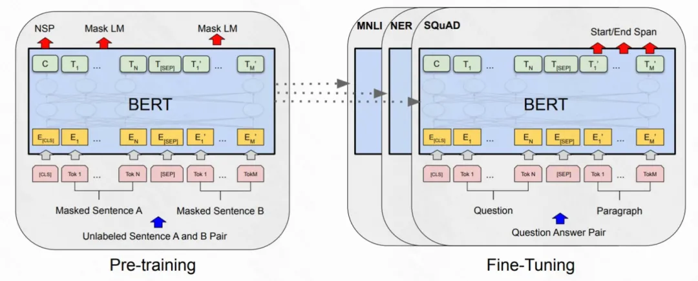

**RoBERTa**：通过一系列的模型选择设计和训练策略来提升模型的鲁棒性，例如修改一些超参数，移除next sentence prediction任务，使用更大的mini-batches和学习率；

**ALBERT**：使用两个parameter-reduction技巧来降低内存消耗并提升训练速度：将embedding矩阵分解为两个矩阵 && 分组进行重复层的切分；

**DeBERTa**: 通过两种技术优化BERT和RoBERTa，一是disentangled attention mechanism，每个word使用两个embedding，包括内容embedding和position embedding，根据这两个embedding计算attention weight；二是enhanced mask decoder，在pre-train阶段结合解码层的绝对位置来预测被mask的token；

**ELECTRA**：使用了一个新的pre-train任务，replaced token detection（RTD）。RTD任务的数据采样比masked language model 效率更高。RTD 通过从小型生成器生成token来替换原句中的token，然后通过判别式模型来判断输入是否被生成样本替代。

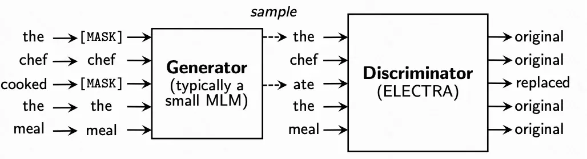

**XLMs**: 扩展BERT成为跨语种语言模型，使用了两个方法：基于单语种的非监督方法 && 一种利用并行数据和新的跨语种语言模型目标的监督方法。

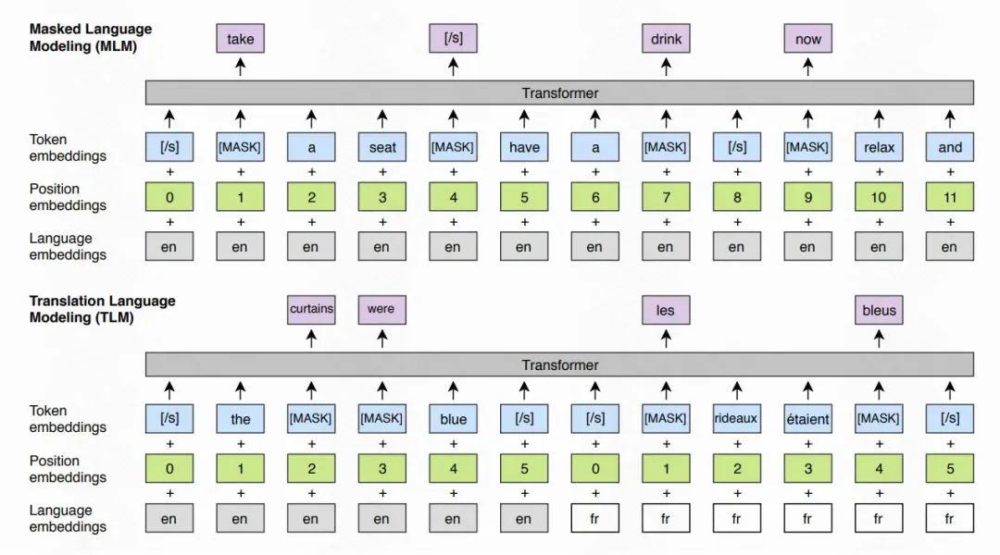

## **模型结构划分：Decoder-only模型**

典型的decoder only PLMs是OpenAI的GPT-1和GPT-2。

**GPT-1** 是一个仅有decoder的transformer model，使用差异化的无标注语料库上，以自监督的形式进行Generative Pre-Training(GPT),  并在每个特定的下游任务中进行判别式的fine-tuning，在多个自然语言处理任务中拿到了非常好的表现。

**GPT-2** 没有任何显示监督，在包含百万量级网页的大型网页文本数据集进行训练，在特定的自然语言处理任务上表现优异。GPT-2延续了GPT-1的模型框架，仅做少许改动：layer normalization 移动到了每个sub-block的输入层；在最后的self-attention block之后增加额外的layer normalization层；对初始化进行修改，以考虑残差路径上的累积和残差层权重的缩放；词典size增加到5025，context size从512增加到1024。

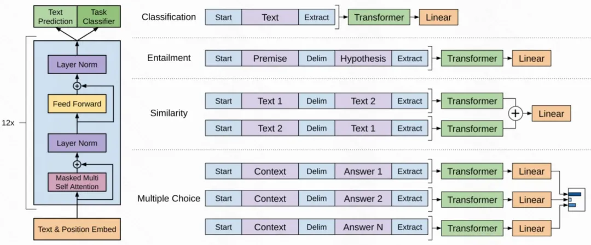

## **模型结构划分：Encoder-Decoder模型**

所有的自然语言处理任务可以理解成一个sequence2sequence的生成式任务，因此encoder-decoder是解决所有自然语言理解和生成任务的统一范式。代表性的model包括T5，mT5，MASS，BART。

**T5**:  Text-to-Text Transfer Transformer model。通过引入统一的框架，将迁移学习有效地用于NLP，在这个框架中，所有的NLP任务都被视为是text-text的生成式任务。mT5是一个T5的多语种变种，使用了基于爬虫的包含101种语言的数据集；

**MASS**：MAsked Sequence to Sequence pre-training。采用encoder-decoder框架在给定句子部分片段的情况下对该sentence进行重构。encoder 接收被随机mask fragment(连续多个token)的sentence作为输入，decoder预测被mask的fragment。因此MASS联合训练了生成embedding的encoder和用来生成的decoder；

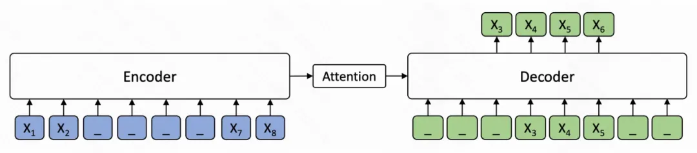

**BART**：标准的seq2seq translating 模型框架，预训练中使用增加了任意噪声的文本，重建原始的文本。

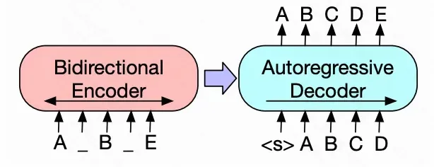

## **模型类型划分：GPT类型**

**GPT**由OpenAI开发，decoder-only Transformer-based language models。包含GPT-1, GPT-2, GPT-3, InstrucGPT, ChatGPT, GPT-4, CODEX, and WebGPT。其中GPT-1和GPT-2是开源模型，GPT-3/GPT-4非开源，仅可以通过API访问。

**GPT-3**：自回归语言模型，175 billion 参数。GPT-3 可以仅通过与模型进行文本交互来制定任务和小样本演示，而不经任何梯度更新和fine-tune直接应用到任意下游任务。GPT-3在大量NLP任务上表现优异，包括翻译，QA，完形填空，以及一些需要即时推理或领域适应的问题。

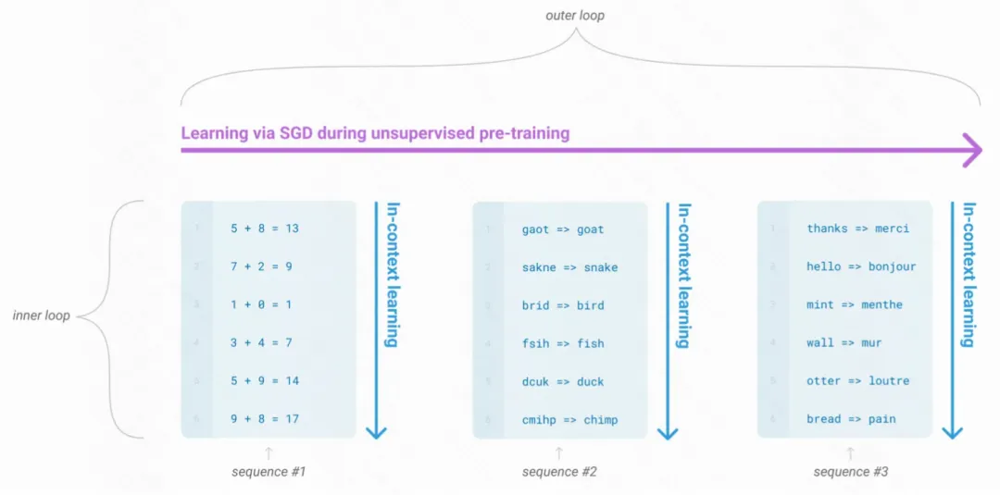

**CODEX**：2023年OpenAI在M3发布，由GPT-3派生，使用从GitHub收集的代码语料库进行fine-tune, 可以解析自然语言并生成相应的代码。

**WebGPT**: 从GPT-3衍生，经过微调，可以使用基于文本的web浏览器回答开放式问题。使用三个步骤进行训练：首先使用人类示范数据来学习模仿人类的浏览行为，然后学习reward function来预测人类的偏好，最后通过强化学习和拒绝采样来改进WebGPT，来优化reward function.

**InstructGPT**: 使得GPT可以遵循预期的人类指令。使用人类反馈进行微调，将语言模型与用户意图在多个任务上进行对齐。从一组标注员编写的提示和通过 OpenAI API 提交的提示开始，收集标注员示例及所需的模型行为作为数据集。在该数据集上fine-tune GPT3，然后收集人类对模型输出的打分，使用强化学习进一步对模型进行fine-tune。这种方法被称为人类反馈中强化学习（RLHF，Reinforcement Learning from Human Feedback）。由此产生的 InstructGPT 模型优化了输出的真实性，并减少了toxic output，同时在公共 NLP 数据集上的性能回归最小。

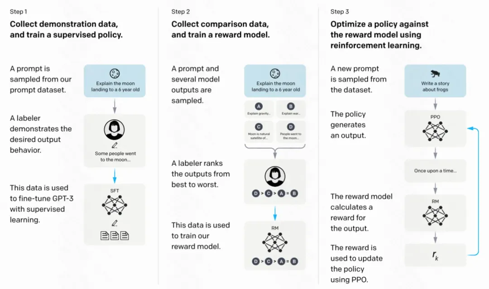

**ChatGPT**: Chat Generative Pre-trained Transformer，20221130发布，是一款聊天机器人，用户通过引导对话来完成各种任务，如回答问题、查找信息、文本摘要等。ChatGPT 由 GPT-3.5（之后由 GPT-4 ）提供支持，它是 InstructGPT 的姐妹模型，经过训练可以遵循prompt中的指令并提供详细的回应。

**GPT-4**：是 GPT 家族中最新、最强大的 LLM。GPT-4 于 2023 年 3 月推出，是一款多模态 LLM，它可以将图像和文本作为输入并生成文本输出。尽管在一些现实场景最有挑战性的任务中，GPT-4 表现不如人类，但它在多个专业性和学术性的benchmark上都拿到了和人类相似的性能表现，例如在模拟律师资格考试中在参赛者中位列Top 10%。与早期的 GPT 模型相似，GPT-4 首先经过预训练，在大型文本语料库预估next token，然后使用 RLHF 进行微调，使得模型行为与人类期望的行为保持一致。

## **模型类型划分：LLaMA类型**

LLaMA是由Meta发布的开源模型。首版LLaMA模型2023年2月发布，参数量在7billion到65billion之间。开源模型一般要比非开源模型发展更迅猛一些。LLaMA发展迅速，基于LLaMa/LLaMA-2的instruction-following 模型在快速出现，例如Code LLaMA/Gorilla/Giraffe/Vigogne/Tulu 65B/Long LLaMA/Stable Beluga2等。

**LLaMA**：2023年2月发布，包含7B-65B的参数，在万亿级别的tokens上进行训练。模型结构是在GPT-3的基础上做了一些改动：激活函数使用SwiGLU替换ReLU；使用旋转位置嵌入代替绝对位置嵌入；使用均方根归一化层替换标准归一化层。LLaMA-13B在绝大多数基线上表现优于GPT-3 (175B)，因此成为LLM领域一个较好的基线。

**LLaMA-2**：2023年7月和微软合作推出LLaMA-2,  包含基础语言模型和对话模型，即LLaMA-2 Chat。在多个公开数据集上表现优于其它开源模型。LLaMA-2首先使用开源数据预训练语言模型，然后通过有监督微调得到初版LLaMA-chat。之后使用RLHF、拒绝采样和近端策略优化对LLaMA-chat进行迭代优化。在RLHF 阶段，人工反馈的累积对修改奖励模型非常重要，可以防止奖励模型发生较大变化并影响模型训练的稳定性。

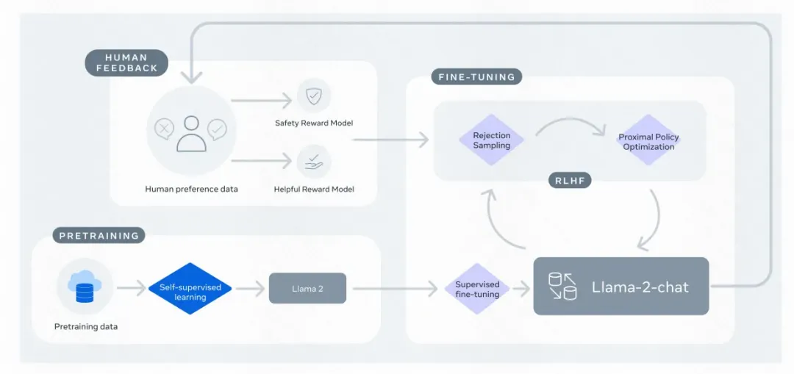

**Alpaca**：在GPT-3.5（text-davinci-003）基础上，基于self-self-instruct方式，使用52k instruction-following demonstration对模型进行微调。是一个小成本模型，在学术研究领域是一个cost-effective的模型。在self-instruct数据集上，尽管体积小但是可以拿到和GPT-3.5相似的表现

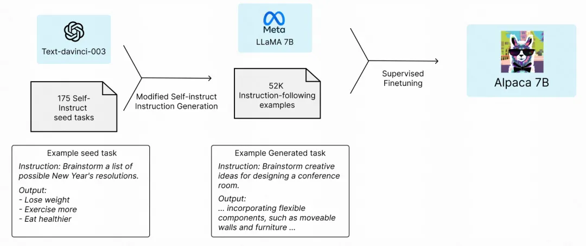

**Vicuna-13B**：The Vicuna team使用从ShareGPT收集到的user-shared对话，对LLaMA进行finetune。使用GPT-4作为evaluator，Vicuna可以媲美OpenAI ChatGPT / GG Bards 90%的能力，同时在 90% 以上的情况下优于 LLaMA 和 Stanford Alpaca 等其他模型。Vicuna-13B 模型训练的计算需求相对较小，训练成本仅为 300 美元。

**QLoRA**：使用instruction-following数据对LLaMA进行预训练，但是微调阶段非常高效，例如可以在单个48G GPU上对65B参数的模型进行微调。通过一个冻结的4位量化预训练语言模型将梯度帆船到低秩适配器（LoRA, Low Rank Adapters）。只需要在单个GPU上进行24小时的微调，就可以在Vicuna基准上的表现优于所有已发布模型，达到了ChatGPT的99.3%；

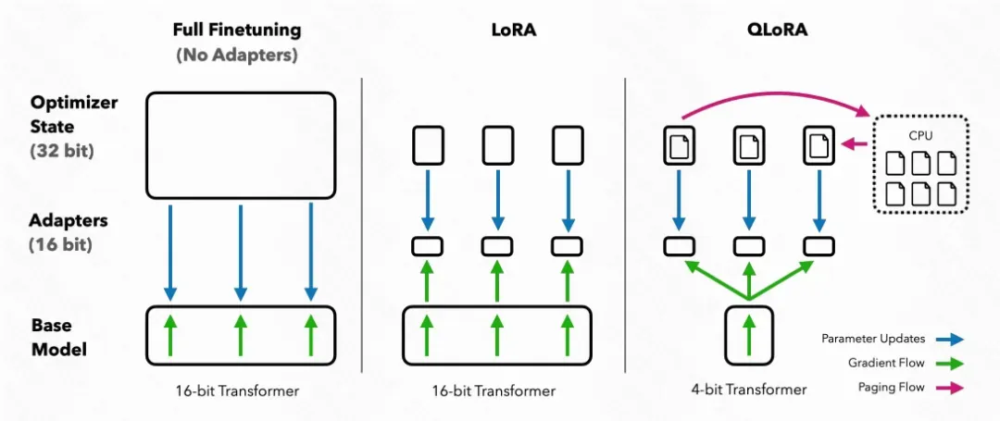

**Koala**：基于LLaMA的instruction-following语言模型，但是会更关注交互数据，包括用户输入和ChatGPT等优质非开源聊天模型生成的response。在一些真实用户prompt上人工评估，Koala-13B性能可与STOA的聊天模型媲美；

**Mistral-7B**：出于模型的性能和效率考虑的7B参数的语言模型，在所有benchmark上表现优于开源的13B参数模型 LLaMA-2-13B。在因果推断、数学和代码生成上表现由于开源的34B模型LLaMA-34B。Mistral 模型利用grouped-query attention进行更快的推理，并结合sliding window attention有效地处理任意长度的序列并降低推理成本。

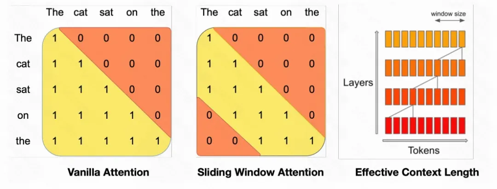

## **模型类型划分：PaLM类型**

**PaLM**(Pathways Language Model)由Google研发，最早的PaLM模型在2022年4月官宣，在2023年公开发布，有540B参数，基于transformer的LLM模型。该模型在由 7800 亿个词条组成的高质量文本语料库上进行预训练，这些词条涵盖了广泛的自然语言任务和用例，训练时在Pathways系统（可以高效跨多TPU进行训练）在6144 TPU v4 芯片上进行。PaLM 在数百个自然语言理解和生成任务基准上，few-shot learning的结果都取得了SOTA的效果。PaLM-540B 不仅在一系列多步推理任务中超越了SOTA微调模型，而且在最近发布的 BIG-bench 基准测试中也与人类表现不相上下。

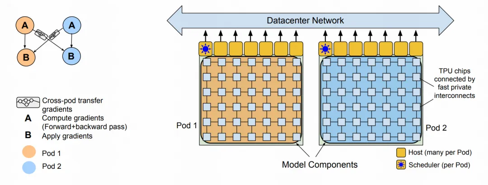

**UPaLM**：使用 UL2R 在 PaLM 上持续训练 8B、62B 和 540B 规模的模型，这是一种使用 UL2 的混合降噪目标分几步持续训练 LLM 的方法，计算资源大约能节约2倍

**Flan-PaLM**：对UPaLM进行instruction-finetune。使用更多的任务、更大的模型尺寸以及chain-of-throught数据。在 1.8K个任务上经过指令微调的 Flan-PaLM-540B 的表现远胜于 PaLM-540B（平均 +9.4%）。微调数据包括 473 个数据集、146 个任务类别和 1836 个总任务。

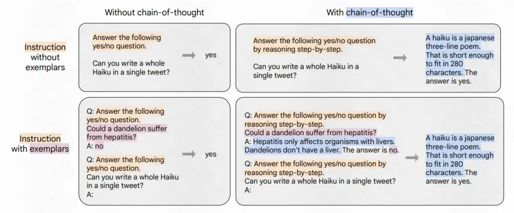

**PaLM-2**：PaLM-2 计算效率更高，与PaLM相比会有更好的多语种和推理能力。PaLM-2 使用多个目标任务进行预训练，通过对英语、多语种和推理任务的广泛评估，不同的模型尺寸的PaLM-2 ，在下游任务的模型性能都有显著提升，同时展现了比PaLM 更快、更高效的推理能力。

**Med-PaLM**：是为医疗问答提供高质量回答的特定领域模型，使用instruction prompt tuning（使用少量示例 && 节省参数地将LLM对齐到新领域）。尽管不如人类临床医生，但是在多个医疗保健任务上取得了非常encouraging的结果。

## **模型类型划分：其他LLM类型**

有一些LLM不在上述三个LLM家族中，但也是一些非常受欢迎的LLM，拿到了优异的性能并推进LLM领域的发展。例如：FLAN、GLM、Orca、Gemini等。

其中Gemini团队推出了一系列新的多模态模型，这些模型在图像、音频、视频和文本理解方面表现出了优异的能力。Gemini 系列包括三个版本：Ultra 用于高度复杂的任务，Pro 用于增强性能和大规模部署能力，Nano 用于设备应用程序。Gemini 架构建立在 Transformer 解码器之上，通过使用高效的注意力机制， 可支持 32k 上下文长度的训练

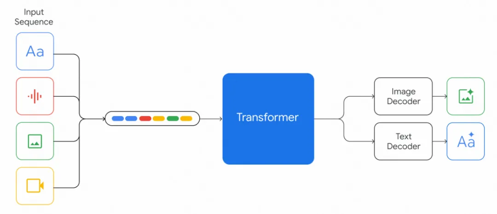