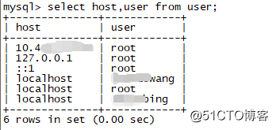

# centos安装mysql8.0

> Centos7 安装 `mysql` 的详细过程，我会通过 “环境准备”、“安装步骤”、“过程遇到的问题” 来告诉你如何操作~

### 1. 环境准备

- 服务器
- CentOS 7.5 64位
- MySQL（因 `MySQL8` 和 `MySQL8以下` 版本的安装方式有些微差别）

### 2. 步骤：安装 MySQL8

安装 `mysql-server`

```bash
rpm -Uvh https://repo.mysql.com/mysql80-community-release-el7-3.noarch.rpm

rpm --import https://repo.mysql.com/RPM-GPG-KEY-mysql-2023

yum install mysql-server -y
```

安装成功后重启`mysql`服务

```bash
service mysqld restart
```


查看mysql运行状态

~~~bash
service mysqld status
~~~


设置密码

```bash
# 登录mysql并输入密码
mysql -u root -p

# mysql8 修改密码方式
alter user 'root'@'localhost' identified by '';
```

> 注：
>
> - mysql8初次安装后，需要先通过`cat /var/log/mysqld.log | grep password `命令查看密码，修改密码时，需要 **符合长度，且含有数字、小写或大写字母、特殊字符**
> - 无需重启数据库即可生效（且`mariadb`自动会被替换，不再生效）

错误：

ERROR 1819 (HY000): Your password does not satisfy the current policy requirements

set global validate_password.policy=0;

进入 `/etc/my.cnf` 配置编码规则（无需配置的话，可跳过本步骤）

  注：这里的字符编码必须和 `/usr/share/mysql/charsets/Index.xml` 中一致

```bash
[mysqld]
# 设置3306端口
port=3306

# 设置mysql数据库的数据的存放目录
datadir=/var/lib/mysql
socket=/var/lib/mysql/mysql.sock

log-error=/var/log/mysqld.log
pid-file=/var/run/mysqld/mysqld.pid
 
# 允许最大连接数/
max_connections=10000
 
# 允许连接失败的次数。这是为了防止有人从该主机试图攻击数据库系统
max_connect_errors=10
 
# 服务端使用的字符集默认为UTF8
#character-set-server=UTF8
 
# 创建新表时将使用的默认存储引擎
default-storage-engine=INNODB
 
# 默认使用“mysql_native_password”插件认证
default_authentication_plugin=mysql_native_password
# 密码设置，新版本好像无法直接使用命令降低密码复杂度
plugin-load-add=validate_password.so
validate-password=FORCE_PLUS_PERMANENT

# 设置mysql客户端默认字符集
default-character-set=utf8
bind-address = 0.0.0.0
 
[client]
# 设置mysql客户端连接服务端时默认使用的端口
port=3306
default-character-set=utf8
user=mysql
```

配置远程连接授权设置（配置后即可用navicat建立连接），至此完成安装！

```bash
# 如果要授权的用户是新用户，而不是root账户，则要先新建用户；如果要授权的是root用户，则跳过此命令
CREATE USER '这里填你要新建的账户'@localhost  IDENTIFIED BY '这里填要新建账户的密码';

# 授权，以root账户为例
GRANT ALL PRIVILEGES ON *.* TO 'root'@localhost WITH GRANT OPTION;

FLUSH PRIVILEGES;

那如何撤销权限呢？
撤销所有权限：
如果你想撤销所有权限，但保留用户账号，可以使用以下命令：

REVOKE ALL PRIVILEGES ON *.* FROM 'root'@'localhost';
撤销特定权限：
如果只想撤销特定的权限（例如，SELECT、INSERT等），你需要指定这些权限。例如，撤销SELECT和INSERT权限：

REVOKE SELECT, INSERT ON *.* FROM 'root'@'localhost';
撤销GRANT OPTION：
如果之前赋予了GRANT OPTION，单独撤销这个权限可以用：

REVOKE GRANT OPTION ON *.* FROM 'root'@'localhost';
最终清理：
如果你想彻底删除这个用户，可以使用：

DROP USER 'root'@'localhost';
但请注意，这一步骤会删除用户，可能会影响到依赖该用户的其他应用或设置，所以请谨慎操作。

执行这些命令之后，记得使用FLUSH PRIVILEGES;命令来确保更改立即生效：

FLUSH PRIVILEGES;
在进行这些操作时，确保你有足够的权限来执行这些命令，通常需要作为MySQL的超级用户（如root）进行。
```

1. 使用 navicat 连接时报错

- 报错：`1045 - Access denied for user 'root'@'xxx'(using password: YES)`，解决方式见**上述步骤6**
- 报错：`1130 - Host 'xxx' is not allowed to connect to this MySQL server`，解决方式见下`第3点_过程遇到的问题`

配置指定IP远程连接授权设置

~~~bash
# 开启3306端口
firewall-cmd --zone=public --add-port=3306/tcp --permanent
# 关闭3306端口
firewall-cmd --zone=public --remove-port=3306/tcp --permanent

firewall-cmd --reload
~~~


### 3. 过程问题

1）报错：`1130 - Host 'xxx' is not allowed to connect to this MySQL server`

解决方法：

```bash
1、执行登陆MySQL mysql -u root -p 密码
2、执行use mysql;
3、执行update user set host = '%' where user = 'root';
4、执行FLUSH PRIVILEGES;
```


2、查看用户表

首先要先指定使用mysql数据库，然后再进行查询操作

```
//进入mysql数据库mysql> use mysql
myql> select Host,User from user;
```

下面的列表就是查询user表后可以访问数据库的指定的Ip地址




2. 报错
   mysql.connector.errors.NotSupportedError: Authentication plugin 'caching_sha2_password' is not supported

   ~~~bash
   问题产生的原因：
   
   　　从MySQL 8.0开始，默认的用户认证插件从mysql_native_password变成了caching_sha2_password
   　　
   查看现有的用户
   
   mysql> select user, host, plugin from mysql.user;
   +------------------+-----------+-----------------------+
   | user             | host      | plugin                |
   +------------------+-----------+-----------------------+
   | root             | %         | caching_sha2_password |
   | mysql.infoschema | localhost | caching_sha2_password |
   | mysql.session    | localhost | caching_sha2_password |
   | mysql.sys        | localhost | caching_sha2_password |
   +------------------+-----------+-----------------------+
   使用连接mysql的账号root加密规则为 caching_sha2_password
   
   修改加密规则
   
   ALTER USER 'root'@'%' IDENTIFIED WITH 'mysql_native_password' BY '`1qaz2wsx#EDC';
   FLUSH PRIVILEGES;
   
   再次查看现有的用户
   
   mysql> select user, host, plugin from mysql.user;
   +------------------+-----------+-----------------------+
   | user             | host      | plugin                |
   +------------------+-----------+-----------------------+
   | root             | %         | mysql_native_password |
   | mysql.infoschema | localhost | caching_sha2_password |
   | mysql.session    | localhost | caching_sha2_password |
   | mysql.sys        | localhost | caching_sha2_password |
   +------------------+-----------+-----------------------+
   
   ~~~

   

### MySQL修改密码规则

登录进入mysql，输入命令mysql>select @@validate_password_policy;该命令为了查看密码的安全等级；

```sql
mysql>select @@validate_password_policy;
```

查看密码相关参数；

```sql
mysql> show variables like 'validate_password%';
+-------------------------------------------------+--------+
| Variable_name                                   | Value  |
+-------------------------------------------------+--------+
| validate_password.changed_characters_percentage | 0      |
| validate_password.check_user_name               | ON     |
| validate_password.dictionary_file               |        |
| validate_password.length                        | 8      |
| validate_password.mixed_case_count              | 1      |
| validate_password.number_count                  | 1      |
| validate_password.policy                        | MEDIUM |
| validate_password.special_char_count            | 1      |
+-------------------------------------------------+--------+

6 rows in set (0.00 sec)
```

> validate_password.dictionary_file：用于验证密码强度的字典文件路径；
> validate_password.length  ：密码最小长度，参数默认为8，它有最小值的限定；
> validate_password.mixed_case_count ：密码至少要包含的大写字母和小写字母的个数；
> validate_password.number_count 密码至少要包含的数字个数；
> validate_password.policy：密码强度等级检查；（默认是1，即MEDIUM）
> validate_password.special_char_count：密码至少要包含的特殊字符个数；

```sql
mysql> set global validate_password.policy=0;
Query OK, 0 rows affected (0.00 sec)

mysql> set global validate_password.mixed_case_count=0;
Query OK, 0 rows affected (0.00 sec)

mysql> set global validate_password.number_count=0;
Query OK, 0 rows affected (0.00 sec)

mysql> set global validate_password.special_char_count=0;
Query OK, 0 rows affected (0.00 sec)

mysql> set global validate_password.length=3;
Query OK, 0 rows affected (0.00 sec)
```

> 1.修改密码强度等级为0，即是LOW；
> 2.修改密码至少要包含的大写字母和小写字母的个数为0；
> 3.修改密码至少要包含的数字个数为0；
> 4.修改密码至少要包含的特殊字符的个数为0；
> 5.修改密码的长度最小个数为3；

修改后的密码相关参数；

```sql
mysql> show variables like 'validate_password%';
+--------------------------------------+-------+
| Variable_name                        | Value |
+--------------------------------------+-------+
| validate_password_dictionary_file    |       |
| validate_password_length             | 3     |
| validate_password_mixed_case_count   | 0     |
| validate_password_number_count       | 0     |
| validate_password_policy             | LOW   |
| validate_password_special_char_count | 0     |
+--------------------------------------+-------+
6 rows in set (0.00 sec)
```


# 卸载

## 1.1、卸载 MariaDB（❗）

### 1.1.1、MariaDB

> MySQL 的一个分支，主要由开源社区维护。

1. `CentOS 7+` 不再默认使用 MySQL 数据库，而是 MariaDB 数据库。
2. 直接安装 MySQL 会与 MariaDB 的文件冲突。

👉 安装 MySQL 之前，先卸载自带的 MariaDB。

### 1.1.2、卸载

> 步骤

1. **查看版本**：有则需要卸载。

   ```SH
   rpm -qa|grep mariadb
   ```

2. **卸载**：复制文件名，执行以下指令。

   ```SH
   rpm -e --nodeps 文件名
   ```

3. **确认卸载**：

   ```SH
   rpm -qa|grep mariadb
   ```

## 1.1.1、Mysql

> **指令**：
>
> ```SH
> rpm -qa|grep mysql
> ```

- **没有输出**：说明当前系统没有安装 MySQL，开始安装。

- **有输出**：显示的 MySQL 不是想要的版本，则卸载。

  ```SH
  # 停止服务
  systemctl stop mysqld
  
  # 卸载
  rpm -e --nodeps mysql文件名
  
  find / -name mysql
  
  rm -rf /var/lib/mysql
  rm -rf /usr/lib64/mysql
  rm -rf /etc/my.cnf
  rm -rf /root/.mysql_sercret
  rm -rf /var/log/mysqld.log
  
  ```