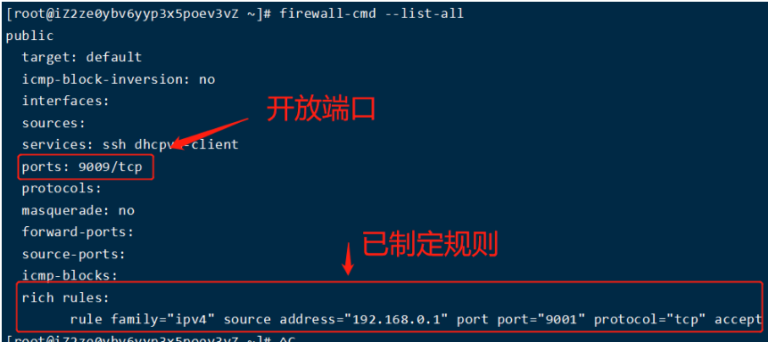

# 关闭centos防火墙

1、命令行界面输入命令“**systemctl status firewalld.service**”并按下回车键。

2、然后在下方可以查看得到“**active（running**）”，此时说明防火墙已经被打开了。

3、在命令行中输入**systemctl stop firewalld.service**命令，进行关闭防火墙。

4、然后再使用命令**systemctl status firewalld.service**，在下方出现**disavtive（dead）**，这权样就说明防火墙已经关闭。

5、再在命令行中输入命令“**systemctl disable firewalld.service**”命令，即可永久关闭防火墙。

---

# 查看所有端口

~~~bash
netstat -ntlp
66.42.102.39
~~~


# centos7对指定ip外开放端口

在CentOS 7[操作系统](http://www.volcengine.com/product/velinux)中，我们可以使用防火墙来控制网络访问。如果我们需要对[指定IP](http://www.volcengine.com/product/eip)开放特定端口，可以使用以下步骤：

1. 确认需要开放的端口

在开放端口之前，需要确认需要开放哪些端口。可以通过以下命令来列出系统中当前开放的端口：

```
firewall-cmd --list-ports
```

如果需要开放的端口已经在列表中，可以直接跳过以下步骤。

1. 添加新的规则

在CentOS 7中，可以使用[firewall](http://www.volcengine.com/product/cloudfirewall)-cmd命令来添加新的防火墙规则。以下命令将针对[指定IP](http://www.volcengine.com/product/eip)地址开放T[CP](http://www.volcengine.com/product/cp)端口：

```
firewall-cmd --zone=public --add-rich-rule='rule family="ipv4" source address="192.168.1.1/32" port protocol="tcp" port="80" accept'
```

在该命令中，'192.168.1.1/32'是需要开放端口的[IP](http://www.volcengine.com/product/eip)地址，'80'是需要开放的端口号。如果需要开放多个端口，可以将端口号用逗号隔开。

1. 保存规则

添加新的[防火墙](http://www.volcengine.com/product/cloudfirewall)规则后，需要将其保存在配置文件中，以便重启后仍然有效。可以使用以下命令将当前[防火墙](http://www.volcengine.com/product/cloudfirewall)规则保存在配置文件中：

```
firewall-cmd --runtime-to-permanent
```

该命令将当前[防火墙](http://www.volcengine.com/product/cloudfirewall)规则保存在/etc/[firewall](http://www.volcengine.com/product/cloudfirewall)d目录下的permanent.xml文件中。

1. 重启[防火墙](http://www.volcengine.com/product/cloudfirewall)

完成以上步骤后，需要重启[防火墙](http://www.volcengine.com/product/cloudfirewall)以使更改生效。可以使用以下命令来重启[防火墙](http://www.volcengine.com/product/cloudfirewall)：

```
systemctl restart firewalld
```

这样，我们就可以对CentOS 7[操作系统](http://www.volcengine.com/product/velinux)中[指定IP](http://www.volcengine.com/product/eip)地址开放特定端口了。

以下是一些示例代码，用于开放T[CP](http://www.volcengine.com/product/cp)端口80和[443](http://www.volcengine.com/product/certificate-center)，[IP](http://www.volcengine.com/product/eip)地址为192.168.1.1：

```
# 添加新的规则
firewall-cmd --zone=public --add-rich-rule='rule family="ipv4" source address="192.168.1.1/32" port protocol="tcp" port="80" accept'
firewall-cmd --zone=public --add-rich-rule='rule family="ipv4" source address="192.168.1.1/32
```

```
#删除已设置规则
firewall-cmd --permanent --remove-rich-rule="rule family="ipv4" source address=" 192.168.0.0" port protocol="tcp" port="9001" accept"
firewall-cmd --reload
```

使用命令

~~~bash
# 查看状态
firewall-cmd --list-all
~~~


