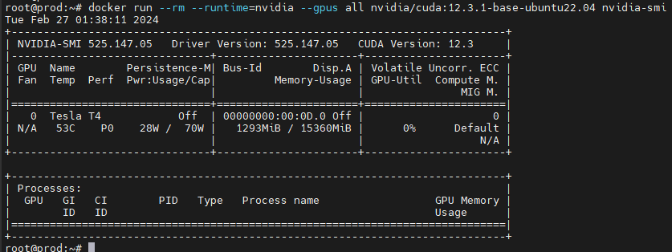

# Ubuntu 22.04 LTS中安装Docker，并支持显卡步骤如下：

```python
# 第1步：更新软件存储库
sudo apt-get update

# 第2步：卸载旧版本的Docker
sudo apt-get remove docker docker-engine docker.io

# 第3步：在 Ubuntu 18.04 上安装Docker
sudo apt install docker.io

# 第4步：安装 nvidia-docker
# 参考： https://docs.nvidia.com/datacenter/cloud-native/container-toolkit/latest/install-guide.html
# Setup the package repository and the GPG key:
distribution=$(. /etc/os-release;echo $ID$VERSION_ID) \
      && curl -fsSL https://nvidia.github.io/libnvidia-container/gpgkey | sudo gpg --dearmor -o /usr/share/keyrings/nvidia-container-toolkit-keyring.gpg \
      && curl -s -L https://nvidia.github.io/libnvidia-container/$distribution/libnvidia-container.list | \
            sed 's#deb https://#deb [signed-by=/usr/share/keyrings/nvidia-container-toolkit-keyring.gpg] https://#g' | \
            sudo tee /etc/apt/sources.list.d/nvidia-container-toolkit.list

# 更新源和安装 nvidia-container-toolkit
sudo apt-get update
sudo apt-get install -y nvidia-container-toolkit

# 配置Docker守护进程以识别NVIDIA容器运行时
sudo nvidia-ctk runtime configure --runtime=docker

# 重启 Docker
sudo systemctl restart docker

# 测试
# docker pull nvidia/cuda:12.5.0-base-ubuntu22.04
# docker run --rm --runtime=nvidia --gpus all nvidia/cuda:12.5.0-base-ubuntu22.04 nvidia-smi
```

正常的话，测试结果显示：



## 安装 Docker Compose

### 方式 1、使用二进制文件安装 Docker Compose

运行下列命令安装最新稳定的 Docker Compose 文件：

```
sudo curl -L "https://github.com/docker/compose/releases/download/v2.27.1/docker-compose-$(uname -s)-$(uname -m)" -o /usr/local/bin/docker-compose
```

如果有更新版本，只需要将上述命令中的 v2.27.1 替换为最新的版本号即可。请不要忘记数字前的 “v” 。

最后，使用下列命令赋予二进制文件可执行权限：

```
sudo chmod +x /usr/local/bin/docker-compose
```

运行下列命令检查安装的 Docker Compose 版本：

```
docker-compose version
Docker Compose version v2.27.1
```