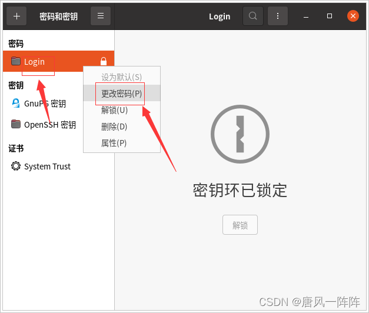

# Windows远程连接ubuntu22.04及桌面优化

## 1. Ubuntu系统设置

[](https://bucket.decoderx.cc/blog-image/Ubuntu2204RemoteDesktop/1.png)

点击 ① 找到设置，如下图 ②

[](https://bucket.decoderx.cc/blog-image/Ubuntu2204RemoteDesktop/2.png)

点击打开设置页面，接着点击左侧 ① 打开屏幕共享配置，然后点开 ② 打开远程桌面配置

[](https://bucket.decoderx.cc/blog-image/Ubuntu2204RemoteDesktop/3.png)

按照下图中打开 ① 远程桌面和 ② 远程控制 开关，注意这里如果不打开远程控制，只能观看屏幕不能控制屏幕。接着配置 ③ 远程用户名和密码

[](https://bucket.decoderx.cc/blog-image/Ubuntu2204RemoteDesktop/4.png)

配置完成后，就可使用windows远程桌面连接了，如果连接不上，尝试关闭Ubuntu的防火墙 `sudo ufw disable`

## 2. 配置xrdp

上面的配置方式虽然可以远程ubuntu了，但是远程用户密码每次系统重启的时候都会改变，而且一旦电脑息屏远程就自动断开，即不能扒掉鼠标键盘及显示器，让它完全作为一个远程电脑使用。有了xrdp就可以解决以上问题，下面开始在ubuntu22.04上安装配置xrdp。

### 2.1 先更新系统

```
sudo apt update
```

### 2.2 安装xrdp

```
sudo apt install xrdp
```

### 2.3 启动并启用 XRDP 服务

```
# 启动xrdp
sudo systemctl start xrdp 
# 开机启动xrdp
sudo systemctl enable xrdp
# 查看xrdp服务状态,如果状态未激活，先不管，后面重启后自动就激活了。
systemctl status xrdp
```

### 2.4 防火墙配置

如果系统开启了防火墙，需要开放3389端口。未开启防火墙，可以忽略此步骤

```
sudo ufw allow from any to any port 3389 proto tcp
```

### 2.5 执行以下命令重启系统

```
reboot
```

> 经过重启，使用windows远程桌面应该可以访问ubuntu了，账号就是你ubuntu正常登录的账号，密码就是登录密码。这里可能会输入三次密码，输就完了。然后你会发现这个远程桌面比较卡，下面就是优化操作。

## 3. 桌面优化

### 3.1添加配置文件

也可以使用vim或者nano，这里我使用 gedit 命令

```
gedit ~/.xsessionrc 
```

打开后添加如下内容，直接复制

```
export GNOME_SHELL_SESSION_MODE=ubuntu
export XDG_CURRENT_DESKTOP=ubuntu:GNOME
export XDG_CONFIG_DIRS=/etc/xdg/xdg-ubuntu:/etc/xdg
```

### 3.2 重启xrdp服务

```
sudo systemctl restart xrdp.service
```

如果有问题，使用`sudo reboot`重启系统，***个人建议重启系统***

### 3.3 Windows远程连接

打开windows远程桌面，快捷指令是 `mstsc` 连接界面如下：

[](https://bucket.decoderx.cc/blog-image/Ubuntu2204RemoteDesktop/5.png)

输入ubuntu账号密码就可以进入远程桌面了，十分丝滑。

## 4. 其他

我个人这里把ubuntu这台电脑作为了Linux开发使用电脑，因为我自己平常使用的是Windows系统，所以就把这台电脑作为了一个远程的开发专用机器，没有插鼠标键盘和显示器。但是我在这台电脑上的显示输出HDMI口上插了一个显卡诱骗器（可以淘宝或者京东买一个几块钱），让这台电脑以为一直插着显示器，目的就是让显卡一直有输出，进一步解决黑屏或者花屏的现象吧。


# Ubuntu系统设置中的远程桌面密码重启后变了

## 问题描述

在使用windows自带的远程桌面连接工具连接Ubuntu服务器时，当服务器重启时，设置的远程桌面密码会自动改变，导致连接失败。

------

## 解决方案：

> 使用命令打开操作面板

```powershell
seahorse
```


将密钥登录密码改为空，然后修改远程桌面认证密码即可。


# [windows远程桌面连接 Ubuntu 20.04黑屏 xrdp黑屏](https://www.cnblogs.com/dwj192/p/15685314.html)

我的是有两个问题：

1、日志报错，权限问题

```
sudo tail -f /var/log/xrdp.log
[20211213-20:52:01] [INFO ] Using default X.509 key file: /etc/xrdp/key.pem
[20211213-20:52:01] [ERROR] Cannot read private key file /etc/xrdp/key.pem: Permission denied
```

解决方法：

```
sudo adduser xrdp ssl-cert 
sudo systemctl restart xrdp
```

参考：http://c-nergy.be/blog/?p=13708

直接看最后。

发现报错已经没有，但是还是不能远程，还是黑屏。

2、修改配置文件

参考：https://www.zhihu.com/question/404968926/answer/1802766989 太白的回答。

[](javascript:void(0);)

```bash
sudo vim /etc/xrdp/startwm.sh

在下图的位置加入这两行：

unset DBUS_SESSION_BUS_ADDRESS
unset XDG_RUNTIME_DIR

sudo systemctl restart xrdp
```

[](javascript:void(0);)


 

 

然后就可以了。