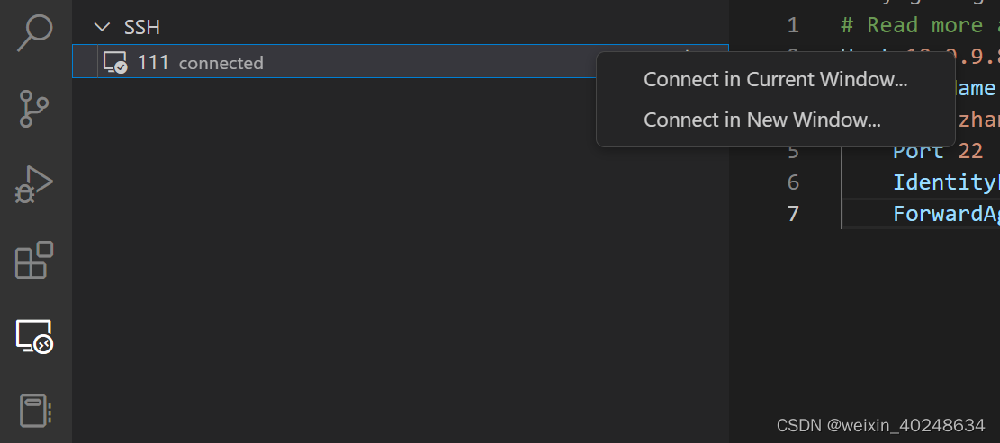

# vscode_SSH保存密码自动登录服务器

先在win local /mac 上拿到公钥和私钥，然后再把这公钥copy 进[服务器](https://so.csdn.net/so/search?q=服务器&spm=1001.2101.3001.7020)。让ssh 身份认证转化为秘钥认证
（mac也是一样的）

### 1. 创建 RSA 密钥对

第一步是在客户端机器（通常是您的计算机 win 10）上创建密钥对：打开powershell, 输入

```bash
ssh-keygen
```

默认情况下ssh-keygen将创建一个 2048 位 RSA 密钥对，这对于大多数用例来说足够安全（您可以选择传入标志-b 4096以创建更大的 4096 位密钥）。

输入命令后，您应该看到以下输出：

Output

```bash
Generating public/private rsa key pair.
Enter file in which to save the key (C:\Users\admin\.ssh/id_rsa):
```

根据括号的路径，将其键入前面部分，将密钥对保存到`C:\Users\admin\.ssh/`主目录的子目录中（或指定备用路径）。

如果您之前生成过 SSH 密钥对，您可能会看到以下提示：

Output

```bash
/home/your_home/.ssh/id_rsa already exists.
Overwrite (y/n)?
```

如果您选择覆盖磁盘上的密钥，您将无法再使用以前的密钥进行身份验证。选择是时要非常小心，因为这是一个无法逆转的破坏性过程。

然后您应该会看到以下提示：

Output

```bash
Enter passphrase (empty for no passphrase):
```

为了方便，是可以不用加密码的，直接Enter 就行。也可以选择输入安全密码，（密码短语添加了额外的安全层，以防止未经授权的用户登录）。

然后您应该看到以下输出：

Output

```bash
Your identification has been saved in /your_home/.ssh/id_rsa.
Your public key has been saved in /your_home/.ssh/id_rsa.pub.
The key fingerprint is:
a9:49:2e:2a:5e:33:3e:a9:de:4e:77:11:58:b6:90:26 username@remote_host
The key's randomart image is:
+--[ RSA 2048]----+
|     ..o         |
|   E o= .        |
|    o. o         |
|        ..       |
|      ..S        |
|     o o.        |
|   =o.+.         |
|. =++..          |
|o=++.            |
+-----------------+
```

您现在在本地~/.ssh 下就会拥有可用于身份验证的**公钥(id_rsa.pub)** 和 **私钥(id_rsa)**。

下一步是将公钥（id_rsa.pub)放在您的服务器上，以便您可以使用基于 SSH 密钥的身份验证来登录。

- 如果还有其他设备，比如 mac, 那么直接将这个**私钥(id_rsa)**放进对应的~/.ssh 下就可以直接用了。

### 2. 手动复制公钥

如果您没有基于密码的 SSH 访问服务器的可用权限，则必须手动完成上述过程。

**目标**：我们将手动将您的`id_rsa.pub` （公钥）文件内容附加到远程服务器上`~/.ssh/authorized_keys`的文件中。

要显示密钥的内容id_rsa.pub，请在本地计算机中键入：（或者直接用记事本打开也行，）

```bash
cat ~/.ssh/id_rsa.pub
```

您将看到密钥的内容，看起来应该是这样的：

Output

```bash
ssh-rsa AAAAB3NzaC1yc2EAAAADAQABAAACAQCqql6MzstZYh1TmWWv11q5O3pISj2ZFl9HgH1JLknLLx44+tXfJ7mIrKNxOOwxIxvcBF8PXSYvobFYEZjGIVCEAjrUzLiIxbyCoxVyle7Q+bqgZ8SeeM8wzytsY+dVGcBxF6N4JS+zVk5eMcV385gG3Y6ON3EG112n6d+SMXY0OEBIcO6x+PnUSGHrSgpBgX7Ks1r7xqFa7heJLLt2wWwkARptX7udSq05paBhcpB0pHtA1Rfz3K2B+ZVIpSDfki9UVKzT8JUmwW6NNzSgxUfQHGwnW7kj4jp4AT0VZk3ADw497M2G/12N0PPB5CnhHf7ovgy6nL1ikrygTKRFmNZISvAcywB9GVqNAVE+ZHDSCuURNsAInVzgYo9xgJDW8wUw2o8U77+xiFxgI5QSZX3Iq7YLMgeksaO4rBJEa54k8m5wEiEE1nUhLuJ0X/vh2xPff6SQ1BL/zkOhvJCACK6Vb15mDOeCSq54Cr7kvS46itMosi/uS66+PujOO+xt/2FWYepz6ZlN70bRly57Q06J+ZJoc9FfBCbCyYH7U/ASsmY095ywPsBo1XQ9PqhnN1/YOorJ068foQDNVpm146mUpILVxmq41Cj55YKHEazXGsdBIbXWhcrRf4G2fJLRcGUr9q8/lERo9oxRm5JFX6TCmj6kmiFqv+Ow9gI0x8GvaQ== demo@test
```

1. 使用可用的任何方法访问远程主机，并找到或者创建目录 ~/.ssh

一旦您可以访问您在远程服务器上的帐户，您应该确保远程服务器的~/.ssh目录存在。
此命令将在必要时创建目录，如果目录已存在，则不执行任何操作：

```bash
mkdir -p ~/.ssh
```

1. 在此目录中创建或修改文件authorized_keys, 为了加入id_rsa.pub 到authorized_keys
   现在，您可以在此目录中创建或修改文件authorized_keys。您可以将文件的内容添加id_rsa.pub到authorized_keys文件的末尾，必要时使用以下命令创建它：

```bash
cat id_rsa.pub>> ~/.ssh/authorized_keys
```

`>>` 是追加的意思
在上述命令中，将id_rsa.pub内容输出追加到~/.ssh/authorized_keys。

1. 查看authorized_keys 是否加入了id_rsa.pub
   `cat ~/.ssh/authorized_keys`
   得到的应该是跟上面一样的一串文字

```bash
ssh-rsa AAAAB3NzaC1yc2EAAAADAQABAAACAQCqql6MzstZYh1TmWWv11q5O3pISj2ZFl9HgH1JLknLLx44+tXfJ7mIrKNxOOwxIxvcBF8PXSYvobFYEZjGIVCEAjrUzLiIxbyCoxVyle7Q+bqgZ8SeeM8wzytsY+dVGcBxF6N4JS+zVk5eMcV385gG3Y6ON3EG112n6d+SMXY0OEBIcO6x+PnUSGHrSgpBgX7Ks1r7xqFa7heJLLt2wWwkARptX7udSq05paBhcpB0pHtA1Rfz3K2B+ZVIpSDfki9UVKzT8JUmwW6NNzSgxUfQHGwnW7kj4jp4AT0VZk3ADw497M2G/12N0PPB5CnhHf7ovgy6nL1ikrygTKRFmNZISvAcywB9GVqNAVE+ZHDSCuURNsAInVzgYo9xgJDW8wUw2o8U77+xiFxgI5QSZX3Iq7YLMgeksaO4rBJEa54k8m5wEiEE1nUhLuJ0X/vh2xPff6SQ1BL/zkOhvJCACK6Vb15mDOeCSq54Cr7kvS46itMosi/uS66+PujOO+xt/2FWYepz6ZlN70bRly57Q06J+ZJoc9FfBCbCyYH7U/ASsmY095ywPsBo1XQ9PqhnN1/YOorJ068foQDNVpm146mUpILVxmq41Cj55YKHEazXGsdBIbXWhcrRf4G2fJLRcGUr9q8/lERo9oxRm5JFX6TCmj6kmiFqv+Ow9gI0x8GvaQ== demo@test
```

最后，我们将确保~/.ssh目录和authorized_keys文件具有适当的权限集：

```bash
chmod -R go= ~/.ssh
```

这递归地删除目录的所有“组”和“其他”权限~/.ssh/。

### 直接ssh命令登录

ssh 是怎么找到秘钥 id-rsa 的？
事实上，ssh xxx@11.11.11.01 的时候，其中有指定的命令–identity_file， 也就是[身份认证](https://so.csdn.net/so/search?q=身份认证&spm=1001.2101.3001.7020)，默认会在本地路径`~/.ssh/`优先找秘钥`id-rsa`，作为认证方式，找不到就让你输入密码。

直接登录

```
ssh xxx@11.11.11.01 
```

如果前面 `Enter passphrase`阶段有写密码，那么接下来输入的密码就是这个用于保护秘钥的密码。
如果前面`Enter passphrase`阶段密码为空，那么就直接登录上去了。

### vscode 使用 ssh密钥 (key) 来连接到远程Linux上

**添加配置文件**

目的：配置 VSCode 连接远程服务器的一些基本信息。

1、点击左侧的 “远程资源管理器” 图标，点击右上角的小齿轮(设置)


2、在弹出来的窗口中，选择第一个 config 文件打开，参考下图，填写对应信息

加入配置：`IdentityFile ~\.ssh\id_rsa`保存即可

```bash
# Read more about SSH config files: https://linux.die.net/man/5/ssh_config
Host test1
    HostName 11.11.11.11
    User xxx
    Port 22
    IdentityFile ~/.ssh/id_rsa
    ForwardAgent yes
# 有需要可以加 第二个服务器
Host test2
    HostName 11.11.11.12
    User xxx
    Port 22
    IdentityFile ~/.ssh/id_rsa
    ForwardAgent yes
```


3.重启vscode，就可以在remote ，输入服务器密码，就可以在remote Explorer 下的SSH 下看到你配置的服务器名称了。右键选择连接就可以。

