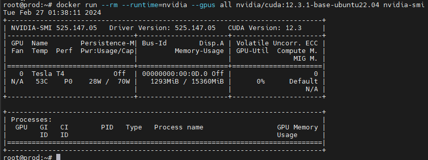
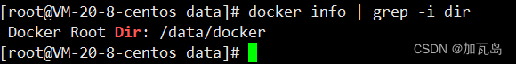

# Ubuntu 22.04 LTS中安装Docker，并支持显卡步骤如下：

```python
# 第1步：更新软件存储库
sudo apt-get update

# 第2步：卸载旧版本的Docker
sudo apt-get remove docker docker-engine docker.io

# 第3步：在 Ubuntu 18.04 上安装Docker
sudo apt install docker.io

# 第4步：安装 nvidia-docker
# 参考： https://docs.nvidia.com/datacenter/cloud-native/container-toolkit/latest/install-guide.html
# Setup the package repository and the GPG key:
distribution=$(. /etc/os-release;echo $ID$VERSION_ID) \
      && curl -fsSL https://nvidia.github.io/libnvidia-container/gpgkey | sudo gpg --dearmor -o /usr/share/keyrings/nvidia-container-toolkit-keyring.gpg \
      && curl -s -L https://nvidia.github.io/libnvidia-container/$distribution/libnvidia-container.list | \
            sed 's#deb https://#deb [signed-by=/usr/share/keyrings/nvidia-container-toolkit-keyring.gpg] https://#g' | \
            sudo tee /etc/apt/sources.list.d/nvidia-container-toolkit.list

# 更新源和安装 nvidia-container-toolkit
sudo apt-get update
sudo apt-get install -y nvidia-container-toolkit

# 配置Docker守护进程以识别NVIDIA容器运行时
sudo nvidia-ctk runtime configure --runtime=docker

# 重启 Docker
sudo systemctl restart docker

# 测试
# docker pull nvidia/cuda:12.8.0-cudnn-devel-ubuntu22.04
# docker run --rm --runtime=nvidia --gpus all nvidia/cuda:12.8.0-cudnn-devel-ubuntu22.04 nvidia-smi
```

正常的话，测试结果显示：



## 安装 Docker Compose

### 方式 1、使用二进制文件安装 Docker Compose

运行下列命令安装最新稳定的 Docker Compose 文件：

```
sudo curl -L "https://github.com/docker/compose/releases/download/v2.36.2/docker-compose-$(uname -s)-$(uname -m)" -o /usr/local/bin/docker-compose
```

如果有更新版本，只需要将上述命令中的 v2.27.1 替换为最新的版本号即可。请不要忘记数字前的 “v” 。

最后，使用下列命令赋予二进制文件可执行权限：

```
sudo chmod +x /usr/local/bin/docker-compose
```

运行下列命令检查安装的 Docker Compose 版本：

```
docker-compose version
Docker Compose version v2.27.1
```


## docker如何备份，重装

### 先查看下存放目录

```bash
docker info | grep -i dir
```



系统默认路径为 `/var/lib/docker`

### 将此目录备份即可   

[重装系统](https://so.csdn.net/so/search?q=重装系统&spm=1001.2101.3001.7020)或新安装docker后修改配置信息

```bash
vi /etc/docker/daemon.json 
```

### 加上下面的语句就可以了

```bash
  "data-root": "/data/docker"
```

这是我的，之前有镜像地址的配置，这次后面加个逗号，保证json格式正确

```bash
{
    "runtimes": {
        "nvidia": {
            "args": [],
            "path": "nvidia-container-runtime"
        }
    }
  "registry-mirrors": ["http://hub-mirror.c.163.com"],
  "data-root": "/data/docker"
}
```

### 重启docker即可

```bash
service restart docker
```


## docker彻底卸载

### **1. 卸载 Docker 相关软件包**

#### **(1) 列出所有已安装的 Docker 相关包**

```
dpkg -l | grep -i docker
```

输出可能包括：

- `docker-ce`（Docker 社区版）
- `docker-ce-cli`（Docker CLI）
- `docker.io`（Ubuntu 仓库提供的旧版 Docker）
- `containerd.io`（容器运行时）
- `docker-buildx-plugin`（Docker Buildx 插件）
- `docker-compose-plugin`（Docker Compose 插件）

#### **(2) 卸载 Docker 相关包**

```
sudo apt remove --purge docker.io

sudo apt-get purge docker.io containerd runc
```

`--purge` 选项会同时删除配置文件。

------

### **2. 删除 Docker 数据和目录**

Docker 默认存储数据在 `/var/lib/docker` 和 `/etc/docker`，手动删除它们：

```
sudo rm -rf /var/lib/docker
sudo rm -rf /var/lib/containerd
sudo rm -rf /etc/docker
sudo rm -rf ~/.docker
```

------

### **3. 删除 Docker 用户组（如果存在）**

```
sudo groupdel docker
```

------

### **4. 清理未使用的依赖**

```
sudo apt autoremove
sudo apt autoclean
```

------

### **5. 检查是否卸载干净**

再次运行以下命令，确保没有 Docker 相关包残留：

```
dpkg -l | grep -i docker
```

如果没有任何输出，说明 Docker 已完全卸载。


## ubuntu中docker如何将数据迁移到其他盘

## ✅ 方法一：修改 Docker 数据目录配置（推荐）

### 步骤 1：停止 Docker 服务

```
sudo systemctl stop docker
```

------

### 步骤 2：创建新目录并移动旧数据

以 `/mnt/docker-data` 为例：

```
sudo mkdir -p /data/docker-data
sudo rsync -aP /var/lib/docker/ /data/docker-data/
```

> ⚠️ 用 `rsync` 能保留权限、软链接等，比 `cp` 更安全。

------

### 步骤 3：修改 Docker 配置文件

#### 如果你使用的是 `systemd` 的默认 Docker：

编辑或创建文件：

```
sudo vim /etc/docker/daemon.json
```

添加（或修改）内容为：

```
{
  "data-root": "/data/docker-data"
}
```

------

### 步骤 4：启动 Docker

```
sudo systemctl start docker
```

------

### 步骤 5：验证

运行以下命令确认新目录已生效：

```
sudo docker info | grep "Docker Root Dir"
```

输出应为：

```
Docker Root Dir: /data/docker-data
```

------

### 步骤 6：确认无误后清除旧目录（可选）

如果一切正常并运行良好，可以删除旧的 `/var/lib/docker` 节省空间：

```
sudo rm -rf /var/lib/docker
```