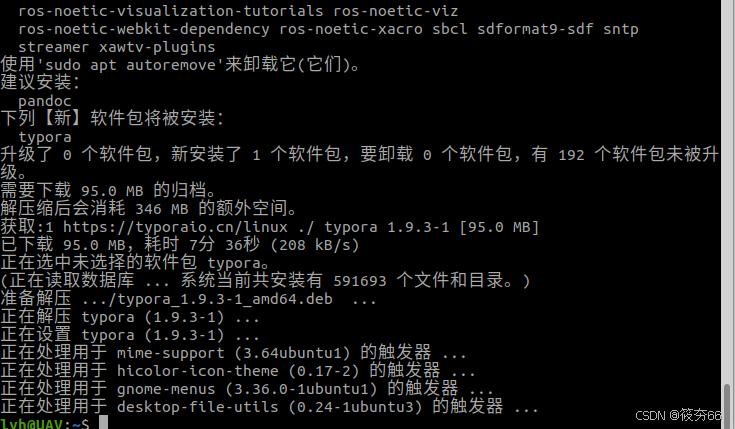
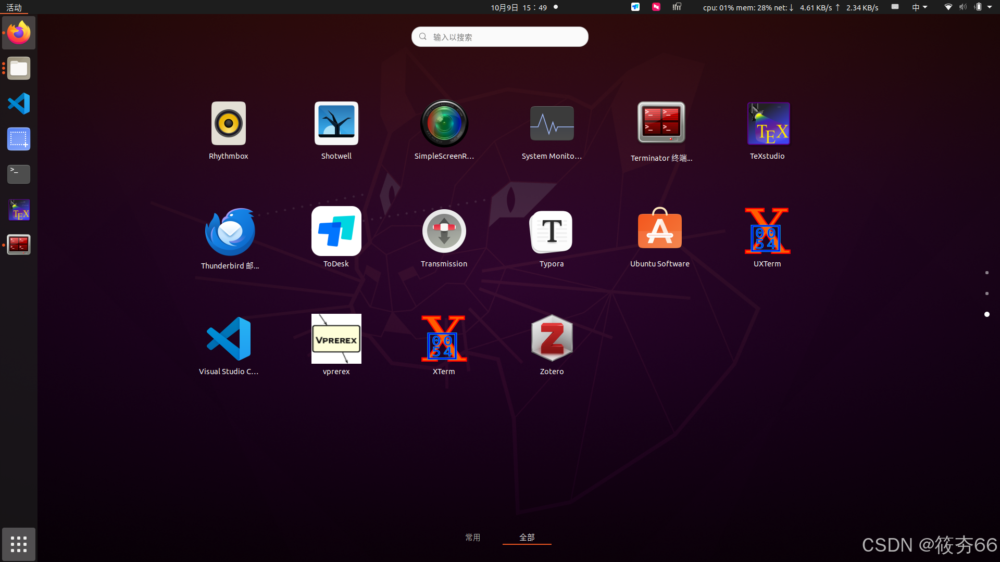
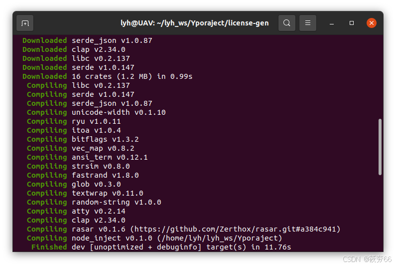
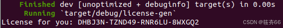
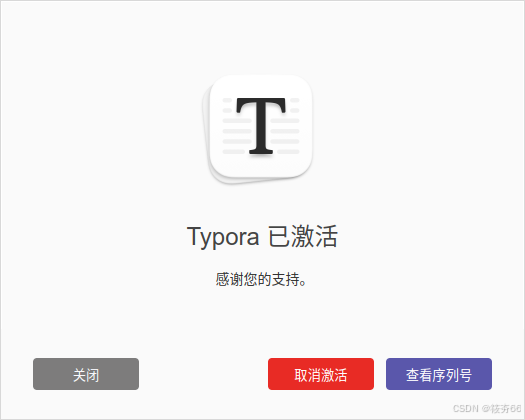

# ubuntu安装typora

## 下载：

```
在终端中输入如下命令：
wget -qO - https://typoraio.cn/linux/public-key.asc | sudo tee /etc/apt/trusted.gpg.d/typora.asc

sudo add-apt-repository 'deb https://typoraio.cn/linux ./'


sudo apt-get update

sudo apt-get install typora
```

出现下图就ok啦。



以上方法可能失效：进入官方： https://typora.io/releases/all

下载1.9.3版本

可以使用

屏幕左下角点击就能找到啦。



## 激活：

```cobol
git clone https://github.com/hazukieq/Yporaject.git


sudo apt  install cargo

cd Yporaject/

cargo build
```

这一步成功的结果：



```cobol
ls target/debug

##看看结果有没有 node_inject

cargo run

sudo cp target/debug/node_inject /usr/share/typora
```

上边的终端别关，新开终端：

```bash
cd /usr/share/typora/

sudo chmod 777 node_inject

sudo ./node_inject 

##下方将打印就对啦

extracting node_modules.asar
adding hook.js
applying patch
packing node_modules.asar
done!

##
```

返回之前的终端：

```cobol
cd license-gen/
      
cargo build

cargo  run
```

得到激活码结果：



然后去[Typora](https://so.csdn.net/so/search?q=Typora&spm=1001.2101.3001.7020)界面激活就好啦。



有能力建议支持正版！