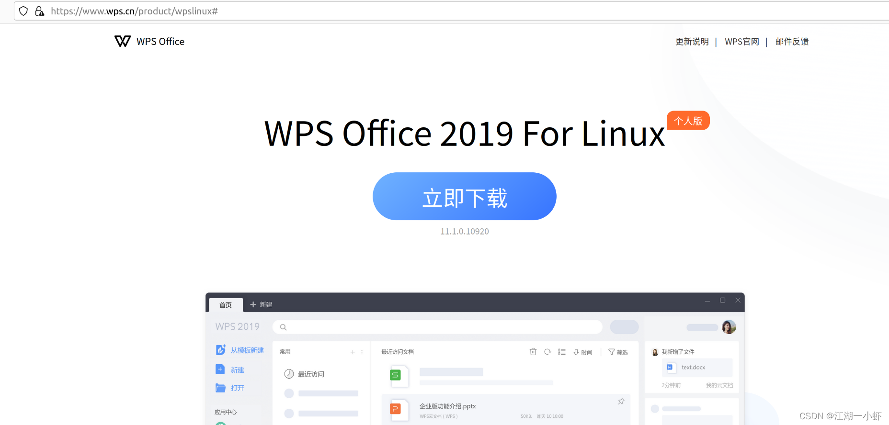
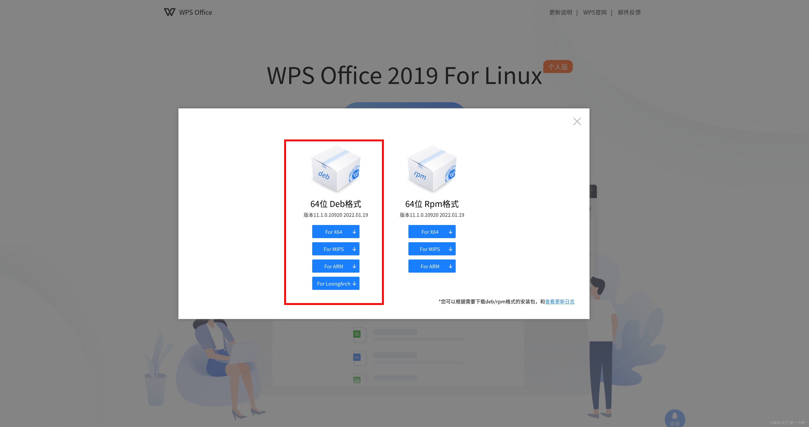
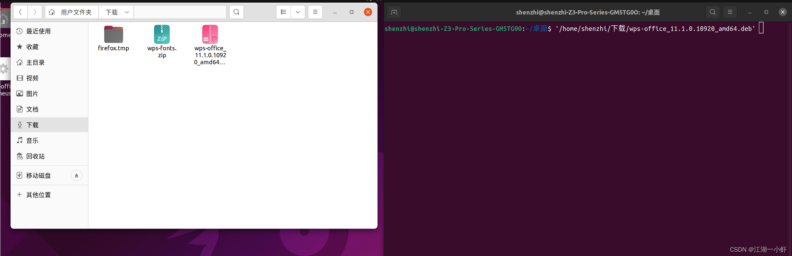
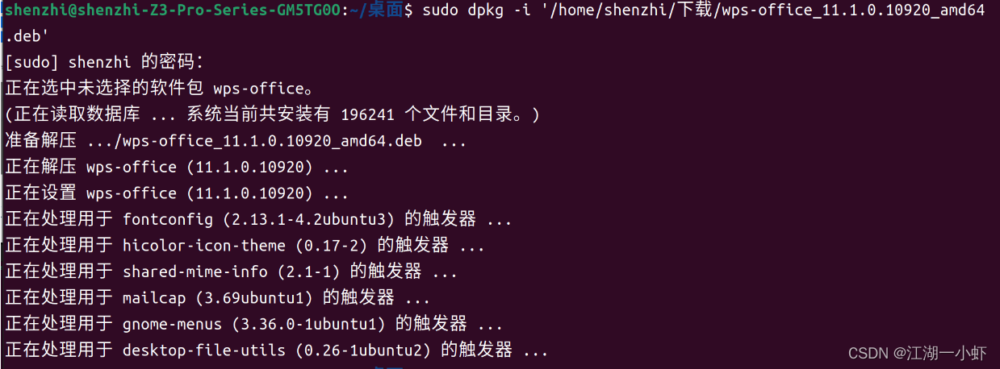
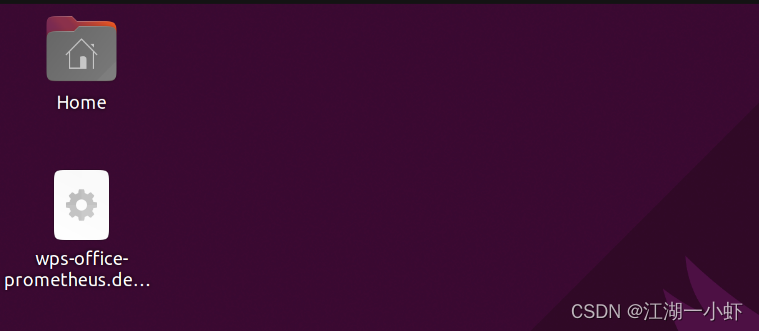
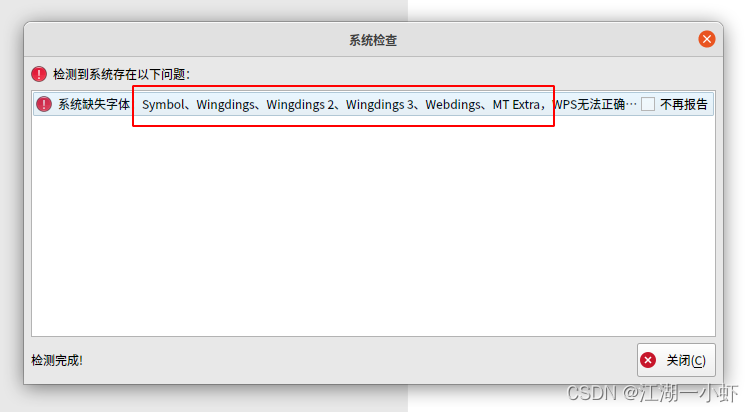
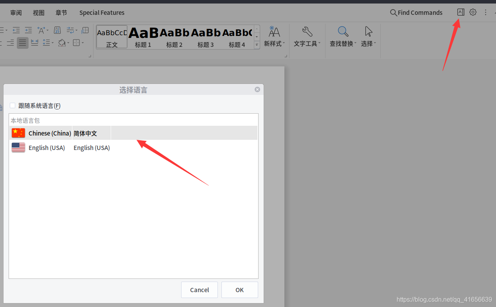

# ubuntu安装wps

### 1.访问WPS官网https://linux.wps.cn/#下载适用的DEB格式的安装包。





### 2.浏览器下载目录下找到下载的安装包，为了方便直接拖动到终端上，在终端上生成路径。



### 3.在终端显示的路径前输入sudo dpkg -i执行安装。

```
sudo dpkg -i '/home/shenzhi/下载/wps-office_11.1.0.10920_amd64.deb' 
```



### 4.完成安装后，在桌面会生成名为wps-office-prometheus.desktop启动器文件。

### 

### 5.给wps-office-prometheus.desktop文件赋予执行权限。

```
 sudo chmod +x wps-office-prometheus.desktop 
```


右键单击，选择允许启动，快捷方式就创建完成了


### 6.右击桌面wps-office-prometheus.desktop文件，点击选择允许运行（截图软件无法捕捉鼠标右键生成的菜单栏，作者就不贴图了），生成启动器。

字体包链接: https://pan.baidu.com/s/1qBhUgfbj-rcDMXX7Qva7aQ 提取码: g608



```
sudo unzip -d /usr/share/fonts/wps-office '/home/shenzhi/下载/wps-fonts.zip' 
```


### 设置中文



如果点击右上角的 **A** 之后出来简体中文，直接切换重启即可。

如果只有English，首先下载中文包：[中文包下载，提取码：fpg4](https://pan.baidu.com/s/1cUO7XPO_uqJNoJKwDsX-RQ)

1. 解压，将文件中的zh_CN目录复制到 `sudo cp -r zh_CN /opt/kingsoft/wps-office/office6/mui/`目录下
2. 之后再按图片上面操作，选择简体中文


以上方法无效

  

```
当前wps版本 11.1.0.8722

1 方法一

修改配置文件

vim  ~/.config/Kingsoft/Office.conf 
将
[General]
languages=
PersistentStatus=0
修改为
[General]
languages=zh_CN
PersistentStatus=0

2 方法二
修改启动文件（wps et wpp wpspdf） 以wps word为例

sudo vim `which wps`

#!/bin/bash
LANGUAGE=zh_CN  # 添加环境变量
gOpt=
#gOptExt=-multiply
```


| 当前wps版本 11.1.0.8722 |                                                  |
| ----------------------- | ------------------------------------------------ |
|                         |                                                  |
|                         | 1 方法一                                         |
|                         |                                                  |
|                         | 修改配置文件                                     |
|                         |                                                  |
|                         | vim  ~/.config/Kingsoft/Office.conf              |
|                         | 将                                               |
|                         | [General]                                        |
|                         | languages=                                       |
|                         | PersistentStatus=0                               |
|                         | 修改为                                           |
|                         | [General]                                        |
|                         | languages=zh_CN                                  |
|                         | PersistentStatus=0                               |
|                         |                                                  |
|                         | 2 方法二                                         |
|                         | 修改启动文件（wps et wpp wpspdf） 以wps word为例 |
|                         |                                                  |
|                         | sudo nano `which wps`                            |
|                         |                                                  |
|                         | #!/bin/bash                                      |
|                         | LANGUAGE=zh_CN  # 添加环境变量                   |
|                         | gOpt=                                            |
|                         | #gOptExt=-multiply                               |
