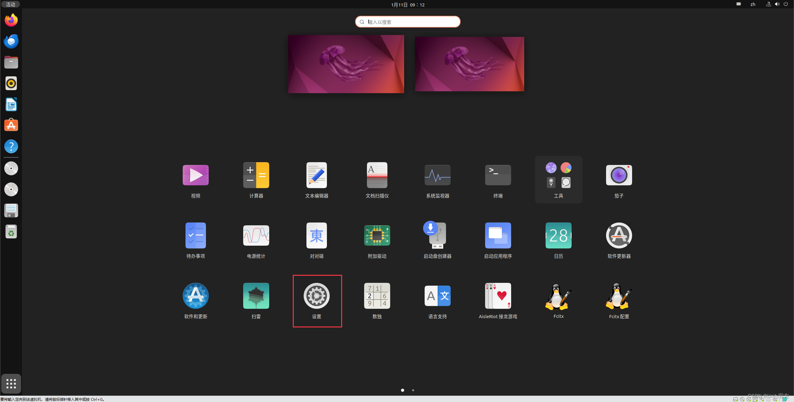
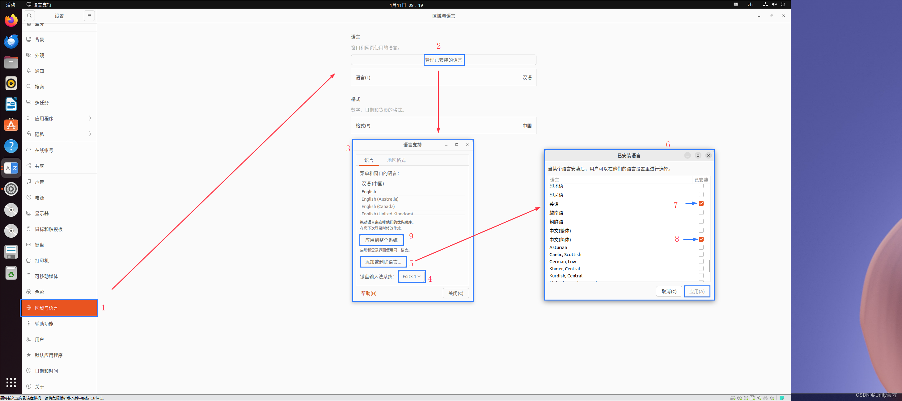
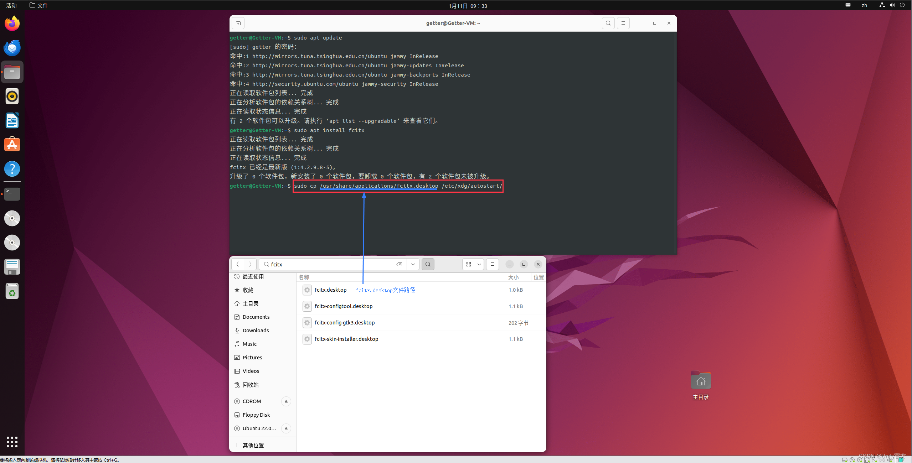
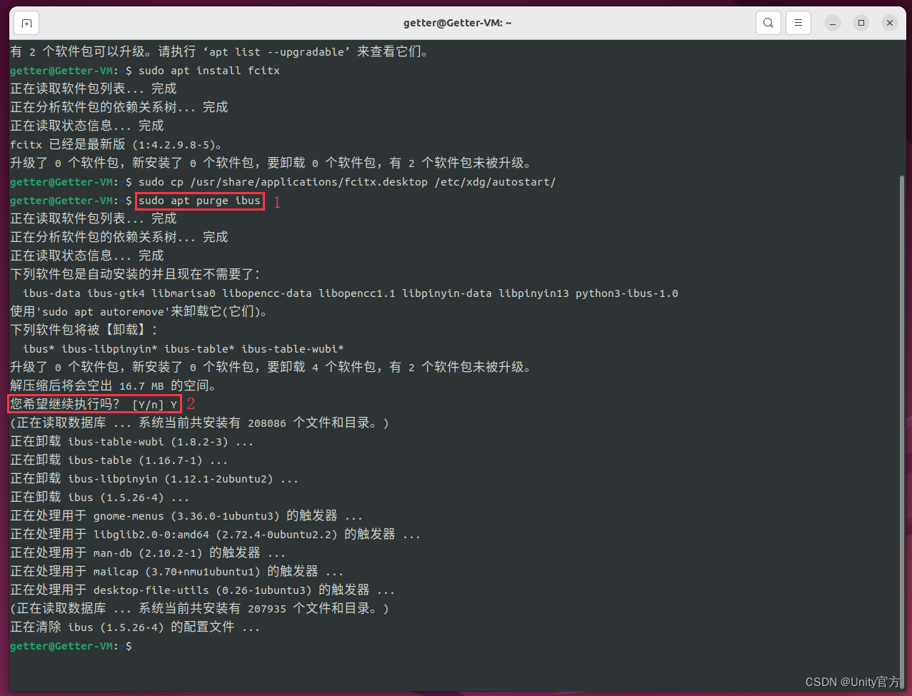
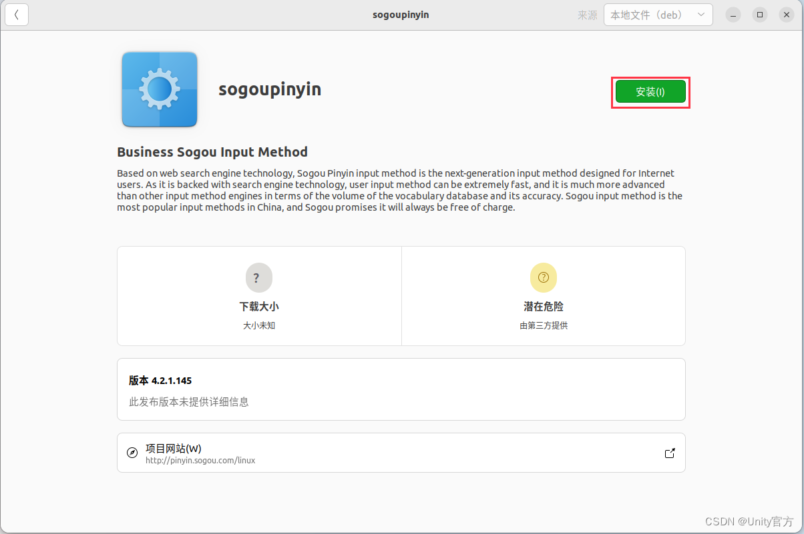
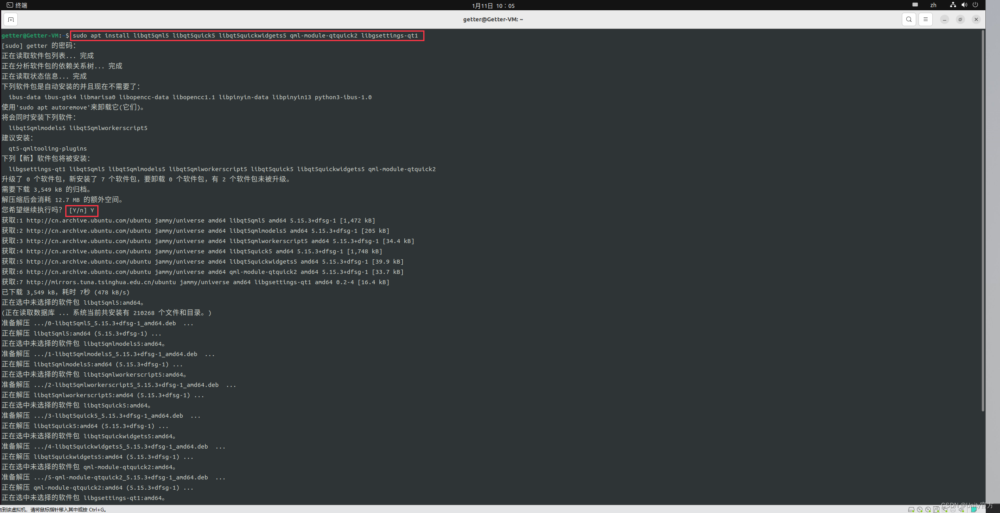
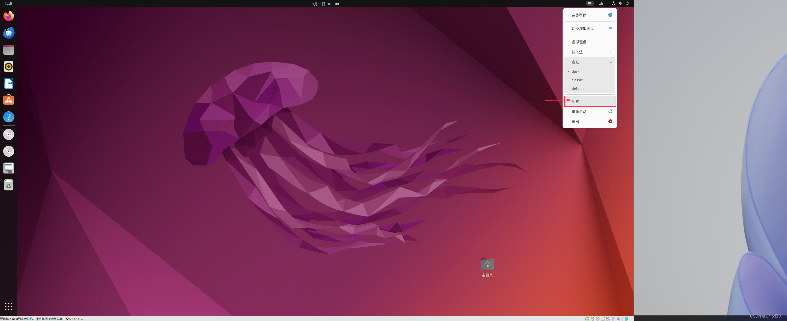
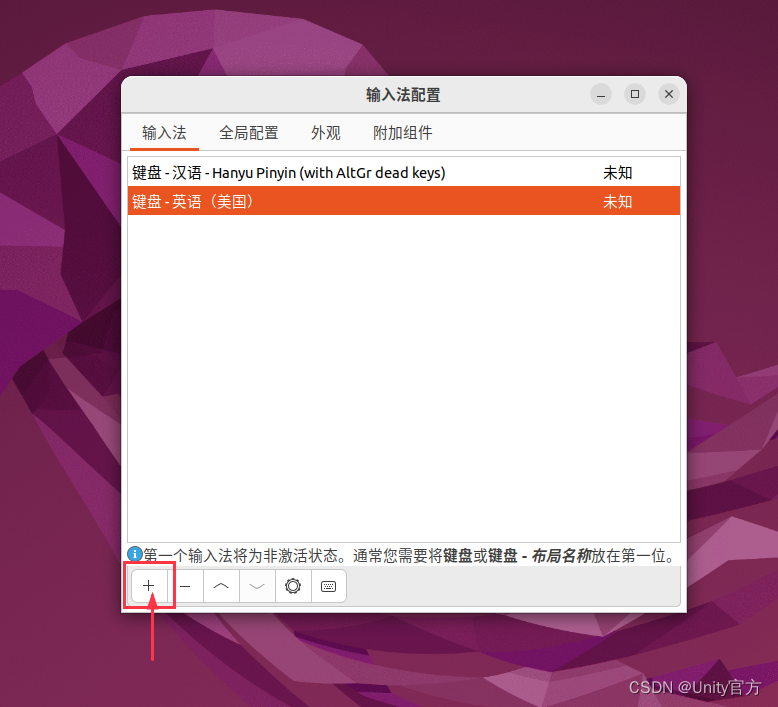
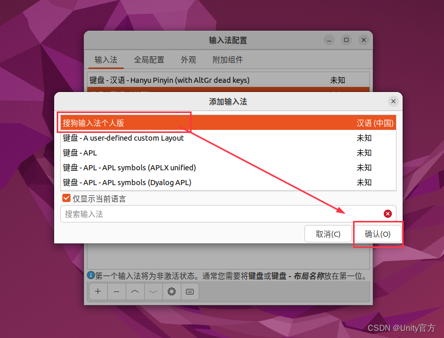
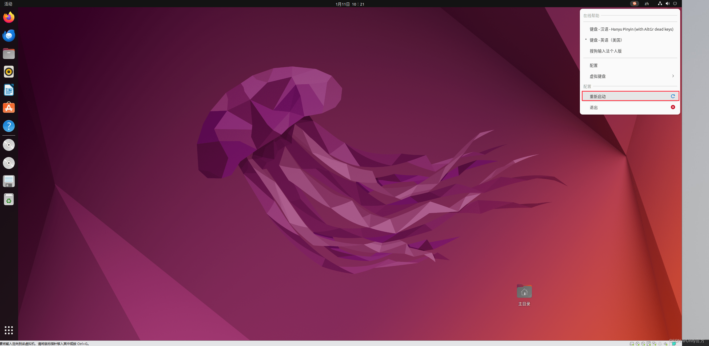

# Ubuntu安装搜狗输入法

#### 01. 更新应用源

```powershell
sudo apt update
```

#### 02. 安装输入法系统

```powershell
sudo apt-get install fcitx

# 使用最新的命令
sudo apt install fcitx5-frontend-gtk4
```

#### 03. 打开系统设置



#### 04. 打开语言支持窗口

① 设置 `键盘输入法` 系统为: fcitx
② 添加或删除语言: 中文简体、英文
③ 应用到整个系统
④ 重启系统


#### 05. 设置fcitx开机自启动

```powershell
# 将fcitx.desktop文件复制到开机自启动目录中
# 命令格式: sudo cp "fcitx.desktop文件所在的位置"  "开机自启动目录"
sudo cp /usr/share/applications/fcitx.desktop /etc/xdg/autostart/
```



#### 06. 卸载ibus输入法系统（可以不要卸载）

```powershell
sudo apt purge ibus
```



#### 07. 下载[搜狗输入法](https://so.csdn.net/so/search?q=搜狗输入法&spm=1001.2101.3001.7020)

[搜狗输入法官网下载地址](https://shurufa.sogou.com/)

需要选择适合你 `个人电脑` 的CPU架构进行下载
最好是直接使用UBuntu系统里的Firefox浏览器下载, 下载后的文件名称大致如此: `sogoupinyin_4.2.1.145_amd64.deb`


#### 08. 安装搜狗输入法

两种安装方式, 选择其一

> 方式一: 命令方式安装

```powershell
# sudo dpkg -i "安装包所在路径"
sudo dpkg -i "/home/getter/Downloads/sogoupinyin_4.2.1.145_amd64.deb"
```

> 方式二: 可视化安装




#### 09. 安装搜狗输入法所需要的其它依赖工具

安装完成后重启

```powershell
sudo apt install libqt5qml5 libqt5quick5 libqt5quickwidgets5 qml-module-qtquick2 libgsettings-qt1
```



#### 10. 添加搜狗输入法到语言栏





#### 11. 使用输入法

打开一个文档或者记事本, 使用快捷键[Ctrl + 空格] 或 [Shift] 切换到搜狗输入法, 就可以使用啦!

**补充:** 如果按了快捷键似乎没有反应, 依旧是英文输入法, 那么r可以尝试**重启**或者在右上角的输入法中**手动切换**一下看看
