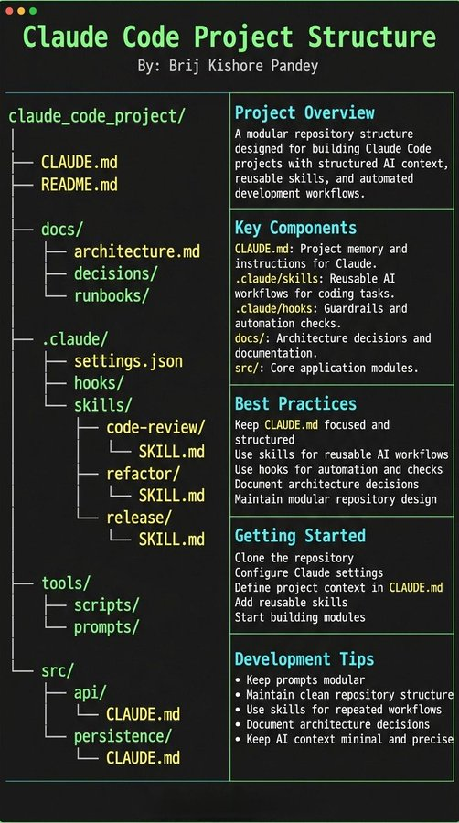

# Claude Code 使用手册

## 目录

1. [安装与登录](#安装与登录)
2. [三种权限模式](#三种权限模式)
3. [常用命令速查](#常用命令速查)
4. [键盘快捷键](#键盘快捷键)
5. [上下文与会话管理](#上下文与会话管理)
6. [项目记忆文件 CLAUDE.md](#项目记忆文件-claudemd)
7. [多平台与集成](#多平台与集成)
8. [多模态：图片处理](#多模态图片处理)
8. [MCP Server 扩展](#mcp-server-扩展)
9. [Hook 自动化](#hook-自动化)
10. [Skill 自定义技能](#skill-自定义技能)
11. [SubAgent 子代理](#subagent-子代理)
12. [Plugin 插件](#plugin-插件)
13. [常见问题](#常见问题)

---

## 安装与登录

### 安装方式

官方已将 npm 安装标记为 **deprecated（不推荐）**，主推原生安装脚本，无需 Node.js，支持后台自动更新。

```bash
# 推荐：macOS / Linux / WSL（Native Installer）
curl -fsSL https://claude.ai/install.sh | bash

# Windows PowerShell（Native Installer）
irm https://claude.ai/install.ps1 | iex

# Windows CMD（Native Installer）
curl -fsSL https://claude.ai/install.cmd -o install.cmd && install.cmd && del install.cmd
# 注意：Windows 需要先安装 Git for Windows (https://git-scm.com/downloads/win)

# macOS - Homebrew（需手动更新）
brew install --cask claude-code

# Windows - WinGet（需手动更新）
winget install Anthropic.ClaudeCode

# npm（已弃用，仍可用，需要 Node.js 18+）
npm install -g @anthropic-ai/claude-code
```

> **从 npm 迁移到 native：**
> ```bash
> curl -fsSL https://claude.ai/install.sh | bash
> npm uninstall -g @anthropic-ai/claude-code
> ```

### 验证安装

```bash
claude --version    # 查看版本号
claude doctor       # 诊断安装与配置问题（推荐）
claude update       # 手动触发更新
```

### 配置 API Key

```bash
# Bash / Zsh
echo 'export ANTHROPIC_API_KEY="sk-your-key-here"' >> ~/.bashrc
source ~/.bashrc

# Windows PowerShell（全局）
[Environment]::SetEnvironmentVariable("ANTHROPIC_API_KEY", "sk-your-key-here", "User")
```

> API Key 获取地址：https://console.anthropic.com

### 登录与验证

> **账号要求**：需要 Pro、Max、Teams、Enterprise 或 Console 账号。免费 Claude.ai 账号**不包含** Claude Code 访问权限。也可使用第三方 API：Amazon Bedrock、Google Vertex AI、Microsoft Foundry。

```bash
claude          # 首次启动会提示登录
/login          # 重新登录或切换账户
/status         # 查看认证状态、模型配置、账户信息
```

---

## 三种权限模式

### 模式对比

| 功能 | 默认模式 | 自动模式 | 规划模式 |
|------|---------|---------|---------|
| 交互性 | 最高 | 最低 | 中等 |
| 安全性 | 最高 | 最低 | 高 |
| 执行效率 | 低 | 高 | 中 |
| 操作预览 | 否 | 否 | **是** |
| 适用场景 | 学习/高风险 | 自动化/已验证任务 | 复杂多步骤任务 |

### 1. 默认模式

每次修改文件或执行命令都需要手动确认，最安全。

```bash
claude
# 操作时会提示：Approve? (y/N)
```

### 2. 自动模式（YOLO Mode）

自动批准所有操作，无需确认。**谨慎使用**，建议先用 Git 创建检查点。

```bash
claude --dangerously-skip-permissions

# 安全建议：使用前先提交 Git
git add . && git commit -m "checkpoint"
# 出错后可回滚
git reset --hard HEAD~1
```

### 3. 规划模式（Plan Mode）

Claude 先生成完整计划，确认后再执行，适合复杂任务。

```bash
# 启动时启用
claude --permission-mode plan

# 会话中切换（按 Shift+Tab 循环切换三种模式）
```

规划模式工作流：
1. 提出需求 → Claude 生成分步计划
2. 审查计划，可输入 `m` 修改某步骤
3. 确认后自动执行全部步骤

---

## 常用命令速查

### 启动方式

```bash
claude                      # 进入交互模式
claude "请分析这个项目结构"   # 带初始提示启动
claude -p "prompt"          # 快速查询并退出（无头模式）
```

### 会话管理

```bash
claude --continue / -c      # 恢复最近的会话
claude --resume / -r        # 选择会话恢复
/rename <name>              # 重命名当前会话
/clear                      # 清除对话历史（保留项目加载）
```

### 配置与状态

```bash
/config         # 查看/修改配置（模型选择等）
/status         # 查看当前模式、模型、token 消耗
/permissions    # 权限管理
/help           # 显示所有命令
```

### 上下文管理

```bash
/compact                    # 压缩上下文（降低 token 消耗）
/compact Focus on API       # 带指令压缩，保留重点内容
/init                       # 自动扫描项目，生成 CLAUDE.md
/memory                     # 查看/管理所有 CLAUDE.md 和 auto memory 文件
/rewind                     # 回滚最后一次操作
```

### 扩展功能

```bash
/mcp            # 显示所有可用 MCP 工具
/agents         # 管理 SubAgent
/plugin marketplace list    # 列出所有插件市场
/plugin install <pkg>@<marketplace>  # 安装插件
```

---

## 键盘快捷键

| 快捷键 | 功能 |
|--------|------|
| `Ctrl+C` | 取消当前输入或生成 |
| `Ctrl+D` | 退出会话 |
| `Ctrl+G` | 在外部编辑器中编辑 |
| `Ctrl+L` | 清屏（保留对话历史） |
| `Ctrl+V` | 粘贴图片 |
| `Ctrl+R` | 反向搜索历史 |
| `Shift+Tab` | 循环切换权限模式 |
| `Alt+P` | 切换模型 |
| `Alt+T` | 切换扩展思考模式 |
| `Esc Esc` | 回滚 |
| `?` | 显示所有快捷键 |

---

## 上下文与会话管理

### 上下文优化策略

- 对话超过 50 轮时，建议执行 `/clear` 或 `/compact`
- 将重要信息整理到 `CLAUDE.md`，避免重复占用上下文
- 使用 `/status` 监控 token 消耗和成本

### 权限配置示例

在 `~/.claude/settings.json` 或 `.claude/settings.json` 中配置：

```json
{
  "permissions": {
    "allow": [
      "Bash(npm run *)",
      "Bash(git commit *)",
      "Bash(* --version)"
    ],
    "deny": [
      "Bash(git push *)"
    ]
  }
}
```

---

## 项目记忆文件 CLAUDE.md

Claude Code 有两种跨会话记忆机制：

| | CLAUDE.md | Auto Memory |
|---|---|---|
| **由谁写** | 你 | Claude 自动写 |
| **内容** | 指令与规范 | Claude 发现的模式与偏好 |
| **加载时机** | 每次会话完整加载 | 每次会话加载前 200 行 |
| **用途** | 代码规范、架构、工作流 | 构建命令、调试经验、偏好 |

### CLAUDE.md 文件位置

| 范围 | 位置 | 说明 |
|------|------|------|
| 组织策略 | macOS: `/Library/Application Support/ClaudeCode/CLAUDE.md`<br>Linux: `/etc/claude-code/CLAUDE.md`<br>Windows: `C:\Program Files\ClaudeCode\CLAUDE.md` | IT 管理，不可被个人排除 |
| 项目（共享） | `./CLAUDE.md` 或 `./.claude/CLAUDE.md` | 通过版本控制共享给团队 |
| 用户（个人全局） | `~/.claude/CLAUDE.md` | 个人偏好，适用所有项目 |
| 本地（个人项目级） | `./CLAUDE.local.md` | 个人项目偏好，**自动加入 .gitignore** |

### 自动生成

```bash
/init    # 自动扫描项目，生成初始 CLAUDE.md（已存在则提供改进建议）
```

### 推荐内容结构

目标 **200 行以内**，超出会降低遵循率。

```markdown
## 项目概述
- 技术栈：React 18, Next.js 14, TypeScript, Tailwind CSS

## 项目结构
src/
├── components/    # React 组件
├── pages/         # Next.js 页面
└── utils/         # 工具函数

## 构建命令
- `npm run dev`    开发服务器（端口 3000）
- `npm run build`  生产构建
- `npm run test`   运行测试

## 代码规范
- 使用 2 空格缩进
- 使用函数式组件和 Hooks
- 文件名：组件 PascalCase，工具函数 camelCase

## 常见问题
- 端口占用：`lsof -i :3000` 找到并 kill 进程
```

### @import 导入其他文件

在 CLAUDE.md 中用 `@路径` 语法引入其他文件，避免单文件过大：

```markdown
See @README for project overview and @package.json for available npm commands.

# Additional Instructions
- git workflow: @docs/git-instructions.md
```

### .claude/rules/ 规则目录

适合大型项目，将规则拆分为多个主题文件。支持按文件路径**按需加载**（仅在 Claude 操作匹配文件时才载入上下文）：

```
.claude/
├── CLAUDE.md             # 主指令文件
└── rules/
    ├── code-style.md     # 代码风格（始终加载）
    ├── testing.md        # 测试规范（始终加载）
    └── api-design.md     # 可配置：仅在编辑 API 文件时加载
```

路径范围规则示例：

```markdown
---
paths:
- "src/api/**/*.ts"
---

# API Development Rules
- All API endpoints must include input validation
- Use the standard error response format
```

### Auto Memory（自动记忆）

Claude 会在会话中自动将学到的内容保存为记忆文件，无需手动编写。

- **存储位置**：`~/.claude/projects/<project>/memory/MEMORY.md`
- **加载规则**：每次会话加载 `MEMORY.md` 的前 200 行
- **内容示例**：构建命令、调试规律、架构决策、代码偏好

```bash
/memory             # 查看已加载的 CLAUDE.md 和 auto memory，可切换开关或打开文件编辑
```

禁用 auto memory（在 settings.json 中）：

```json
{ "autoMemoryEnabled": false }
```

---

## 多平台与集成

Claude Code 支持多种工作环境，所有平台共享同一套 CLAUDE.md、设置和 MCP 服务器配置。

| 环境 | 特点 |
|------|------|
| Terminal CLI | 完整功能的命令行工具 |
| VS Code 扩展 | IDE 内直接使用，边写代码边对话 |
| JetBrains 插件 | 支持 IntelliJ、PyCharm 等 |
| Desktop App | 无需终端，图形界面，macOS/Windows |
| Web | 浏览器内使用，可在手机上继续本地会话 |
| Chrome 扩展（beta） | 调试实时 Web 应用 |
| GitHub Actions | 自动化 PR 审查、Issue 处理 |
| GitLab CI/CD | CI/CD 流水线集成 |
| Slack | 将 Bug 报告自动转为 Pull Request |
| Remote Control | 从手机/其他设备继续本地会话 |

---

## 多模态：图片处理

Claude Code 支持在交互模式中粘贴图片。

### 使用方式

```bash
# 方式1：在交互模式中 Ctrl+V 粘贴截图
claude
> [粘贴截图或设计稿]  # 自动识别为 [Image #1]

# 方式2：指定图片路径
claude "根据 design.png 创建 React 组件"
```

### 常见场景

- **从设计稿生成代码**：粘贴 Figma 截图 → 生成 React + Tailwind 组件
- **分析错误截图**：粘贴报错截图 → 获得修复方案
- **白板架构图转代码**：拍照白板 → 转换为代码结构
- **表格图片提取数据**：图片表格 → 导出为 JSON

---

## MCP Server 扩展

MCP（Model Context Protocol）让 Claude 连接外部服务，如 Figma、GitHub、数据库等。

### 查看已配置的 MCP 工具

```bash
/mcp
```

### 配置 MCP Server

编辑 `~/.claude/settings.json`：

```json
{
  "mcpServers": {
    "figma": {
      "command": "node",
      "args": ["./mcp-figma/index.js"],
      "env": {
        "FIGMA_API_TOKEN": "your-figma-token-here"
      }
    }
  }
}
```

### 官方 MCP 服务器

| 服务 | 包名 | 主要功能 |
|------|------|---------|
| 文件系统 | `@modelcontextprotocol/server-filesystem` | 文件访问 |
| GitHub | `@modelcontextprotocol/server-github` | 仓库、PR、Issues |
| PostgreSQL | `@modelcontextprotocol/server-postgres` | 数据库查询 |
| 网络搜索 | `@modelcontextprotocol/server-brave-search` | 实时搜索 |
| Slack | `@modelcontextprotocol/server-slack` | 消息管理 |

---

## Hook 自动化

Hook 通过 JSON 配置实现事件驱动的自动化，如代码修改后自动执行 lint。

### 配置位置

- 用户级：`~/.claude/settings.json`
- 项目级：`.claude/settings.json`

### Hook 事件类型

| 事件 | 触发时机 |
|------|---------|
| `PreToolUse` | 工具调用前 |
| `PostToolUse` | 工具调用后 |
| `Notification` | Claude 发出通知时 |
| `Stop` | Claude 完成回复时 |

### 示例：保存后自动 Lint

```json
{
  "hooks": {
    "PostToolUse": [
      {
        "matcher": "Write.*\\.(js|ts|jsx|tsx)$",
        "hooks": [
          {
            "type": "command",
            "command": "npx eslint \"$FILE\" --fix && npx prettier \"$FILE\" --write"
          }
        ]
      }
    ]
  }
}
```

### Hook 安全建议

- 始终引用 shell 变量（用 `"$VAR"` 而非 `$VAR`）
- 使用绝对路径
- 避免处理 `.env`、密钥等敏感文件

---

## Skill 自定义技能

Skill 是通过 Markdown 文件定义的工具集/指令集，可手动调用或由 Claude 自动识别使用。

### 创建 Skill

```bash
# 项目级 Skill
mkdir -p .claude/skills/my-skill

# 用户级 Skill（跨项目可用）
mkdir -p ~/.claude/skills/my-skill
```

创建 `.claude/skills/my-skill/SKILL.md`：

```markdown
---
invokedBy: user    # user | auto
description: 分析代码质量并提供优化建议
---

# Code Analyzer

## 功能
- 检查代码复杂度
- 识别性能问题
- 建议重构方向

## 使用
/my-skill 分析 src/index.js
```

### 调用 Skill

```bash
/my-skill 分析 src/auth.js
# 或让 Claude 根据任务上下文自动调用
```

---

## SubAgent 子代理

SubAgent 是可独立运行的专门代理，适合需要独立决策或并行处理的任务。

### Skill vs SubAgent

| 特性 | Skill | SubAgent |
|------|-------|---------|
| 定义位置 | `.claude/skills/` | `.claude/agents/` |
| 工作方式 | 工具集，由主 Agent 调用 | 完全独立运行 |
| 并行执行 | 否 | **是** |
| 适用场景 | 特定工具/指令集 | 专门角色/复杂工作流 |

### 创建 SubAgent

```bash
# 使用交互界面
/agents

# 或手动创建文件
mkdir -p .claude/agents
```

创建 `.claude/agents/code-reviewer.md`：

```markdown
---
description: 专业代码审查专家，检查代码质量、安全漏洞和最佳实践
---

# Code Reviewer

你是一个专业的代码审查专家，专注于：
- 检查代码质量与可维护性
- 识别安全漏洞
- 提供优化建议

输出格式：
- 问题列表及严重性（High / Medium / Low）
- 具体改进建议
```

### 使用场景

```bash
# 并行协作示例
> 我需要完成用户认证功能：
> 1. 让 code-reviewer agent 检查现有代码
> 2. 让 test-writer agent 编写测试
> 3. 让 doc-generator agent 生成文档
```

---

## Plugin 插件

Plugin 是包含 Skills、Commands、Agents、Hooks 的完整扩展包。

### 目录结构

```
my-plugin/
├── .claude-plugin/
│   └── plugin.json       # 插件清单（必须在此目录）
├── commands/             # 自定义命令
├── agents/               # SubAgent 定义
├── skills/               # Skill 定义
└── hooks/
    └── hooks.json        # Hook 配置
```

### plugin.json 示例

```json
{
  "name": "my-awesome-plugin",
  "version": "1.0.0",
  "description": "一个超棒的 Claude Code Plugin",
  "author": "Your Name",
  "license": "MIT"
}
```

### 安装 Plugin

```bash
/plugin install ./my-plugin              # 安装本地插件
/plugin marketplace add ./my-marketplace # 添加本地插件市场
/plugin install review-plugin@my-plugins # 从市场安装
```

> 只安装来源可信的 Plugin，Plugin 拥有代码执行权限。

---

## 常见问题

**Q: 命令执行失败？**
1. `claude doctor` 诊断安装问题
2. `/status` 确认认证正常
3. 检查当前权限模式
4. 重新表述需求，或切换规划模式预览操作

**Q: Token 消耗过多/成本过高？**
1. `/compact` 压缩上下文
2. `/clear` 清除历史
3. 将重要项目信息整理到 `CLAUDE.md`
4. 使用 `.claude/rules/` 拆分超大 CLAUDE.md

**Q: Claude 没有遵循 CLAUDE.md 的指令？**
1. `/memory` 确认 CLAUDE.md 被正确加载
2. 检查文件是否超过 200 行（过长会降低遵循率）
3. 使指令更具体：如 "使用 2 空格缩进" 而非 "格式化代码"
4. 检查多个 CLAUDE.md 之间是否有相互矛盾的指令

**Q: 如何切换规划模式？**
- 启动时：`claude --permission-mode plan`
- 会话中：按 `Shift+Tab` 循环切换

**Q: MCP 连接失败？**
1. 检查 `settings.json` 中的 MCP 配置
2. 确认 MCP 服务器进程正在运行
3. `/mcp` 查看已注册的工具列表

**Q: SubAgent 不工作？**
1. `/agents` 查看所有已注册代理
2. 确认文件在 `.claude/agents/` 目录下
3. 检查 Markdown 文件的 YAML frontmatter 格式是否正确

---

## 参考资源

- 官方文档：https://code.claude.com/docs/en/overview
- Changelog：https://github.com/anthropics/claude-code/blob/main/CHANGELOG.md
- GitHub：https://github.com/anthropics/claude-code
- MCP 连接器市场：https://claude.com/partners/mcp



