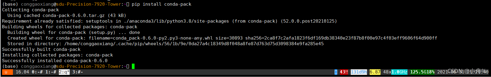
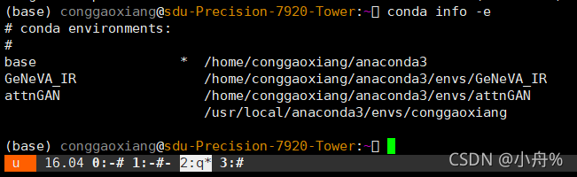
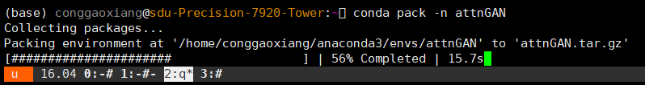
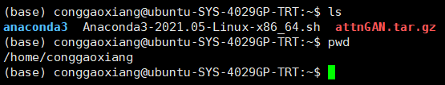
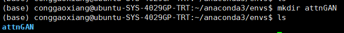
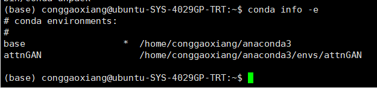

# 使用conda pack进行环境迁移

### 第一步先下载conda pack

```bash
pip install conda-pack
```

如图conda-pack下载成功


### 第二步“打包原环境”

这有两个自己创建的虚拟环境，我对attnGAN进行环境迁移打包。


```bash
conda pack -n attnGAN
```

如下图，正在对环境进行打包，还是很快的。最后打包成·后缀为.tar.gz的压缩文件。


### 第三步“还原环境”

现在已经attnGAN.tar.gz上传到无网的服务器了，现在将attnGAN.tar.gz解压到/home/conggaoxiang/anaconda3/envs下

1)先创建个文件夹

```bash
mkdir attnGAN
```



2）解压

```bash
tar -xzvf attnGAN.tar.gz -C /home/conggaoxiang/anaconda3/envs/attnGAN
```

### 第四步查看结果

```bash
conda info -e
```

虚拟环境已迁移完毕

进入虚拟环境，就可以使用了