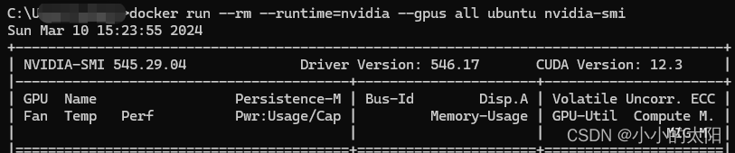
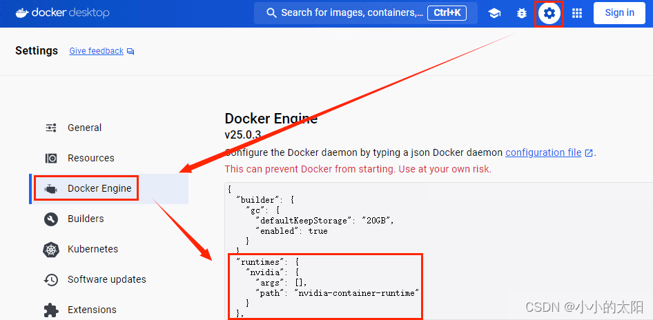

# win版docker搭建cuda版ubuntu环境

## 拉取镜像

~~~
docker pull nvidia/cuda:12.5.0-base-ubuntu22.04
docker run --rm --runtime=nvidia --gpus all nvidia/cuda:12.5.0-base-ubuntu22.04 nvidia-smi
~~~

## 启动容器

~~~
docker run -itd -p 50022:22 --name my_ubuntu_cuda --privileged=true nvidia/cuda:12.5.0-base-ubuntu22.04 
~~~

参数解释：

| OPTIONS           | 作用                                                         |
| :---------------- | :----------------------------------------------------------- |
| -i                | 以交互模式运行容器，通常与 -t 同时使用                       |
| -t                | 为容器重新分配一个伪输入终端，通常与 -i 同时使用             |
| -d                | 后台运行容器，并返回容器ID                                   |
| 50022:22          | 把docker上centos的22端口映射到本地50022端口，端口号可以自己指定 |
| --name my_centos7 | 为容器指定一个名称，这里容器名为my_centos7，可以自己指定     |
| --privileged=true | 开启权限，要Xshell连接，需要创建一个有访问特权、映射端口的容器 |
| centos:centos7    | 前面的centos表示软件源的名称，后面是版本标签（版本在dockerhub上查询） |

## 进入容器

~~~
docker exec -it my_ubuntu_cuda /bin/bash
~~~

参数解释：

| OPTIONS    | 作用                         |
| :--------- | :--------------------------- |
| -i         | 即使没有附加也保持STDIN 打开 |
| -t         | 分配一个伪终端               |
| my_centos7 | 容器名称                     |

可能报错

~~~
大致意思是说 nvidia 不可用
~~~

首先将 将 wsl 中的 ubuntu wsl1 改成 wsl2

~~~
wsl -l -v
#输出
Name              State            Version
Ubuntu-22.04      Stopped          1

wsl --set-version Ubuntu-22.04  2
#输出
正在进行转换，这可能需要几分钟时间...
有关与 WSL 2 的主要区别的信息，请访问 https://aka.ms/wsl2
转换完成。

重启

wsl -l -v
#输出
NAME            STATE           VERSION
Ubuntu-22.04    Stopped         2
~~~

然后添加

## 安装各种包

~~~
yum install openssh-server

# 启动ssh
service ssh start

# 查看ssh状态
service ssh status
# 设置ssh服务开机自启：
systemctl is-enabled ssh  # 虽然好像没什么用，每次重启后都需要手动启动ssh
~~~

# 启动过程

~~~
# 启动ssh
service ssh start
# 启动mysql
service mysql start
# 启动redis
redis-server /etc/redis/redis.conf

./script/start_services.sh
~~~

~~~
docker run -itd --gpus all --privileged=true -e NVIDIA_DRIVER_CAPABILITIES=compute,utility -e NVIDIA_VISIBLE_DEVICES=all --name my_ubuntu -e TZ=UTC -p 63306:3306 -p 60022:22 -e MYSQL_ROOT_PASSWORD=1qaz2wsx/ ubuntu/mysql:8.0-22.04_beta
~~~

## 进入容器

~~~
docker exec -it my_ubuntu /bin/bash
~~~

参数解释：

| OPTIONS    | 作用                         |
| :--------- | :--------------------------- |
| -i         | 即使没有附加也保持STDIN 打开 |
| -t         | 分配一个伪终端               |
| my_centos7 | 容器名称                     |

