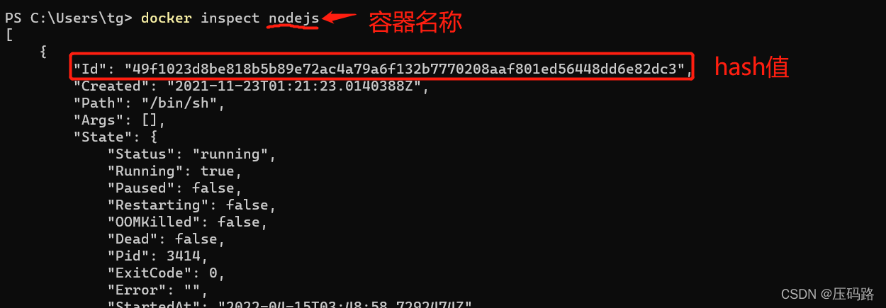

# win10 docker 容器修改端口映射

## 方法一：

通常容器生成后是无法通过docker界面或[docker命令](https://so.csdn.net/so/search?q=docker命令&spm=1001.2101.3001.7020)去修改端口映射的，以下是通过修改配置文件的方式实现：

第一步：在[powershell](https://so.csdn.net/so/search?q=powershell&spm=1001.2101.3001.7020)执行以下命令找到容器hash值

```cobol
docker inspect 容器名称
```



第二步： 打开文件管理器，在地址栏输入以下内容回车

```haskell
\\wsl.localhost\docker-desktop-data\data\docker\containers\[容器hash值]
```

第三步：修改config.v2.json，比如我要暴露容器的22端口到宿主机，那么将 "ExposedPorts":{"22/tcp":{}} 加入到 "try" 属性前，然后保存。

第四步： 修改hostconfig.json，比如我要将容器22端口映射到宿主机的10022端口，那么在PortBindings属性里添加 "22/tcp":[{"HostIp":"","HostPort":"10022"}]。

第五步：重新启动docker，检查是否生效 

## 方法二：

### 利用docker commit新构镜像

  docker commit：把一个容器的文件改动和配置信息commit到一个新的镜像。这个在测试的时候会非常有用，把容器所有的文件改动和配置信息导入成一个新的docker镜像，然后用这个新的镜像重起一个容器，这对之前的容器不会有任何影响。

1、停止docker容器

`docker stop container01`

2、commit该docker容器

`docker commit container01 new_image:tag`

3、用前一步新生成的镜像重新起一个容器

`docker run --name container02 -p 80:80 new_image:tag`

  优缺点：这种方式的优点是不会影响统一宿主机上的其他容器，缺点是管理起来显得比较乱，没有第一种方法那么直观。
