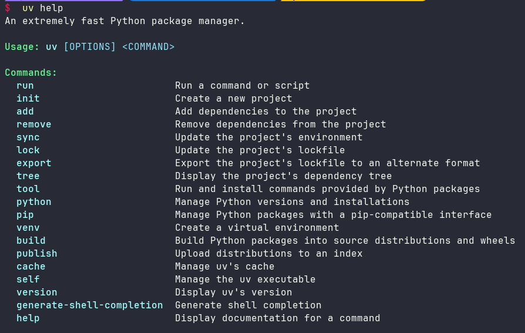

# uv 基本用法

## 1. 简介

### 1.1 什么是 uv

`uv` 是 `Astral` 公司推出的一款基于 `Rust` 编写的 `Python` 包管理工具，旨在成为 "**Python 的 Cargo**"。它提供了快速、可靠且易用的包管理体验，为 `Python` 项目的开发和管理带来了新的选择。

### 1.2 为什么使用 uv

与其他 `Python` 包管理工具（如 `pip`、`pip-tools`、`poetry`、`conda`）相比，`uv` 更像是一个全能选手：

1. **速度快**：得益于 `Rust`，安装依赖的速度比其他工具快很多
2. **功能全面**：一站式服务，从安装 Python、管理虚拟环境，到安装和管理包，再到管理项目依赖
3. **前景光明**：背后有 `Astral` 公司支持，采用 `MIT` 许可
4. **现代化**：像 `NodeJS` 或 `Rust` 项目那样方便地管理依赖

## 2. 安装 uv

### 2.1 安装方法

```bash
# macOS 和 Linux
curl -LsSf https://astral.sh/uv/install.sh | sh

# Windows
powershell -ExecutionPolicy ByPass -c "irm https://astral.sh/uv/install.ps1 | iex"

# 使用 pip 安装
pip install uv
```

### 2.2 验证安装

安装完成后，运行以下命令验证：

```bash
uv help
```



## 3. 核心概念

在使用 `uv` 之前，需要了解两个核心文件：

- **`pyproject.toml`**：项目配置文件，定义项目元数据和依赖
  - 项目名称、版本、描述
  - 支持的 Python 版本
  - 生产依赖和开发依赖

- **`uv.lock`**：依赖锁定文件，记录所有依赖的精确版本
  - 包括依赖的依赖（传递依赖）
  - 跨平台一致性保证
  - 由 `uv` 自动管理，**不要手动编辑**

## 4. 基本操作

### 4.1 创建新项目

使用 `uv init` 命令创建新项目：

```bash
# 创建项目
uv init myproject

# 进入项目目录
cd myproject

# 查看生成的文件
ls
```

生成的项目结构：

```
myproject/
├── .gitignore          # Git 忽略文件
├── .python-version     # Python 版本标识
├── hello.py            # 示例代码（可删除）
├── pyproject.toml      # 项目配置文件
└── README.md           # 项目说明
```

查看示例代码：

```python
# hello.py
def main():
    print("Hello from myproject!")

if __name__ == "__main__":
    main()
```

查看项目配置：

```toml
# pyproject.toml
[project]
name = "myproject"
version = "0.1.0"
description = "Add your description here"
readme = "README.md"
requires-python = ">=3.12"
dependencies = []
```

**注意**：`uv init` 会自动将项目初始化为 Git 仓库。

### 4.2 初始化现有项目

如果已有项目代码，可以在项目目录中初始化：

```bash
# 在现有目录中初始化
cd existing-project
uv init

# 或者创建虚拟环境
uv venv
```

### 4.3 同步项目环境

进入项目后，首先同步依赖：

```bash
uv sync
```

`uv sync` 会自动完成以下操作：
1. 查找或下载合适的 Python 版本
2. 创建虚拟环境（`.venv` 目录）
3. 解析依赖关系并生成 `uv.lock` 文件
4. 安装所有依赖到虚拟环境

同步后的项目结构：

```
myproject/
├── .venv/              # 虚拟环境（新增）
├── .gitignore
├── .python-version
├── hello.py
├── pyproject.toml
├── README.md
└── uv.lock             # 锁定文件（新增）
```

### 4.4 运行代码

使用 `uv run` 运行 Python 代码：

```bash
# 运行脚本
uv run hello.py

# 运行模块
uv run -m pytest

# 运行 Python 命令
uv run python -c "print('Hello')"
```

**推荐**：使用 `uv run` 而不是直接使用 `python`，这样可以确保使用项目的虚拟环境。

### 4.5 虚拟环境管理

```bash
# 创建虚拟环境
uv venv

# 创建指定 Python 版本的虚拟环境
uv venv --python 3.11

# 激活虚拟环境（可选，使用 uv run 可以跳过此步骤）
# Linux/macOS
source .venv/bin/activate

# Windows
.venv\Scripts\activate
```

## 5. 依赖管理

### 5.1 添加依赖

使用 `uv add` 添加依赖包：

```bash
# 添加单个包
uv add pandas

# 添加多个包
uv add requests numpy pandas

# 添加指定版本
uv add pandas==2.2.3

# 添加版本范围
uv add "pandas>=2.0,<3.0"
```

添加依赖后，`uv` 会自动：
- 下载并安装包及其依赖
- 更新 `pyproject.toml`
- 更新 `uv.lock`

### 5.2 删除依赖

使用 `uv remove` 删除依赖：

```bash
# 删除单个包
uv remove pandas

# 删除多个包
uv remove pandas numpy
```

删除依赖后，相关的传递依赖也会被自动清理。

### 5.3 更新依赖

```bash
# 更新所有依赖到最新版本
uv lock --upgrade

# 更新特定包
uv lock --upgrade-package pandas

# 同步更新后的依赖
uv sync
```

### 5.4 查看依赖

```bash
# 列出已安装的包
uv pip list

# 以 freeze 格式显示
uv pip list --format freeze

# 查看依赖树
uv tree

# 检查未在 pyproject.toml 中记录的包
uv pip list --not-required
```

### 5.5 区分开发和生产依赖

使用依赖组（dependency groups）管理不同环境的依赖：

```bash
# 添加开发依赖
uv add --group dev pytest black ruff

# 添加生产依赖（默认）
uv add requests pandas

# 添加自定义组
uv add --group docs sphinx

# 只安装生产依赖
uv sync --no-dev

# 只安装特定组
uv sync --group dev
```

查看 `pyproject.toml` 中的依赖组：

```toml
[project]
name = "myproject"
version = "0.1.0"
dependencies = [
    "requests>=2.32.3",
    "pandas>=2.2.3",
]

[dependency-groups]
dev = [
    "pytest>=8.0.0",
    "black>=24.0.0",
    "ruff>=0.1.0",
]
docs = [
    "sphinx>=7.0.0",
]
```

## 6. 高级操作

### 6.1 从 requirements.txt 迁移

如果项目使用 `requirements.txt`，可以迁移到 `uv`：

**方法 1：逐个添加**

```bash
# 初始化项目
uv init

# 逐个添加依赖
uv add package1 package2 package3
```

**方法 2：使用 uv pip install**

```bash
# 创建虚拟环境
uv venv

# 激活环境
source .venv/bin/activate  # Linux/macOS
# 或 .venv\Scripts\activate  # Windows

# 从 requirements.txt 安装
uv pip install -r requirements.txt

# 导出到新的 requirements.txt
uv pip freeze > requirements.txt
```

**注意**：`uv pip install` 是底层命令，不会自动更新 `pyproject.toml` 和 `uv.lock`。推荐使用 `uv add`。

### 6.2 锁定文件管理

```bash
# 生成或更新 uv.lock
uv lock

# 根据 pyproject.toml 重新生成锁定文件
uv lock --upgrade

# 验证锁定文件是否最新
uv lock --check

# 使用锁定文件安装（不更新锁定文件）
uv sync --frozen
```

### 6.3 同步依赖

```bash
# 同步所有依赖
uv sync

# 只同步生产依赖
uv sync --no-dev

# 同步特定组
uv sync --group dev --group docs

# 使用锁定文件同步（不更新锁定文件）
uv sync --frozen

# 只生成锁文件，不安装
uv lock
```

### 6.4 手动修改 pyproject.toml 后同步

如果手动编辑了 `pyproject.toml`，需要更新依赖：

```bash
# 更新锁定文件并同步
uv lock && uv sync

# 或者直接同步（会自动更新锁定文件）
uv sync
```

### 6.5 Python 版本管理

```bash
# 安装特定 Python 版本
uv python install 3.11

# 列出可用的 Python 版本
uv python list

# 使用特定 Python 版本创建环境
uv venv --python 3.11

# 在 pyproject.toml 中指定 Python 版本
# requires-python = ">=3.11,<3.13"
```

## 7. 常用命令速查

| 命令 | 说明 |
|------|------|
| `uv init` | 创建新项目 |
| `uv venv` | 创建虚拟环境 |
| `uv sync` | 同步依赖 |
| `uv add <package>` | 添加依赖 |
| `uv remove <package>` | 删除依赖 |
| `uv lock` | 生成/更新锁定文件 |
| `uv run <script>` | 运行脚本 |
| `uv pip list` | 列出已安装的包 |
| `uv tree` | 显示依赖树 |
| `uv python install` | 安装 Python 版本 |

## 8. 最佳实践

1. **始终使用 `uv add` 而不是 `uv pip install`**
   - `uv add` 会自动更新 `pyproject.toml` 和 `uv.lock`
   - `uv pip install` 只是底层安装命令

2. **区分生产依赖和开发依赖**
   ```bash
   uv add requests          # 生产依赖
   uv add --group dev pytest  # 开发依赖
   ```

3. **提交 `uv.lock` 到版本控制**
   - 确保团队成员使用相同的依赖版本
   - 保证部署环境的一致性

4. **使用 `uv run` 运行代码**
   - 自动使用项目虚拟环境
   - 无需手动激活环境

5. **定期更新依赖**
   ```bash
   uv lock --upgrade
   uv sync
   ```

6. **在 CI/CD 中使用 `--frozen`**
   ```bash
   uv sync --frozen  # 不更新锁定文件，确保可重现构建
   ```

7. **不要手动编辑 `uv.lock`**
   - 始终通过 `uv` 命令管理
   - 手动修改可能导致依赖冲突

8. **检查未记录的依赖**
   ```bash
   uv pip list --not-required
   ```

## 9. 常见问题

### 9.1 如何在 Docker 中使用 uv？

```dockerfile
FROM python:3.12-slim

# 安装 uv
COPY --from=ghcr.io/astral-sh/uv:latest /uv /usr/local/bin/uv

# 复制项目文件
COPY pyproject.toml uv.lock ./

# 安装依赖
RUN --mount=type=cache,target=/root/.cache/uv \
    uv sync --frozen --no-dev

# 复制应用代码
COPY . .

# 运行应用
CMD ["uv", "run", "python", "app.py"]
```

### 9.2 uv.lock 文件冲突怎么办？

```bash
# 重新生成锁定文件
uv lock

# 或者使用远程分支的版本后重新锁定
git checkout --theirs uv.lock
uv lock
```

### 9.3 如何清理缓存？

```bash
# 清理 uv 缓存
uv cache clean

# 查看缓存大小
uv cache dir
```

### 9.4 如何离线安装依赖？

```bash
# 下载依赖到本地
uv pip download -r requirements.txt -d ./packages

# 从本地安装
uv pip install --no-index --find-links ./packages -r requirements.txt
```


