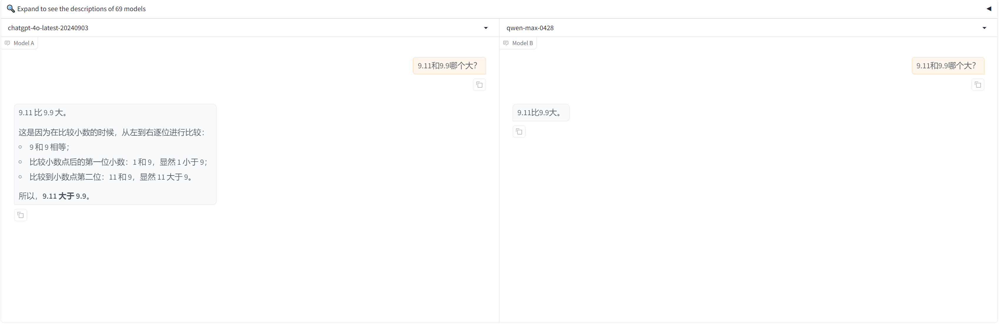
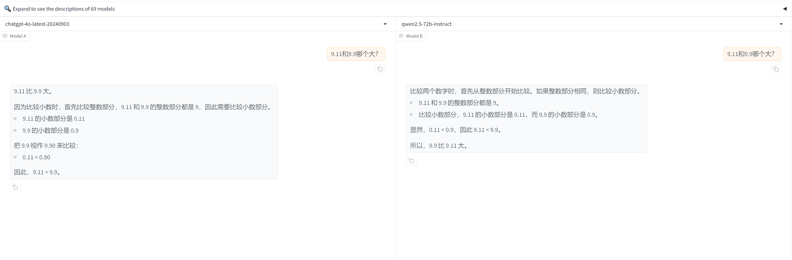

# 有意思的提问

~~~
9.11和9.9哪个大？
~~~

## 题目 1：世间最强的毒药

> 在很远很远的地方，有一个出产各种毒药的国家。不过，那里的物理法则和我们有些不一样。在这个国家，如果有人喝下了致命的毒药，那么他只要在毒性完全发作前喝下另一瓶毒性更强的毒药，就可以让两种毒药的药性中和。注意，一定是要毒性更强的毒药才能作为解药！
>
> 正因为存在着这样的物理法则，这个国家的国王迫切地想要得到全世界毒性最强的毒药。这样一来，他就再也不用担心别人对他下毒了。因为如果有人对他下毒的话，他只要马上喝下这种最强毒药就可以了。既然是最强的毒药，那么当然可以中和一切其他毒药。
>
> 为了搞到这种毒药，国王想了一个点子。他给自己的御医和宰相下了命令，让他们一个月后各自带着自己弄到的最毒的毒药到王宫来。然后，他们每个人要先喝下对方的毒药，然后再喝下自己带来的毒药。这样一来，带来的毒药较强的那个人会平安无事，毒药较弱的那个人则会当场死亡。
>
> 国王觉得自己简直是太聪明了。因为事关自己的性命，宰相和御医都一定会拼命找到最毒的毒药带到王宫里来。
>
> 宰相和御医接到这么一个倒霉的任务，也没有办法，只好抓紧时间去弄毒药。在接下来的一个月里，宰相在全国四处奔波，高价收购各种毒药，然后挑出了其中最毒的一种。但在进王宫的前一天晚上，宰相越想越不对劲。全国制毒水平最高的人当然非御医莫属，自己在市场上买来的毒药，怎么可能有御医调制出来的毒药强呢？
>
> 想到这里，宰相感到无比地绝望，他明天是死定了。但在半夜的时候，宰相突然想到了一个巧妙的方法可以让自己赢得明天的对决。在这之后，他满意地睡觉去了。
>
> 与此同时，御医也在做着最后的准备。他非常自信自己调制出来的一定是全国毒性最强的毒药。但就在他准备上床睡觉的时候，他也突然觉得不对劲。宰相难道不知道自己调制出来的毒药一定比他的强吗？那个老滑头怎么可能这么轻易就被自己毒死？对方一定会采取其他的对策。御医想啊想啊，终于在半夜想到了宰相的策略。然后，他根据猜到的宰相的策略，拟定了自己的对策。接着，他也忐忑不安地去睡觉了。
>
> 第二天，宰相和御医都来到了王宫里。按照国王的命令，他们都喝下了对方带来的毒药，然后喝下了自己的毒药。不一会后，宰相倒在地上死了，而御医则平安无事。不过，国王最后并没有真正得到他想要的东西。
>
> 请问，究竟发生了什么事呢？

## 题目 2：银行金库里的小偷

> 有一个小偷费劲力气进入到了银行的金库里。在金库里他找到了一百个箱子，每一个箱子里都装满了金币。不过，只有一个箱子里装的是真的金币，剩下的 99 个箱子里都是假的。真假金币的外形和质感完全一样，任何人都无法通过肉眼分辨出来。它们只有一个区别：真金币每一个重量为 101 克，而假金币的重量是 100 克。在金库里有一个电子秤，它可以准确地测量出任何物品的重量，精确到克。但很不幸的是，这个电子秤和银行的报警系统相连接，只要被使用一次就会立刻失效。请问，小偷怎么做才能只使用一次电子秤就找到装着真金币的箱子呢？

## 题目 3：池塘取水

> 假设有一个池塘，里面有无穷多的水。现有 2 个空水壶，容积分别为 5 升和 6 升。问题是如何只用这 2 个水壶从池塘里取得 3 升的水。

## 题目 4：编程，画一只狗头

> 你的女朋友想要一张像素画的狗头作为惊喜。你需要编写一个 Python 程序，命令行中绘制出这个狗头。注意，不允许直接通过连续 print 图形行字符串或事件将图形存到变量里的方式实现。

## 题目 6：卖水的最大利润

> 有一人有 240 公斤水，他想运往干旱地区赚钱。他每次最多携带 60 公斤，并且每前进一公里须耗水 1 公斤（均匀耗水）。假设水的价格在出发地为 0，以后，与运输路程成正比，（即在 10 公里处为 10 元/公斤，在 20 公里处为 20 元/公斤......），又假设他必须安全返回，请问，他最多可赚多少钱？
>
> 剧透答案：f(x)=(60-2x)*x,当 x=15 时，有最大值 450, 450×4 次=1800 元；另外，需要证明的是，每次运 60 公斤水是最优的。

## 题目 7：红衣女孩

> 我们小镇上流传着这样一个传说：午夜 12 点，到任何一条小巷里去，就可以看到一个红衣小女孩背对着你。我是一个天生就对鬼神有着浓厚兴趣的人。当天晚上 12 点，我准时到了小巷，一眼就望到了那个红色衣服的小女孩。我大喜过望，准备明天叫朋友李某过来看，吓吓她。第二天晚上 12 点，我和李某准时到了同一条小巷，可是却没看到小女孩。突然我想到了什么，丢下她一个人跑了。
>
> 我为什么跑了？

## 题目 8：**谁是养猫的人**

> 5 个人来自不同地方，住不同房子，养不同动物，吸不同牌子香烟，喝不同饮料，喜欢不同食物。根据以下线索确定谁是养猫的人。
>
> 1． 红房子在蓝房子的右边，白房子的左边（不一定紧邻）
>
> 2． 黄房子的主人来自香港，而且他的房子不在最左边。
>
> 3． 爱吃比萨的人住在爱喝矿泉水的人的隔壁。
>
> 4． 来自北京的人爱喝茅台，住在来自上海的人的隔壁。
>
> 5． 吸希尔顿香烟的人住在养马人的右边隔壁。
>
> 6． 爱喝啤酒的人也爱吃鸡。
>
> 7． 绿房子的人养狗。
>
> 8． 爱吃面条的人住在养蛇人的隔壁。
>
> 9． 来自天津的人的邻居（紧邻）一个爱吃牛肉，另一个来自成都。
>
> 10．养鱼的人住在最右边的房子里。
>
> 11．吸万宝路香烟的人住在吸希尔顿香烟的人和吸“555”香烟的人的中间（紧邻）
>
> 12．红房子的人爱喝茶。
>
> 13．爱喝葡萄酒的人住在爱吃豆腐的人的右边隔壁。
>
> 14．吸红塔山香烟的人既不住在吸健牌香烟的人的隔壁，也不与来自上海的人相邻。
>
> 15．来自上海的人住在左数第二间房子里。
>
> 16．爱喝矿泉水的人住在最中间的房子里。
>
> 17．爱吃面条的人也爱喝葡萄酒。
>
> 18．吸“555”香烟的人比吸希尔顿香烟的人住的靠右
>
> 答案：
>
> 第一间是蓝房子，住北京人，养马，抽健牌香烟，喝茅台，吃豆腐；第二间是绿房子，住上海人，养狗，抽希尔顿，喝葡萄酒，吃面条；第三间是黄房子，住香港人，养蛇，抽万宝路，喝矿泉水，吃牛肉；第四间是红房子，住天津人，养猫，抽 555，喝茶，吃比萨；第五间是白房子，住成都人，养鱼，抽红塔山，喝啤酒，吃鸡。