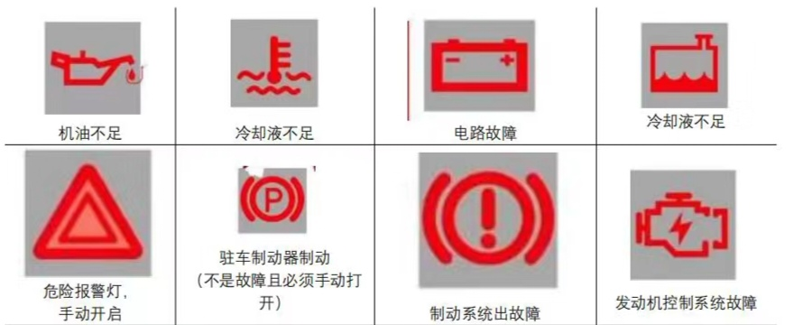

# 实用内容

1. 水面行驶要慢速，防止水溅起到车中；泥泞行驶要快速，防止车陷入泥中；冰面行驶，不快不慢。

  

2. 灰的是路，白的是水（反光），黑的是坑

# 科目一、科目四知识点总结

## 车型

小型自动挡科目三，科一通过20日后才可以预约;  小型手动档科目三，科一通过30日后才可以预约。

小型**手动**挡汽车科目二考试内容包括倒车入库、**坡道**定点停车和起步、侧方停车、曲线行驶、直角转弯。

小型汽车C1 ，还准许驾驶小型 自动挡汽车C2、低速载货汽车C3、三轮汽车C4。

C6轻型牵引；C5残疾人

B1为中型客车驾驶证，准驾车型有中型载客汽车(含核载10人以上、19人以下的城市公共汽车)， 包含B1、C1、C2、C3、 C4、 M共六种车型。

A1大客，A2(重型挂车，也可以免试直接开轻型挂车)，B1中客，B2大货。  
普通三轮摩托车D（摩的）  
普通二轮摩托车E  
轻便摩托车F  
轮式专用机械车是M

## 驾驶证

申请小型汽车驾驶证年龄18岁以上即可;  三轮汽车驾驶证年龄在18 ~ 60。

信息变更后三十日内，向从业单位**所在地车辆管理所**备案。

机动车驾驶证遗失的，机动车驾驶人应当向**核发地、暂住地、居住地**的车辆管理所申请补发

增驾找**核发地**

补领换发、抵押找**登记地**

补证换证，去任意车管所。

只要是跟机动车相关的证件(登记证书、号牌、行驶证等)申请补发的，都在登记地车管所。

车管所在受理之日起**15日内补发**、换发号牌。

改变机动车车身颜色的应到**公安交通管理部门**申请变更登记。

机动车登记证书、好牌、行驶证、丢失损毁的选择**登记证车辆管理所**。

注销登记在登记地车辆管理登记。

身体条件证明的有效期是6个月，过期需重新办理。

信息发生变化是30天，有效期满前90日内申请换证。

普通申领：在哪里住就在哪里申领  
增驾：核发地  
学生和军人：专属地

预约考证：自动20天；手动30天；大车40天  
小型汽车、小型自动挡 路程3km；大车 路程6km。

机动车登记分为注册登记、变更登记、转移登记、抵押登记和注销登记，5种。

## 行驶标志

夜间通过没有信号灯的路口时，为避免事故，引起前车注意。所以选“交替使用远近光灯”。

红叉是禁停，空白是禁行，中间白一是禁驶。<红色是禁止。红X两条路都可以走，不能停；空白，路都没有，人都不能行走；白一是马路，可以让车行驶。>

单白横实线是停止线，双白横实线是停车让行线，双白横虚线是减速让行线。

国G（guo）省S（seng） 县X（xian） 乡Y（最小的不一样）

## 处罚

未逃逸，致人死亡： 3年以下  
逃逸或情节特别恶劣；组织作弊情节严重：3-7年  
因逃逸致人死亡： 7年以上

伪造变造驾驶证，拘留15天以下并罚款。

1.酒驾或毒驾；  
2.无驾驶资格驾车；  
3.车辆有安全隐患；  
4.无牌车或报废车；  
5.严重超载；  
6.肇事逃逸。  
具有以上任意一种行为，且致人重伤，负全部或主要责任的，都是交通肇事罪。

事故赔偿有争议的，收到认定书之日起**10日内**提交书面申请。

使用伪造或其他车辆号牌、驾驶证、行驶证的，一次记**12分**。

7座以上载客汽车超载20%未达50%的，一次记**6分**。

考试过程中贿赂、舞弊一经发现，**其他科目成绩也会被取消**，并处2000元以下罚款

驾驶人违反规定，采用隐瞒、欺骗手段补领驾驶证的，公安交管部门将处以200元以上500元以下罚款，并收回补领的驾驶证。

伪造变造，拘留罚款，所以选“处十五日以下拘留并处罚款”。

7座以上载客汽车超载20%未达50%的，一次记6分。

年龄在70周岁以上的，不得驾驶低速载货汽车、三轮汽车、轻型牵引挂车、普通三轮摩托车、普通二轮摩托车。

运载爆炸物品，未悬挂警示标志并采取必要安全措施，一次记6分。

参加满分学习考试中弄虚作假的，相应学习记录和考试成绩无效，并会被处以1000元以下罚款。

申请增驾轻型牵引挂车，要在最近1个记分周期没有记满12分记录。

高速超速50%扣12分，20% ~ 50%扣6分;  
普路超速50%扣6分， 20% ~ 50%扣3分。

高速公路行驶速度：  
两条车道是：100km/h 60km/h  
三条车道是：110km/h 90km/h 60km/h  
四条车道是：110km/h 90km/h 90km/h 60km/h

准驾不符**9分**;不按红绿灯**6分**;拥堵占道**3分**。

不按规定安装机动车号牌上路行驶，一次记**3分**。

## 扣分

舞弊、虚假1年；吊销驾照2年；欺骗贿赂、撤销、吸毒3年；醉5年；逃罪终生（假1 吊2 骗3 醉5 逃终生）

不按规定年检 1分  
违反禁令 1分  
不系安全带 1分  
不按规定会车 1分  
不按规定使用灯光一次1分

找电话 3分  
借道超车 3分  
不让校车 3分  
高速，不按规定行驶 3分；占用6；违停9；逆行12  
发生故障，不按规定设置警告标志，扣3分。

无证驾驶 6分，发生交通事故，10年不得申请机动车驾驶证。  
红绿灯6分

车型不符 9分

酒驾 12分  
伪造、变造的行驶证 12分

轻微伤6分；轻伤12分  
不按规定的车牌扣3；遮挡、不挂扣9；伪造扣12

车辆发生故障，不按规定使用灯光和设置警告标志的，不按规定超车、让行或逆行，一次记3分。

驾驶与准驾车型不符的机动车；未悬挂机动车号牌上路行驶；未取得校车驾驶资格驾驶校车 记9分

驾驶机动车不按交通信号灯指示通行 记6分

不按红绿灯6分；拥堵占道3分；准驾不符9分。  
疲劳驾驶369 ，货车3分；轿车6；客车9  
机动车所有权发生转让应在30日内申请登记。转让后，未及时申请转让登记，处200元以下罚款。

代替实际机动车驾驶人接受交通违法行为处罚和记分牟取经济利益的，一次记12分。

轻微伤或者财产损失逃逸记6分；轻伤或死亡逃逸记12分。

凡是使用“伪造、变造的”，无论是机动车号牌、行驶证、驾驶证、校车标牌，都一次记12分。

驾驶校车、中型以上载客载货汽车、危险物品运输车辆_以外_的机动车在高速公路、城市快速路_以外_的道路上行驶超过规定时速60%的，一次记6分。

驾驶校车、中型以上载客载货汽车、危险物品运输车辆_以外_的机动车在**高速公路、城市快速路上**行驶超过规定时速50%+的，一次记12分。

故意遮挡、污损机动车号牌的机动车上道路行驶的一次记9分。

造成致人轻微伤或者财产损失的交通事故后逃逸，尚不构成犯罪的，一次记6分  
机动车驾驶证被暂扣或扣留期间驾驶机动车的，一次记6分

驾驶机动车在高速公路上违法占用应急车道行驶的，一次记6分

驾驶机动车在高速公路或者城市快速路上违法停车的，一次记9分

载货汽车载物**超载30%-50%** ，或违法**载客**，一次记3分。

## 超载

**7座以下**小型汽车超载20%以内不扣分，  
20% ~ 50%扣3分  
50% ~ 100%扣6分  
100%以上扣12分。

**7座以上载客汽车**载人超过20%-50%，一次记6分。  
超载50% ～ 100%，一次记9分。

载货汽车超载  
30％以下扣1分  
30％～50％扣3分  
50％～100％扣6分  
100％+扣12分

公路客运车辆载客超过额定乘员的，处罚?  
超额0-20%，处200-500元；  
20% ~ 50%，处500元 ~ 2000元；  
经处罚不改的，对直接负责的主管人员处2000元~5000元；由公安机关交通管理部门扣留机动车至违法状态消除。

驾驶校车、公路客运汽车、旅游客运汽车（人多）**超载20%**，一次记12分；**未满20％**扣6分。

因超员、超速被吊销驾驶证， 5年内不得再次申领机动车驾驶证。

## 超速

普通城市，超速20%-50%，记3分；50%+扣6分。

城市快速路、高速公路，超速20%–50%的，记6分；50%+扣12分，罚款200-2000 ，吊销驾驶证。

小型汽车载客超过额定人员20%以上未达到50%的记3分；  
高速公路时速超过100km，车距100+米；  
时速低于100km，车距50+米。

机动车行驶中掉头、转弯、下陡坡时，最高行驶速度不得超过30km/h。

### 罚款

使用原证（旧证），20-200元。

实习期内不得牵引挂车否则罚款20-200元

未及时申报变更信息的，处20 ~ 200罚款。

发生财产损失交通事故，未自行撤离造成交通堵塞的， 交警可依法对驾驶人处以200元罚款。

**综上：**实习挂车原证驾驶造成阻塞，信息未变更罚20-200元。

---

身体不适驾车，处200 ~ 500罚款。

**逾期未检，200 ~ 500元。**

**隐瞒、欺骗**手段**补领**驾驶证的，200-500元。

提供虚假材料**申领**驾驶证的，处500元以下罚款，一年不得再次申领。

审验学习教育过程中弄虚作假的，相应学习记录无效，并处1000元罚款。

不听劝阻还造成交通阻塞的驾驶人，处200-2000元罚款，可并处十五日以下拘留。

驾驶报废车，将罚款200 ～ 2000元，吊销驾驶证，收缴车辆并强制报废。

无证驾驶，200 ～ 2000罚款，并处十五日以下拘留。

将车交由未取得驾驶证的人驾驶，吊销车主驾驶证， 并处200-2000元罚款。

驾驶拼装车上路有安全隐患，处罚款200-2000元，吊销驾驶证，收缴车辆并强制报废。  
<小孩搭积木（拼装）22>

逃逸未构成犯罪的，处15日以下拘留，并处200 ～ 2000元罚款。

考试贿赂、舞弊，2000元以下罚款。

**综上：**新手考试贿赂、舞弊，无证驾驶拼装报废车，造成堵塞后逃逸200-2000元。

**组织作弊**，处三年以下有期徒刑或者拘役。牟取经济利益的，处违法所得3倍 ～ 5倍罚款，最高不超过10W元。

组织他人参与弄虚作假，处罚组织者2万元以下罚款。

代为处罚和记分并支付经济利益，会被处以所支付经济利益的3倍以下罚款，但最高不超过5万元。

凡是使用其他车辆证件（登记证书，行驶证）、号牌、标志（检验合格、保险）的，交警都可依法扣留车辆，并处2000-5000元罚款。

驾驶人在收到罚单后，要在15日内缴纳罚款。

初次酒后驾车，扣6个月驾驶证，罚款1000 ~ 2000元；  
再次酒后驾车，10日以下拘留，并罚款1000 ~ 2000，吊销驾驶证。  
酒驾**重大事故**，终生不得申领驾驶证。  
醉酒驾驶、追逐竞驶，拘役并处罚金，吊销驾驶证5年内不得再次申领机动车驾驶证。

## 满分学习

在1个记分周期3次以上累积记分满12分，参加法规学习考试合格后，再按规定参加科目二科目三考试。

1个记分周期记满12分的，要参加满分学习、考试。

一次满分学习的时间为7天，总长不能超过60天。一个记分周期累计最高减6分。

参加满分学习现场学习时，满1h且考试合格， 1次减2分。

网上学习30分钟1分；公益学习1h1分，一次扣减1分；现场学习1h2分。

机动车驾驶人在一个记分周期内累积记分满24分未满36分的，在道路交通安全法律、法规和相关知识考试合格后，应当按规定预约参加**场地驾驶技能考试。**

最近3个记分周期内，凡是因逃逸、饮酒、伪造、买卖分等受到处罚的，不得参加学法减分。

## 限速

高速公路规定：  
时速超过100km/h，车距100米以上  
时速低于100km/h，车距50米以上。

高速公路规定：  
雾霾能见度低于200米，时速不能超过60km， 车距100米以上；（261）  
能见度低于100米，时速不能超过40km，车距50米以上；（145）  
能见度低于50米，时速不能超越20km，尽快驶离高速。（520）  
解析：记口诀：261、145、520（离）（ 261表示：能见度低于200米时，限速60km/h，与前车要保持至少100米的安全距离。）

转弯、冰雪道路和进出非机动车道都不得超过30km/h，因此只有“同方向只有一条车道的公路”限速是70。

无中心线城市30km/h，公路40km/h；有中心线城50km/h、公70km/h。  
城市道路为每50km/h，公路为70km/h。

判断牵引故障车时，牵引与被牵引的机动车都要开启危险报警闪光灯，最高行驶速度不得超过30km/h。

小型机动车时速不超120km/h ，其他时速不超100km/h，摩托车不超80km/h。  
窄路、窄桥等特殊路段行车要控制好车速，不得超过30km/h。

---

## 按钮、标识

点火开关4个挡位的功能是：  
LOCK ：切断电源，锁定方向盘；  
ACC ：接通附件电源(比如收音机等附件)  
ON ：接通除起动机外的全车全部电源；  
START ：接通起动机电源，起动发动机。

EBD电子制动力分配系统，  
BAR胎压，  
TSR交通标志识别系统，  
FCW前方碰撞预警系统。  
盲点监测系统BSD。  
紧急制动辅助系统的是EBA。<E急>  
自动刹车<安逸吧>  
盲点辅助BSA<别上啊，CAM计算机辅助>  
盲点监测BSD<不上当>  
车身电子稳定系统(ESP)<电E>

防抱死制动系统( ABS )在**紧急制动**情况下可以最大限度发挥制动器效能。

安装ABS系统的车辆紧急制动时，要用力踏制动踏板(即猛踩刹车)，才能防止车轮抱死。

## 路面情况

1. 机动车在高速行驶中，突然**爆胎**要采取的安全措施是什么？  
    ①牢牢地握住转向盘，保持直行  
    ②立即松开加速踏板  
    ③轻踩制动踏板  
    ④禁止紧急制动
    
2. 在**泥泞路段**行车，要用**加速踏板**控制速度，匀速一次性通过。
   
3. 在**冰雪**路面上_减速或停车_，要充分利用~~发动机的牵制作用~~降低车速
   
4. **雪天**行车，要注意：  
    1、降低车速行驶， 避免猛加速  
    2、制动时，以_**点**_<雪点>刹方式为主，轻踩轻抬  
    3、_前轮_打滑时，应往_**侧滑相反**_方向轻转方向盘  
    4、_后轮_打滑时，应往_**侧滑方向**_轻轻转动方向盘
    
5. **转向失控**后，若机动车偏离直线行驶方向，应果断地连续踩踏、放松制动踏板_使机动车尽快减速停车
   
6. 与对向来车**发生正面碰撞**且碰撞位置在驾驶人正前方时，驾驶人正确的应急驾驶姿势是：  
    1、迅速躲离转向盘  
    2、往副驾驶座位躲避  
    3、迅速将两腿抬起  
    4、禁止两腿蹬直
    
7. 车辆发生**倾翻**：  
    1、双手紧握转向盘双脚勾住踏板  
    2、背部紧靠椅背
    
8. 行车中与其他机动车发生**正面碰撞已不可避免时**应该~~迅速采取紧急制动~~
   
9. 在行驶中遇有下列情形之一的，**机动车≤30km/h**，其中~~拖拉机、电瓶车、轮式专用机械车~~ **≤15km/h**：  
    (一)进出非机动车道，通过铁路道口、急弯路、窄路、窄桥时;  
    (二)掉头、转弯、下陡坡时;  
    (三)遇雾、雨、雪、沙尘、冰雹，能见度在50米以内时;  
    (四)在冰雪、泥泞的道路上行驶时;
    
10. 颠簸路段挂低档位缓抬加速踏板
    
11. 涉水行车时，应看远处固定目标防止车辆行驶方向偏移；机动车涉水后，擦干被水浸湿的部位，保持低速行驶，并**间歇踩踏制动踏板，以恢复制动效果。**<水间>
    
12. **止血方法：**  
    1、_止血带止血法_：一般用于四肢大出血，且加压包扎无法止血的情况。  
    2、_屈肢加垫止血法_：四肢膝、肘以下部位出血时，如没有骨折和关节损伤，可掌动脉弓压迫部位股动脉压迫部位将一个厚棉垫、泡沫塑料垫或绷带卷塞在肘窝或肘窝部，屈曲腿和臂，再用三角巾、宽布条、手帕或绷带等紧紧缚住。  
    3、_加压包扎止血法_：最常用。一般小动脉和静脉损伤出血的情况可用。  
    4、_压迫止血法_：效果有限，难以持久，只是应急措施。

## 其他

两个红叉，禁止停车；一个红斜线，禁止长时间停车!

夜间城市起步，开启转向及近光灯，不能开远光灯。

一天行车时间不要超过8h；深夜行车不得连续超过2天；  
驾驶人连续驾驶4h以上，停车休息的时间不得少于20分钟。

**轻微疲劳**：驾驶人会频频打哈欠、眼皮沉重、出现换挡不及时、不准确的情况；  
**中度疲劳**：驾车容易走神，动作迟缓，有时甚至会忘记操作；  
**重度疲劳**：驾驶人往往会下意识地操作或出现短时间睡眠现象，严重时会失去对车辆的控制能力。

交叉路口、铁路道口、急弯路、宽度不足4米的窄路、桥梁、陡坡、隧道以及距离上述地点50米以内的路段，不得停车。

公共汽车站、急救站、加油站、消防栓或者消防队(站)门前以及距离上述地点30米以内的路段，除使用上述设施的以外，不得停车。

出现下列哪些情况时，需要更换轮胎?  
胎侧被扎时，轮胎上有鼓包或脱皮，前轮花纹深度低于1.6mm时。

在狭窄的坡路，上坡的一方先行；但下坡的一方已行至中途而上坡的一方未上坡时，下坡的一方先行。

行驶过程中如果后车跟车过近时，可以采用轻踩制动踏板的方式警告后车，不需用力踩踏，让制动灯亮起就可以。

道路标线：虚线可跨越，实线不可跨，白色虚线同向分界，黄色虚线是相向。