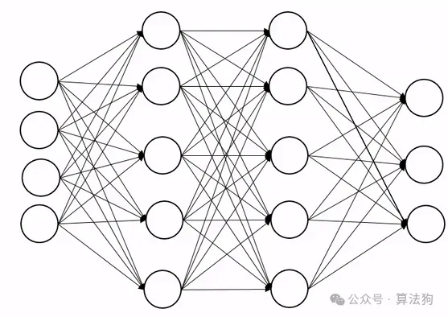

# 面试题：大模型中不使用Dropout的原因？

大模型中不用dropout的主要原因有以下几点：

1. 使用dropout操作固然可以增加模型的泛化性，但其引入噪声会导致模型训练的不稳定性。考虑到现在的大模型都是深层结构，以及在训练过程中会使用损失低精度量化计算，加入dropout无疑会加重整体训练的不稳定性。这里提一嘴，貌似增加模型泛化性的操作好像都会影响到训练的不稳定性，如Moe的操作也需要很小心。

   

2. 使用dropout会导致计算资源的增加和效率的降低，首先要生成一个mask(需要显存)，然后计算结果也需要存下来(需要显存)，反向传播也需要执行额外的逻辑上的操作等，效率上肯定是低的。

3. 不使用dropout不会导致模型效果变差，现在的大模型都是decoder-only的结构，且模型中使用了大量的如MQA、多头、pre-norm，residual等技术，且使用到了大量的多领域的数据进行预训练，在某种程度上也增加了泛化性，小小的去掉一个dropout影响不大。

4. 大量的实验证明了在小模型中可能dropout的效果比较显著，因为小模型针对的是特定领域且少量数据的情况，容易过拟合；而在大模型中，实验证明了dropout效果不明显或者会带来差的效果，因此后面LLM发展过程中就不考虑加入dropout了。