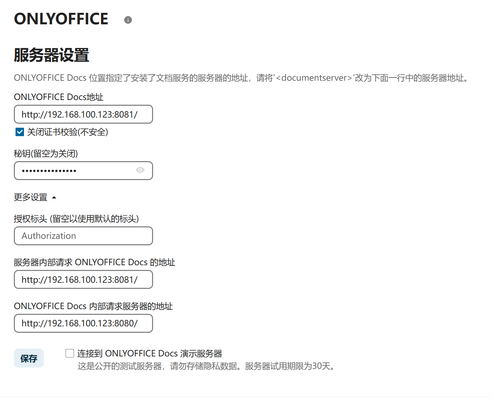
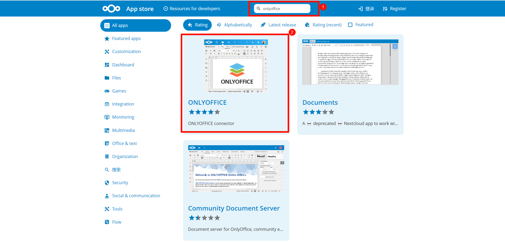
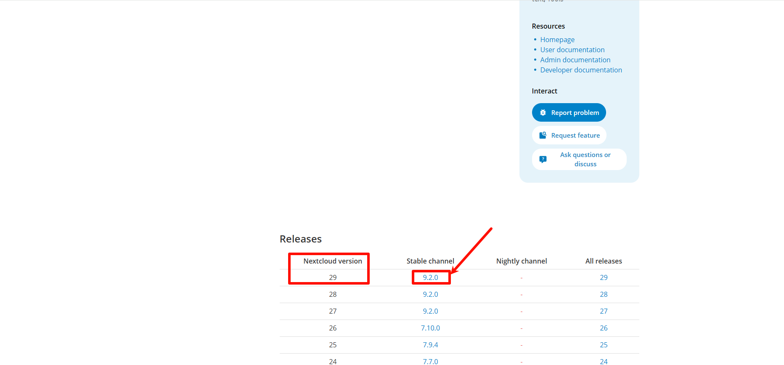
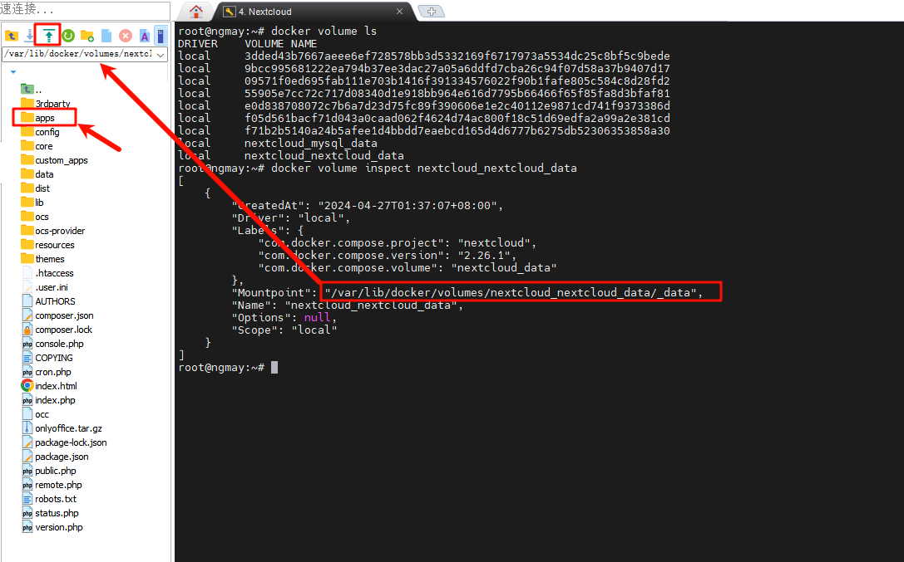
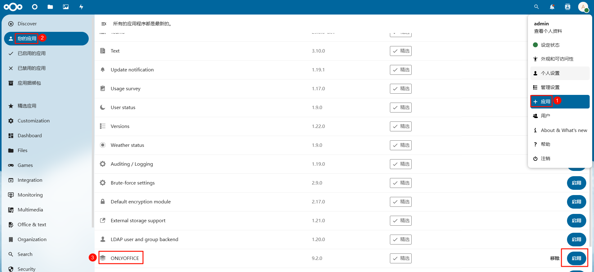
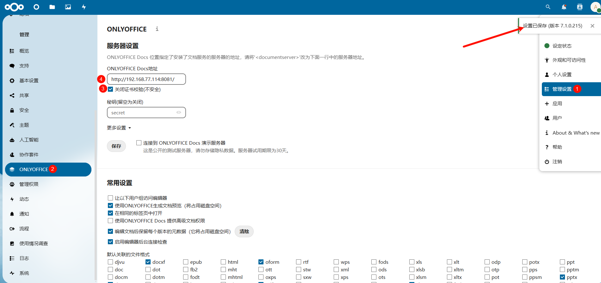
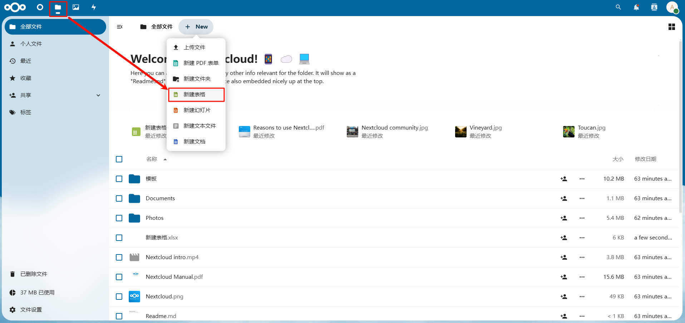
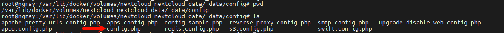
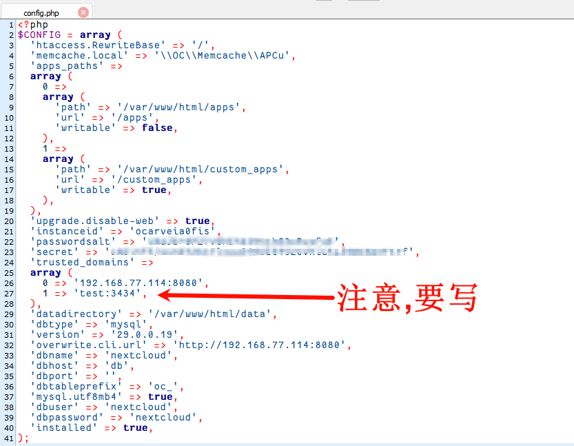

# Docker安装Nextcloud+Onlyoffice


# 修改两个位置

1、/var/www/html/config/config.php     **Nextcloud**

~~~
array (
0 => 'localhost:8080',
1 => '192.168.100.123',
),


修改权限
chmod 777 /var/www/html/config/config.php
~~~

2、/etc/onlyoffice/documentserver/default.json     **Onlyoffice**

~~~
"request-filtering-agent" : {
    "allowPrivateIPAddress": true,
    "allowMetaIPAddress": true
},
~~~


# 前端填写




# 离线化安装插件

~~~
/var/www/html/apps
~~~


# 创建docker-compose.yml文件


```bash
#创建目录
mkdir /opt/nextcloud
cd /opt/nextcloud/
#nano创建编辑docker-compose.yml文件，Ctrl+O写入，Ctrl+X退出；也可以用vim看个人喜欢
nano docker-compose.yml
```

docker-compose.yml填入以下内容，根据需要修改以下配置
容器默认时区为UTC时区，所以修改为上海时区


```yaml
version: '3.8'

services:
  db:
    image: mysql:latest
    container_name: nextcloud_mysql	       # 自定义容器名称
    restart: always
    environment:
      MYSQL_ROOT_PASSWORD: your_root_password  # 定义 MySQL 的 root 密码
      MYSQL_PASSWORD: your_password            # 定义 MySQL 用户的密码
      MYSQL_DATABASE: nextcloud                # 创建数据库名为 nextcloud
      MYSQL_USER: nextcloud                    # 定义 MySQL 用户名
      TZ: Asia/Shanghai                        # 设置时区为上海
    volumes:
      - mysql_data:/var/lib/mysql              # MySQL 数据持久化
    networks:
      - nextcloud_network

  app:
    image: nextcloud:latest
    container_name: nextcloud		       # 自定义容器名称
    restart: always
    depends_on:
      - db
    environment:
      MYSQL_DATABASE: nextcloud
      MYSQL_USER: nextcloud
      MYSQL_PASSWORD: your_password            # MYSQL密码
      MYSQL_HOST: db
      TZ: Asia/Shanghai                        # 设置时区为上海
    volumes:
      - nextcloud_data:/var/www/html           # Nextcloud 数据持久化
    ports:
      - "8080:80"
    networks:
      - nextcloud_network

  onlyoffice:
    image: onlyoffice/documentserver:7.1.0
    container_name: nextcloud_onlyoffice       # 自定义容器名称
    restart: always
    environment:
      JWT_ENABLED: 'false'                     # 关闭 JWT，因此不需要密钥
      JWT_SECRET:                              # 不设置密钥
      TZ: Asia/Shanghai                        # 设置时区为上海
    ports:
      - "8081:80"
    networks:
      - nextcloud_network

networks:
  nextcloud_network:                           # 定义网络

volumes:
  mysql_data:                                  # 定义 MySQL 的数据卷
  nextcloud_data:                              # 定义 Nextcloud 的数据卷
```

运行


```x86asm
docker compose up -d
```

然后查看运行中的容器


```css
docker ps -a
```


# 5.登录网页

IP不知道什么可以在Ubuntu使用`ifconfig`查看
浏览器打开`IP:8080`可以看到nextcloud的界面
设置用户名和密码登录

浏览器打开`IP:8081`可以看到onlyoffice的界面

# 6.安装onlyoffice插件

> https://apps.nextcloud.com/

- 在官网下载onlyoffice插件
  [](https://img2024.cnblogs.com/blog/2887466/202404/2887466-20240427015643923-1150050277.png)
- 往下滑找到最新nextcloud版本的onlyoffice插件点击下载
  [](https://img2024.cnblogs.com/blog/2887466/202404/2887466-20240427015923216-2127897388.png)
- 查看卷信息


```dockerfile
 docker volume ls
```

- 查看nextcloud卷的存储位置


```mipsasm
docker volume inspect nextcloud_nextcloud_data
```

- mobaxterm跳转到卷存储目录后进入子文件夹apps然后将onlyoffice插件上传至apps里
  [](https://img2024.cnblogs.com/blog/2887466/202404/2887466-20240427023925059-968189955.png)
- 解压


```bash
# 这里进入到卷存储目录下的apps文件夹，就是刚才上传插件的目录
cd /var/lib/docker/volumes/nextcloud_nextcloud_data/_data/apps/
tar -xzf onlyoffice.tar.gz
```

- 登录nextcloud启用onlyoffice
  [](https://img2024.cnblogs.com/blog/2887466/202404/2887466-20240427024908145-1203107596.png)
- 配置onlyoffice地址
  [](https://img2024.cnblogs.com/blog/2887466/202404/2887466-20240427025148150-1689266972.png)
- 新建表格测试
  [](https://img2024.cnblogs.com/blog/2887466/202404/2887466-20240427025401588-1121015597.png)

[](https://img2024.cnblogs.com/blog/2887466/202404/2887466-20240427025318930-66098691.png)

# 7.公网访问

使用公网IP访问提示：通过不被信任的域名访问
[](https://img2024.cnblogs.com/blog/2887466/202404/2887466-20240427025642014-730694220.png)

- 修改/var/lib/docker/volumes/nextcloud_nextcloud_data/_data/config/config.php


根据IP或者域名参照文件格式填写保存
[](https://img2024.cnblogs.com/blog/2887466/202404/2887466-20240427030346773-458336422.png)


Docker安装Onlyoffice并更新中文字体的办法

**1.删除Onlyoffice自带字体**
首先，在[宝塔面板](https://so.csdn.net/so/search?q=宝塔面板&spm=1001.2101.3001.7020)中，打开镜像内目录，进入容器内的字体文件夹，将系统字体和onlyoffice自带的字体全部删除。
删除系统字体文件夹中所有文件及文件夹:  /usr/share/fonts
删除onlyoffice自带字体文件夹 中所有文件及文件夹: /var/www/onlyoffice/documentserver/core-fonts

**2.拷贝字体文件**
把从windows字体目录拷贝到镜像内 /usr/share/fonts/ 目录中，把中文字体文件名改成英文名称。

**3.启动onlyoffice容器，并更新字体**
最后启动onlyoffice容器，进入/usr/bin目录， 输入./documentserver-generate-allfonts.sh 运行完毕后字体更换完成，清除浏览器缓存，并重新打开页面，就会发现之前onlyoffice自带的其他字体都没有了，只有刚才复制进去的中文字体了。

查看正在运行的docker:

```undefined
sudo docker ps
```

进入运行着的docker镜像内：

```cobol
docker exec -it <ID> /bin/bash
```

exec命令可以进入docker，并执行后面的命令，上面是执行/bin/bash
其中<ID>是容器id的前三位字符

进入指定文件夹下执行下方命令，使新增的字体生效

```bash
#进入文件夹

cd /usr/bin

#执行sh文件，使其新增的字体生效

./documentserver-generate-allfonts.sh
```

